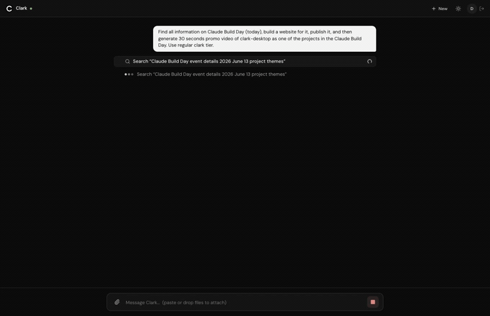

# Clark Desktop

<p align="center">
  
  <br/>
  <em>One Clark run in the desktop app: web research → a live plan → file edits → tool calls that build and publish a site.</em>
</p>

Open-source, cross-platform desktop client for agentic work. One UI that talks
to many agent backends through a single provider abstraction — **ACP** local CLI
agents (Codex, Claude Code, Gemini, …) and the **Clark** runtime — with the
performance-critical engine written once in Rust and shared across desktop,
mobile, and web.

## Why

- **Most performant.** Tauri 2 (native WebView, ~10MB binaries, ~50% less RAM
  than Electron) + a Rust core. No bundled Chromium.
- **One engine, three targets.** Transport codec, event projection, and run
  lifecycle live once in the `agent-core` Rust crate and compile to native
  (desktop/mobile) and WASM (web) — instead of being re-implemented per platform.
- **Agent-agnostic, Clark-focused.** A trait-based `Provider` abstraction fronts
  every backend. ACP-first; the Clark adapter rides the same trait.
- **Beautiful & complete.** React 19 + Tailwind v4 UI: streaming chat, tool-call
  timeline, plan, permission gates, and an agent "computer" surface.

## Architecture at a glance

```
React (Tauri WebView)  ──invoke/emit──►  agent-core (Rust, native + WASM)
   surfaces, store            │              domain · projection · Provider trait
                              ▼
                  provider-acp (JSON-RPC/stdio)   provider-clark (WS+msgpack)
                  local CLI agents via sidecar     remote Clark runtime
```

## Layout

| Path | What |
| --- | --- |
| `crates/agent-core` | Domain model, projection reducers, `Provider` trait, codecs. Native + WASM. |
| `crates/provider-acp` | Agent Client Protocol adapter (JSON-RPC over stdio). |
| `src-tauri` | Tauri 2 host: commands, event bridge, sidecar, state. |
| `app` | Vite + React + TS + Tailwind v4 frontend. |

## Develop

Prerequisites: Rust (stable), Node 24+, pnpm 10+, and the
[Tauri 2 system deps](https://v2.tauri.app/start/prerequisites/).

```bash
# Rust engine: test + lint
cargo test -p agent-core -p provider-acp
cargo clippy -p agent-core -p provider-acp --all-targets

# Frontend (browser preview uses a mock provider)
cd app && pnpm install && pnpm dev      # http://localhost:1420
pnpm test                               # vitest

# Run the desktop app (spawns the Vite dev server automatically)
cargo tauri dev
```

In a plain browser the UI runs against a **mock provider** that plays a scripted
streaming run, so every surface is demonstrable without the native host.

## License

Apache-2.0. Clean-room: no code from the proprietary Clark repository is used.
