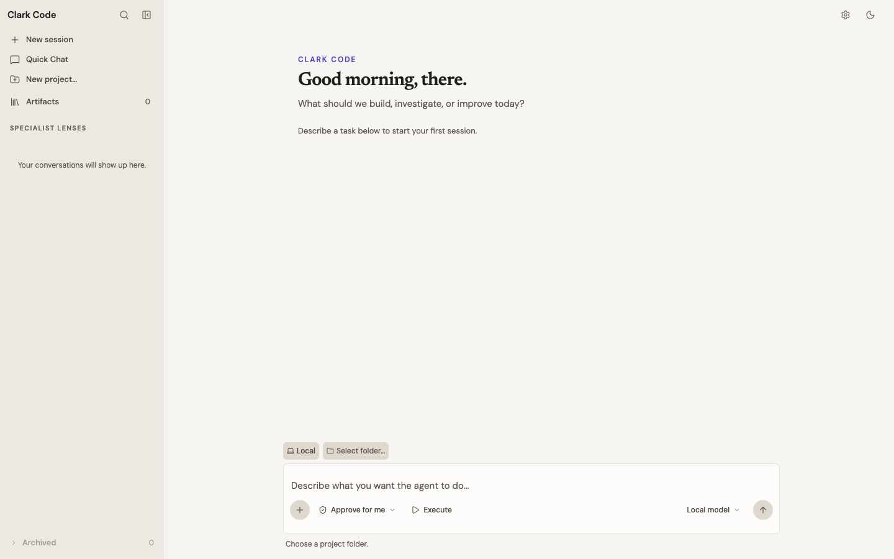

# Clark Code

Clark Code is an open-source desktop coding agent for working across real
projects with local tools, explicit permissions, and resumable sessions.



## What it does

- Works with local coding models and Agent Client Protocol (ACP) providers.
- Reads, edits, searches, and runs commands inside project-scoped sandboxes.
- Keeps tool calls, plans, progress, diffs, and artifacts visible while work is
  running.
- Supports multiple projects, Git worktrees, remote SSH environments, quick
  chats, and durable conversation history.
- Uses explicit approval boundaries for sensitive filesystem, network, and
  computer-use actions.
- Runs as a native Tauri application on macOS, Linux, and Windows.

## Build from source

You need a current Rust toolchain, Node.js, Corepack, and the platform
dependencies required by [Tauri 2](https://v2.tauri.app/start/prerequisites/).

```bash
git clone https://github.com/clark-labs-inc/clark-desktop.git
cd clark-desktop/app
corepack pnpm install --frozen-lockfile
cd ..
```

On macOS, build and launch the development app with:

```bash
./script/build_and_run.sh
```

For browser-only interface development:

```bash
cd app
pnpm dev
```

## Development checks

Install the CI-pinned Rust test runner once with
`cargo install cargo-nextest --version 0.9.143 --locked`.

```bash
cargo fmt --all --check
cargo clippy -p agent-core -p provider-acp -p provider-local -p devbridge --all-targets -- -D warnings
cargo nextest run -p agent-core -p provider-acp -p provider-local
cargo check -p agent-core --target wasm32-unknown-unknown

cd app
pnpm typecheck
pnpm test
pnpm build
```

## Repository map

| Path | Purpose |
| --- | --- |
| `crates/agent-core` | Provider contract, domain events, codecs, and projections |
| `crates/provider-acp` | Agent Client Protocol adapter |
| `crates/provider-local` | Local tool-calling coding agent |
| `crates/exec-*` | Sandboxed execution and cross-platform isolation |
| `src-tauri` | Native application host and session lifecycle |
| `app` | React interface |
| `harness` | Deterministic integration and UI checks |

See [CONTRIBUTING.md](CONTRIBUTING.md) for contribution guidelines.

## License

Clark Code is licensed under the [Apache License 2.0](LICENSE).
