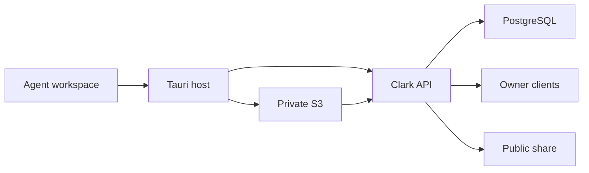

## Executive summary

The highest-risk boundary is the transfer from an agent-writable local workspace
to multi-tenant object storage. The implementation confines reads in native
code, binds every API operation to the authenticated user and conversation,
verifies uploaded bytes before publication, keeps S3 leases out of durable
state, and strips private artifact URIs from public shares. Residual risk is
primarily orphaned-object cleanup failure and storage abuse within hard quotas.

## Scope and assumptions

- In scope: `clark-desktop/app/src/lib/cloudArtifacts.ts`,
  `clark-desktop/src-tauri/src/commands/desktop_artifacts.rs`,
  `clark-desktop/crates/provider-local/src/agent_adapter/translate.rs`,
  `clark/crates/clark-services/src/rest/desktop_artifacts.rs`,
  `clark/crates/clark-service-db/src/desktop/tombstone.rs`,
  `clark/crates/clark-service-db/src/desktop_share.rs`, and the artifact
  migration.
- Production is an internet-exposed multi-tenant Clark service; generated
  Markdown may contain source code, credentials copied into reports, customer
  data, or other sensitive material.
- Sync is mandatory for signed-in Clark Code clients and has no disable path.
  Signed-out clients have no cloud authority and retain local data until a
  signed-in session can sync.
- Existing private S3 controls (block-public-access, KMS encryption, versioning,
  and one-day temporary-upload expiry) remain enabled; evidence:
  `clark/infrastructure/pulumi/components/s3.py`.
- CI/build compromise, malicious Clark operators, compromise of AWS/KMS, and
  non-Markdown workspace outputs are out of scope.
- Open questions: production alert thresholds for failed completion/deletion,
  and whether product policy should eventually impose retention on old
  immutable versions.

## System model

### Primary components

- Local provider writes Markdown and emits a workspace-relative artifact ID;
  evidence: `crates/provider-local/src/agent_adapter/translate.rs::markdown_artifact`.
- React projects a safe pending/cloud snapshot and owns mandatory retries;
  evidence: `app/src/lib/cloudArtifacts.ts::snapshotForArtifactCloud`.
- Tauri confines local reads and performs upload/download with account-bound
  native authority; evidence:
  `src-tauri/src/commands/desktop_artifacts.rs::desktop_artifact_upload`.
- Clark's authenticated API owns metadata, leases, integrity completion, reads,
  quotas, and cleanup; evidence:
  `clark/crates/clark-services/src/rest/desktop_artifacts.rs`.
- PostgreSQL stores user/conversation/version ownership; private S3 stores
  immutable bytes; evidence:
  `clark/crates/clark-services/migrations/zz_20260728c_desktop_artifact_versions.sql`.

### Data flows and trust boundaries

- Agent workspace → Tauri host: Markdown path and bytes cross a local IPC/file
  boundary. Tauri canonicalizes beneath the exact conversation workspace,
  requires a regular Markdown file, and caps size at 8 MiB.
- WebView → Clark API: bearer, conversation ID, logical ID, filename, size, and
  SHA-256 cross HTTPS through an exact-origin, no-redirect native client.
  Backend JWT middleware and user-scoped SQL authorize every operation.
- Tauri host → S3: exact Markdown bytes cross HTTPS using a short-lived PUT
  lease. No Clark bearer is attached and the lease is not returned to the
  WebView or persisted.
- S3 → Clark API: completion reads bytes server-side and validates size, fixed
  content type, and SHA-256 before state becomes `uploaded`.
- Clark API → Desktop/mobile: Markdown crosses authenticated HTTPS through a
  backend proxy with `private, no-store` and `nosniff`; no presigned GET URL is
  durable client state.
- Snapshot → public share: anonymous token-gated read crosses a public boundary;
  private Clark artifact routes, pending workspace URIs, and legacy local paths
  are removed by `desktop_share.rs::redact_snapshot_for_share`.

#### Diagram

## Assets and security objectives

| Asset | Why it matters | Security objective (C/I/A) |
| --- | --- | --- |
| Generated Markdown | May contain proprietary code or sensitive user data | C/I/A |
| Clark bearer token | Authorizes all owner-scoped artifact operations | C/I |
| S3 upload lease | Temporarily permits object creation | C/I |
| Artifact ownership metadata | Prevents cross-tenant reads and deletion | I/A |
| SHA-256 and immutable URI | Binds displayed content to completed bytes | I |
| Local workspace path | Reveals username and machine layout | C |
| Conversation tombstone | Prevents stale-client resurrection after delete | I/A |

## Attacker model

### Capabilities

- Remote unauthenticated callers can reach public routes and guess API paths.
- An authenticated malicious tenant can choose request JSON, IDs, filenames,
  sizes, hashes, and upload bytes for its own account.
- Agent-produced filenames/content and WebView IPC arguments are untrusted.
- A stale or offline legitimate client can replay requests out of order.

### Non-capabilities

- The attacker cannot sign a Clark JWT for another user, read another user's
  local filesystem, bypass private-bucket policy, or modify the trusted Clark
  backend response without a separate infrastructure compromise.
- Public share-token possession does not confer owner authentication.

## Entry points and attack surfaces

| Surface | How reached | Trust boundary | Notes | Evidence (repo path / symbol) |
| --- | --- | --- | --- | --- |
| Artifact initiate | Authenticated POST | Internet → API | Validates ID, filename, hash, size, parent, quota | `clark-services/src/rest/desktop_artifacts.rs::initiate_desktop_artifact_handler` |
| S3 PUT lease | Server-issued HTTPS URL | Native → S3 | Fixed key/content type, short lifetime | `clark-upload/src/attachment_uploads.rs::presign_browser_put` |
| Artifact complete | Authenticated POST | Internet/S3 → API | Re-reads and hashes object | `desktop_artifacts.rs::complete_desktop_artifact_handler` |
| Artifact read | Authenticated GET | API → owner client | User/conversation/version-scoped query | `desktop_artifacts.rs::get_desktop_artifact_handler` |
| Tauri upload IPC | WebView invoke | WebView → native | Canonical workspace confinement | `desktop_artifacts.rs::markdown_source_path` |
| Cloud snapshot PUT | Native invoke/HTTPS | WebView → API | Safe projection removes host paths | `app/src/lib/cloudArtifacts.ts::snapshotForArtifactCloud` |
| Public share GET | Share token | Internet → share projection | Removes private/local artifact URIs | `clark-service-db/src/desktop_share.rs::redact_snapshot_for_share` |
| Delete/account clear | Authenticated mutation | Owner → DB/S3 | Tombstone/cascade then object cleanup | `clark-service-db/src/desktop/tombstone.rs::delete` |

## Top abuse paths

1. Cross-tenant read: guess a conversation/version URI → call owner GET without
   the victim JWT → user-scoped lookup returns not found.
2. Local file exfiltration: invoke upload with `/etc/...` or another session's
   URI → canonical conversation-workspace check rejects before reading.
3. Symlink escape: place a workspace symlink to a secret → canonical target
   leaves the workspace → native upload rejects it.
4. Upload substitution: declare benign hash/size → PUT different bytes →
   completion hashes the S3 object, marks failed, and deletes it.
5. Lease leakage/replay: compromise WebView state/history → no lease is present
   because native Rust consumes it and returns only the Clark API URI; a late
   replay can write only the temporary prefix, which expires after one day.
6. Public-share disclosure: share a conversation containing cloud/pending/legacy
   URI → anonymous projection removes the URI before response.
7. Storage exhaustion: repeatedly initiate unique versions → per-conversation
   and per-user quotas stop metadata/object growth.
8. Delete race: stale client uploads while another deletes → shared advisory
   lock plus parent FK/tombstone prevents post-delete metadata resurrection.

## Threat model table

| Threat ID | Threat source | Prerequisites | Threat action | Impact | Impacted assets | Existing controls (evidence) | Gaps | Recommended mitigations | Detection ideas | Likelihood | Impact severity | Priority |
| --- | --- | --- | --- | --- | --- | --- | --- | --- | --- | --- | --- | --- |
| TM-001 | Malicious WebView/agent | Local code can invoke IPC or create workspace links | Upload a file outside the conversation workspace | Secret exfiltration | Local files, Markdown | Canonical path and session confinement (`markdown_source_path`) | Host compromise can bypass app controls | Keep command narrow; add platform-specific symlink regression tests | Log rejected confinement reason without paths | low | high | medium |
| TM-002 | Authenticated tenant | Valid Clark account | Read or complete another tenant's version | Cross-tenant disclosure/tampering | Markdown, ownership | JWT middleware plus `(user_id, desktop_id, artifact_id)` lookup | Authorization depends on middleware remaining on route group | Add API integration tests for two users | Alert on repeated 404s across artifact IDs | low | high | medium |
| TM-003 | Authenticated tenant/network fault | Valid initiate response | Upload bytes differing from declared hash/type/size | Content substitution | Artifact integrity | Server-side GET and SHA-256/type/size verification (`complete_desktop_artifact_handler`) | S3 read adds completion latency | Retain immutable completion; monitor latency/error rate | Metric for integrity failures and deleted bad objects | low | high | medium |
| TM-004 | Share-token holder | Active public share | Follow a private artifact URI found in snapshot | Sensitive document disclosure | Markdown, local path | Share redaction plus authenticated artifact GET (`redact_snapshot_for_share`) | Future artifact URI schemes need redaction updates | Keep allowlist-based public artifact projection | Test every new URI scheme against share projection | low | high | medium |
| TM-005 | Authenticated abusive tenant | Valid account and upload access | Create many unique versions | Cost/availability degradation | S3, DB, API | 8 MiB/file, 1,000 versions/conversation, 1 GiB/user | No request-rate limiter specific to this route | Add per-user initiate/complete rate metrics and limiter if abuse appears | Quota-denial and initiation-rate alerts | medium | medium | medium |
| TM-006 | Offline/stale legitimate client | Pending artifact and account change/delete | Retry under wrong account or resurrect deleted data | Ownership confusion/data retention | Ownership, tombstone | Shared credential reset epoch, native account binding, advisory delete lock, FK/tombstone | In-flight network calls cannot be cancelled | Preserve epoch fences and add account-switch integration test | Log account-binding rejection and tombstoned initiate | low | high | medium |
| TM-007 | Infrastructure failure | S3 delete fails after metadata deletion | Leave inaccessible object behind | Retention/cost issue | Stored Markdown | Metadata cascade immediately revokes access; temporary lease targets expire after one day; cleanup is best-effort | Orphan verified bytes remain until reconciled | Add durable deletion outbox or periodic orphan sweeper | Alert on object-delete failures and age | medium | medium | medium |

## Criticality calibration

- Critical: practical unauthenticated cross-tenant bulk read, Clark bearer
  disclosure to attacker infrastructure, or public-bucket exposure.
- High: authenticated cross-tenant artifact read/write, arbitrary local-file
  upload through Tauri, or public-share access to private Markdown.
- Medium: bounded single-tenant storage exhaustion, integrity failure caught
  before publication, or inaccessible orphan retention.
- Low: filename/path metadata leakage without file bytes, noisy rejected
  requests, or availability impact confined to one pending artifact.

## Focus paths for security review

| Path | Why it matters | Related Threat IDs |
| --- | --- | --- |
| `src-tauri/src/commands/desktop_artifacts.rs` | Local-file confinement and credential/lease boundary | TM-001, TM-006 |
| `app/src/lib/cloudArtifacts.ts` | Mandatory retry state and path-safe cloud projection | TM-004, TM-006 |
| `app/src/lib/cloudHistory.ts` | Account reset, deletion, and snapshot ordering | TM-006 |
| `crates/provider-local/src/agent_adapter/translate.rs` | Artifact identity and local URI source | TM-001 |
| `clark/crates/clark-services/src/rest/desktop_artifacts.rs` | Authenticated API, quotas, integrity, and reads | TM-002, TM-003, TM-005 |
| `clark/crates/clark-services/migrations/zz_20260728c_desktop_artifact_versions.sql` | Ownership, immutability, constraints, cascade | TM-002, TM-005 |
| `clark/crates/clark-service-db/src/desktop/tombstone.rs` | Delete/upload serialization and object-key capture | TM-006, TM-007 |
| `clark/crates/clark-service-db/src/desktop_share.rs` | Anonymous projection redaction | TM-004 |
| `clark/infrastructure/pulumi/components/s3.py` | Bucket privacy, encryption, versioning, lifecycle | TM-003, TM-007 |
