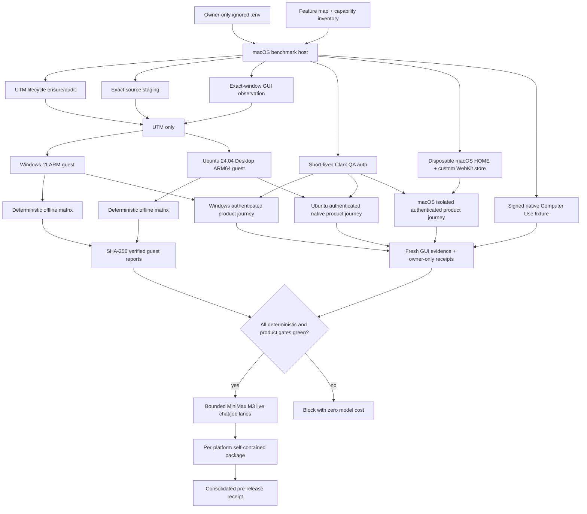

# Clark Code simulation, UTM VM QA, and real-use benchmark runbook

**Status:** living implementation and operations record; the consolidated
three-platform paid release gate remains in progress

**Last deep verification:** 2026-07-24

**Primary repository:** `clark-desktop`

**Host platform:** macOS

**Virtualization:** UTM only

**Guest platforms:** Windows 11 ARM and Ubuntu 24.04 Desktop ARM64

**Release rule:** a required VM action performed by a person is a benchmark
failure, never an instruction to the user

This document records the complete Clark Code simulation and cross-platform QA
workstream: what is being tested, how the test system is structured, how the
VMs are controlled without a person, how source and evidence integrity are
maintained, what security boundaries are enforced, what failed during
development, how those failures were diagnosed, and what remains before the
entire real-use goal can be called complete.

It is intentionally much more detailed than a quick-start guide. The intended
audience is an engineer who must reproduce, audit, extend, or recover the
benchmark without relying on oral history.

---

## 1. Executive summary

The simulation system now has four distinct evidence layers:

1. **Static capability inventory**
   maps every supported Clark Code feature, tool, native command, permission
   class, sandbox backend, computer-action type, incident state, test lane,
   platform applicability rule, and real-use scenario.
2. **Deterministic local and guest tests**
   validate implementation contracts without spending model credits.
3. **Native product journeys**
   install or launch the real desktop product, authenticate a Clark-owned QA
   identity, configure an isolated project, verify same-account provider-key
   binding, and capture fresh GUI evidence.
4. **Bounded paid real-use tests**
   use the lowest-cost supported paid model only after all deterministic,
   environment, authentication, and evidence gates are green.

The two VM paths are fully UTM-based. There is no supported Parallels path.
Provisioning, OS login, guest-agent transport, source transfer, test execution,
GUI wake/unlock, app launch, authentication-state injection, evidence capture,
receipt export, and recovery are harness responsibilities. The receipts pin
this with:

```json
{
  "required_user_vm_actions": 0,
  "manual_vm_actions_allowed": false,
  "human_input_observed": false
}
```

The current deterministic v23 guest evidence is green for both Windows and
Ubuntu against the same source archive:

```text
source SHA-256:
1d8cffb6ad03c60afdd4ae9a0555d1bbb7343c975aa67490afd597bd8cb1ee0e
```

Windows and Ubuntu each passed six applicable offline lanes, failed zero, and
skipped four platform/live-only lanes. Their exported report hashes exactly
match the hashes computed inside the guests.

The authenticated Windows and Ubuntu product journeys use a dedicated
Clark-owned QA account. A non-Clark email domain is rejected before any
session is minted or injected. Neither the account email, password, session
cookie, JWT, nor provider API key is written to a receipt.

The current macOS native boundary is green at the deterministic and
signed-fixture layers:

- the app was rebuilt and launched through the repository's stable signed
  development launcher;
- strict/deep code-signature verification and the helper self-test passed;
- Accessibility and Screen Recording were both available;
- all 38 `computer-use` tests passed;
- the signed native fixture exercised real observe/action behavior and all
  required safety assertions passed.

The host also now has an implemented isolated-product-profile harness. It uses
the same signed development bundle and TCC identity, but launches it with:

- a dedicated `WKWebsiteDataStore` identifier;
- a disposable `HOME` and `CFFIXED_USER_HOME`;
- a separate Computer Use approval-data directory;
- a Clark-owned short-lived QA session;
- a disposable workspace under `target/`;
- a newly provisioned, same-account desktop provider key that is revoked in
  cleanup.

Nine deterministic macOS product-profile contract tests pass, including a real
custom-origin WebKit persistence test. The live authenticated macOS
`auth-smoke` journey has not yet produced a passing receipt. Until that receipt
exists, the implementation is evidence that the isolation mechanism is
present, not evidence that the end-to-end authenticated product journey passed.
The existing personal product profile remains a protected read-only boundary.

The default paid test route is:

```text
clark-code:minimax_m3
```

It was selected because the checked-in pricing snapshot identifies it as the
lowest expected cost for input-heavy tool-calling tests. Paid model calls are
not part of the deterministic receipts. A user-authorized host-side
provider-local paid campaign has now run independently of the still-pending
isolated macOS product `auth-smoke`. Its current authoritative v7 receipt is
failed: skills, pong, read/search, mutation tools, permissions, and the
mutation completion token passed, but the fixture rejected `beta\n` because
it expected byte-exact `beta`. This host evidence must not be promoted into a
macOS product-journey or three-platform release pass.

---

## 2. Non-negotiable decisions

### 2.1 UTM only

Windows and Ubuntu QA use UTM. Do not install, invoke, probe, migrate back to,
or add a fallback for Parallels.

The capability contract makes this machine-readable:

- `virtualization: "utm"`
- `forbidden_virtualization: ["parallels"]`

### 2.2 Ubuntu means Ubuntu Desktop

The Ubuntu guest must be a real graphical Ubuntu Desktop installation. A
server-only or live-installer environment is not acceptable.

Readiness requires:

- installed Ubuntu Desktop rather than installer media;
- a graphical login session for the `home` QA user;
- GNOME desktop processes;
- UTM guest-agent connectivity;
- SPICE integration;
- a visible non-degenerate framebuffer;
- WebKitGTK and GTK runtime support;
- the bubblewrap sandbox prerequisite;
- a native ARM Clark Code process and visible window.

### 2.3 No user-only VM actions

There is no valid release-gating state called “the user must click/type/do this
inside the VM.”

If the harness cannot perform a VM action autonomously, the outcome is:

- `blocked`, when the environment cannot presently run the scenario; or
- `failed`, when an implemented automation contract broke.

It is never converted into a user instruction.

Physical input may exist as an optional diagnostic for investigating a broken
automation channel, but evidence produced with physical input cannot satisfy a
release gate.

### 2.4 Clark-owned QA identity only

QA authentication must use the Clark-owned domain configured by the
authentication harness. Client-owned, employee-personal, or arbitrary external
domains are forbidden.

An early QA configuration accidentally used a client-owned identity domain.
That was treated as an isolation incident, not a cosmetic typo. The active
path now:

- rejects every non-Clark domain before sign-in;
- uses a dedicated Clark-owned identity from an ignored owner-only `.env`;
- fingerprints the stable account ID without recording it directly;
- verifies that a provisioned Clark Code key belongs to that same account;
- scans tracked source for the retired client identifier;
- records only the allowed domain and non-secret account fingerprint.

External deletion or revocation of historical server-side accounts/keys is a
separate state-changing operation and requires explicit authorization.

### 2.5 Cheapest paid model, not a brand preference

The default paid route is chosen by cost and tool-calling suitability, not by
the model name originally mentioned during exploration.

Current checked-in contract:

| Field | Value |
| --- | --- |
| Route | `clark-code:minimax_m3` |
| Upstream | `minimax/minimax-m3` |
| Provider | Clark platform |
| Selection rule | lowest expected cost for input-heavy tool-calling tests |
| Maximum live tests | 3 |
| Maximum iterations per turn | 16 |
| Inter-test cost ceiling | USD 0.50 |
| Explicit deterministic mode | `--offline` |

Pricing is a dated snapshot, not an eternal truth:

| Token class | Snapshot price per million |
| --- | ---: |
| Input | USD 0.30 |
| Output | USD 1.20 |
| Cached input | USD 0.06 |

The snapshot date in the feature map is 2026-07-23. Refresh the map and justify
the selection if provider pricing changes.

### 2.6 Credentials are local configuration, never evidence

Credential values live only in ignored local configuration and normal product
credential storage inside disposable QA guests. They must not appear in:

- source archives;
- tracked files;
- shell command lines;
- test logs;
- Markdown reports;
- JSON receipts;
- screenshots;
- OCR text retained in evidence;
- error messages.

This document intentionally lists variable names but not values.

---

## 3. Source-of-truth files

The benchmark is distributed across several deliberately small contracts.
These are the files to inspect before changing behavior.

### 3.1 Capability and feature contracts

| File | Purpose |
| --- | --- |
| `harness/clark-code-feature-map.json` | Base feature map, platforms, model tools, test lanes, paid-model contract, base real-use scenarios |
| `harness/clark-code-capability-inventory.json` | Derived/native inventory, extended features, security controls, VM environments, autonomy contract, extended real-use scenarios |
| `harness/feature-matrix.mjs` | Validates inventory completeness and runs deterministic or paid lanes |

### 3.2 VM lifecycle and transport

| File | Purpose |
| --- | --- |
| `harness/utm-config.mjs` | Reads and mutates narrowly scoped UTM configuration |
| `harness/utm-autonomy.mjs` | Audits or ensures VM installation, login, guest-agent bootstrap, and recovery |
| `harness/utm-unattended-config.mjs` | Produces Windows one-shot autologon and Ubuntu Desktop autoinstall content |
| `harness/utm-qmp.mjs` | Localhost-only QMP wake and bounded keyboard bootstrap/recovery |
| `harness/utm-guest-channel.mjs` | Authenticated script/result file channel over the UTM guest agent |
| `harness/utm-window-observation.mjs` | Raises the exact UTM window and captures a fresh framebuffer |
| `harness/utm-real-use.mjs` | Read-only environment preflight |

### 3.3 Source, provisioning, and deterministic guest matrix

| File | Purpose |
| --- | --- |
| `harness/utm-source-stage.mjs` | Packages the exact dirty worktree, excludes secrets, SHA-pins, transfers, extracts, and advances guest pointers |
| `harness/utm-guest-provision.mjs` | Reconciles guest toolchains and sandbox dependencies |
| `harness/utm-guest-provision-scripts.mjs` | Platform-specific provisioning probes |
| `harness/utm-guest-benchmark.mjs` | Runs the offline matrix in Windows and Ubuntu and exports verified reports |
| `harness/utm-guest-benchmark-scripts.mjs` | Platform-specific detached benchmark jobs |

### 3.4 Product journeys and QA authentication

| File | Purpose |
| --- | --- |
| `harness/clark-qa-auth.mjs` | Loads owner-only QA configuration, enforces Clark ownership, signs in, and mints a short-lived JWT |
| `harness/clark-qa-auth.spec.mjs` | Auth-domain, JWT, cookie, and non-disclosure tests |
| `harness/utm-windows-webview.mjs` | Temporary loopback-only WebView2 CDP control and storage seeding |
| `harness/utm-windows-journey.mjs` | Authenticated installed-product journey on Windows |
| `harness/utm-ubuntu-journey-probe.mjs` | Native ARM build, atomic install, desktop-session discovery, unlock, and launch |
| `harness/utm-ubuntu-webview.mjs` | WebKit local-storage seeding, same-account key verification, and authenticated relaunch |
| `harness/utm-ubuntu-journey.mjs` | Ubuntu build and authenticated product journey with fresh screenshot/OCR evidence |
| `src-tauri/tauri.qa.macos.conf.json` | Pinned macOS QA window title and dedicated `WKWebsiteDataStore` identifier |
| `script/build_and_run.sh` | Canonical signed launcher, including isolated macOS QA build/launch modes |
| `harness/macos-webkit-runner.swift` | Hidden custom-origin `WKWebView` runner bound to the dedicated data store |
| `harness/macos-webkit-data-store.swift` | Validates, seeds, and safely probes the isolated macOS WebKit profile |
| `harness/macos-qa-profile.mjs` | Profile layout, helper build, redaction, personal-state hashing, and disposable-key cleanup primitives |
| `harness/macos-product-observation.mjs` | Exact-window capture, image validation, and privacy-preserving Vision OCR markers |
| `harness/macos-product-journey.mjs` | Autonomous signed macOS build, auth, launch, state proof, cleanup, and prior-app restoration |

### 3.5 Guest real-use packages and release consolidation

| File | Purpose |
| --- | --- |
| `harness/platform-real-use.mjs` | Runs or verifies a platform-specific real-use observation/matrix |
| `harness/platform-real-use-package.mjs` | Independently verifies and copies guest evidence packages |
| `scripts/run-pre-release-benchmarks.sh` | Consolidates deterministic, paid, UTM, and three-platform real-use receipts |

### 3.6 Tests

| File | Purpose |
| --- | --- |
| `harness/utm-real-use.spec.mjs` | UTM parsing, transport, autoinstall, provisioning, source, GUI, Windows WebView, Ubuntu WebKit, and auth contracts |
| `harness/platform-real-use.spec.mjs` | Observation integrity, human-input rejection, paid/offline rules, packaging, and CLI behavior |
| `harness/macos-product-journey.spec.mjs` | macOS store identity, launcher isolation, redaction, key selection, personal-state hashing, real WebKit persistence, and crash-avoidance contracts |

---

## 4. End-to-end architecture



### 4.1 Important separation of concerns

Do not collapse these into one ambiguous “VM test passed” statement:

- VM installation is not product readiness.
- Product readiness is not feature coverage.
- Deterministic feature coverage is not paid-provider proof.
- A tool action transcript is not GUI-state proof.
- A screenshot is not proof that the intended source was tested.
- A source hash is not proof that the installed product used that source.
- A preflight receipt is not a real-use receipt.

Each layer has a separate receipt because each answers a different question.

---

## 5. VM inventory and host topology

### 5.1 Windows

| Property | Value |
| --- | --- |
| VM name | `Clark QA - Windows 11 ARM` |
| UUID | `95A632BC-CCB1-4EE4-95F0-8AD7609DECF6` |
| Architecture | Windows 11 ARM |
| QMP port | `47111` |
| QMP bind | `127.0.0.1` |
| Product executable | `C:\Users\home\AppData\Local\Clark Code\clark-desktop.exe` |
| QA fixture | `C:\Users\home\ClarkCodeQA` |
| Native product Computer Use | unsupported on Windows |
| Harness computer control | UTM QMP, guest agent, temporary guest-loopback WebView2 CDP |

### 5.2 Ubuntu

| Property | Value |
| --- | --- |
| VM name | `Clark QA - Ubuntu 24.04 Desktop` |
| UUID | `F7B555EF-F2BB-463D-9702-9C8BA84C446A` |
| Architecture | `aarch64` |
| QMP port | `47112` |
| QMP bind | `127.0.0.1` |
| Installed binary | `/opt/Clark Code/clark-code` |
| Stable launcher | `/usr/local/bin/clark-code` |
| Desktop entry | `/usr/local/share/applications/com.clark.desktop.dev.desktop` |
| QA fixture | `/home/home/ClarkCodeQA` |
| Product data root | `/home/home/.local/share/com.clark.desktop.dev` |
| Native product Computer Use | unsupported on Ubuntu |
| Harness computer control | UTM guest agent, QMP wake/unlock support, exact-window capture |

### 5.3 Local configuration variable names

VM credentials:

```text
CLARK_QA_VM_USERNAME
CLARK_QA_VM_PASSWORD
```

Clark QA authentication:

```text
CLARK_QA_AUTH_NAME
CLARK_QA_AUTH_EMAIL
CLARK_QA_AUTH_PASSWORD
```

Paid Clark Code model:

```text
CLARK_CODE_API_KEY
```

Local macOS development signing:

```text
APPLE_SIGNING_IDENTITY
```

`script/build_and_run.sh` defaults to a non-personal certificate fingerprint
and accepts `APPLE_SIGNING_IDENTITY` as the explicit override. Do not restore a
human-readable certificate label to tracked source. The signing identity is not
a Clark application credential, but a keychain label can include personal
identifying text. Treat any override as local-only and record only a team
identifier or certificate fingerprint in publishable evidence.

The macOS QA launcher also consumes this transient harness-owned variable:

```text
CLARK_QA_MACOS_HOME
```

Operators normally do not set it by hand. `macos-product-journey.mjs` creates a
new mode-`0700` directory beneath `target/`, passes it to the launcher, and
removes it in cleanup. The launcher rejects a missing path, symlink, path
outside this repository's `target/`, or group/other-accessible directory.

Release-specific paid gate, where applicable:

```text
CLARK_CODE_PRERELEASE_API_KEY
CLARK_CODE_PRERELEASE_LIVE
```

The repository `.env` and `.env.utm` must be ignored and mode `0600`.
Application `.env.local` is also ignored. Never copy these files into a guest
source tree.

---

## 6. Autonomous lifecycle

### 6.1 Audit versus ensure

Use audit when you want a read-only answer:

```bash
node harness/utm-autonomy.mjs audit --platform all
```

Use ensure when the requested outcome authorizes lifecycle repair:

```bash
node harness/utm-autonomy.mjs ensure --platform all
```

`ensure` owns:

- VM start;
- unattended OS installation where needed;
- guest-agent bootstrap;
- display/session recovery;
- autonomous login;
- one-time setup suppression;
- clean reboot;
- verification that temporary login secrets were erased;
- receipt creation.

### 6.2 Windows autonomous login

Windows uses one-shot autologon only as a bootstrap/recovery mechanism.

Security requirements:

- `AutoLogonCount` bounds use;
- the temporary Winlogon password value is removed after the GUI starts;
- a scheduled cleanup task removes residual values;
- the cleanup task unregisters itself;
- the postcondition verifies no plaintext autologon secret remains.

The permanent automation interface is the authenticated UTM guest-agent file
channel, not indefinite autologon.

### 6.3 Ubuntu autonomous install and login

Ubuntu uses a Canonical Desktop autoinstall with NoCloud `cidata`.

Required autoinstall properties:

- `id: ubuntu-desktop`;
- `qemu-guest-agent`;
- `spice-vdagent`;
- normal `home` user;
- a password hash, never a plaintext password in autoinstall content;
- GDM automatic login for the disposable QA user;
- GNOME initial-setup completion marker;
- poweroff at the end of installation.

The harness ejects installer media through the UTM configuration boundary,
reboots, and validates the installed desktop. A visible live installer does
not count as readiness.

### 6.4 QMP scope

QMP is bound to localhost and used only for:

- wake;
- boot/login bootstrap;
- bounded recovery input;
- opening the Windows Run dialog to launch a known executable.

It is not the primary guest command transport and is not exposed to the
network.

Host-wide synthetic keyboard input was found unreliable for VM automation:
focus drift and key repetition can corrupt guest input. VM-scoped QMP is the
preferred fallback because it targets the guest directly.

---

## 7. Authenticated guest command channel

The guest channel exists because a successful `utmctl exec` return is not
enough evidence. UTM diagnostics, stale files, short launcher timeouts, and
partial file visibility can otherwise be mistaken for execution success.

### 7.1 Protocol

For every command:

1. Generate a cryptographically random marker.
2. Generate a random script basename.
3. Build a platform-specific script:
   - Python on Ubuntu;
   - PowerShell on Windows.
4. Push the script through `utmctl file push`.
5. Pull the script back and require exact byte-for-byte equality.
6. Retry the read-back barrier up to three bounded attempts.
7. Execute synchronously or launch a detached job.
8. Poll for a JSON output file.
9. Accept only a JSON object containing the unpredictable marker.
10. Delete script, output, and log files.
11. Return whether cleanup succeeded.

### 7.2 Why the read-back barrier matters

UTM can acknowledge a file push before the guest sees the final bytes. Before
the barrier was added, a command could execute a missing or partial script.
The failure looked like a random syntax or file-not-found error.

The correct contract is:

```text
push acknowledged
    is not enough
pulled bytes == pushed bytes
    is required before execution
```

### 7.3 Detached jobs

Long Rust/Node builds exceed UTM's short synchronous event window.

Detached execution:

- launches a background process;
- returns quickly from the guest-agent request;
- writes a marker-authenticated result file;
- lets the host poll for up to the configured benchmark timeout;
- preserves guest logs and exit codes;
- avoids treating a launcher timeout as a test timeout.

### 7.4 Secret-bearing probes

The Ubuntu authenticated journey temporarily embeds a short-lived session in a
random probe script. That is allowed only because:

- the source file is transferred through the guest-agent channel, not placed
  on a shell command line;
- exact script contents are never logged;
- result JSON contains only booleans and non-secret metadata;
- JWT/provider-key redaction is applied to diagnostics;
- the probe script/result/log are deleted;
- `cleanup_succeeded` must be true;
- the product's normal guest-local profile is the only remaining credential
  store.

A passed authenticated journey requires:

```json
{
  "sensitive_transfer_erased": true,
  "credential_recorded": false
}
```

---

## 8. Exact source staging

### 8.1 Why the dirty worktree is staged

Clark Desktop is developed with concurrent local changes. Testing only `HEAD`
would often test code different from the working product.

The source packager enumerates:

- tracked files;
- non-ignored untracked files.

It intentionally excludes ignored files, including `.env` and generated
targets.

### 8.2 Path safety

Every archive member must:

- be relative;
- contain no `..` segment;
- contain no backslash;
- contain no newline or carriage return;
- be a regular file;
- avoid Windows-reserved path segments;
- avoid secret-bearing `.env` names.

One untracked host artifact named `NUL` exists. `NUL` is a reserved Windows
device name and cannot be extracted as a normal source file. The packager
explicitly excludes only that known artifact and records:

```json
{
  "path": "NUL",
  "reason": "Windows-reserved untracked artifact"
}
```

Any other Windows-reserved path is an error.

### 8.3 Archive integrity

The staging pipeline:

1. writes an owner-only tarball;
2. checks archive members for AppleDouble/`__MACOSX` contamination;
3. computes SHA-256;
4. pushes the same bytes to each guest;
5. recomputes SHA-256 inside each guest;
6. extracts into a hash-addressed directory;
7. rejects path escape and links on Ubuntu;
8. writes `.source-sha256`;
9. advances a stable `source-current.txt` pointer;
10. verifies file count, marker, pointer, and absence of `.env`.

Windows pointer:

```text
C:\ClarkQA\source-current.txt
```

Ubuntu pointer:

```text
/opt/clark-qa/source-current.txt
```

### 8.4 Current v23 source receipt

Receipt:

```text
target/utm-source-stage/current-v23/receipt.json
```

Key facts:

| Field | Value |
| --- | --- |
| Status | passed |
| Archive SHA-256 | `1d8cffb6ad03c60afdd4ae9a0555d1bbb7343c975aa67490afd597bd8cb1ee0e` |
| Source files | 923 |
| Ignored `.env` included | false |
| Credentials recorded | false |
| Windows pointer | verified |
| Ubuntu pointer | verified |
| User VM actions | 0 |

Each guest contains 924 files because `.source-sha256` is written after
extraction.

### 8.5 Shared-worktree drift after a source freeze

The repository is intentionally shared by concurrent agents. A valid source
receipt freezes a point-in-time snapshot; it does not prevent another agent
from editing the working tree afterward.

This happened after v23 was staged and tested. A byte comparison between the
v23 archive and the live tree found later edits in:

- `src-tauri/src/commands/cloud_conversations.rs`;
- `src-tauri/src/trajectory/outbox.rs`;
- `src-tauri/src/trajectory/outbox/recovery.rs`;
- `src-tauri/src/trajectory/outbox/tests.rs`;
- this documentation file, which was created after the test snapshot.

The v23 receipts remain valid evidence for the immutable v23 archive. They are
not evidence for those later edits.

The recovery rule is:

1. do not revert or overwrite the concurrent changes;
2. inspect whether the change is coherent;
3. run the smallest relevant local tests;
4. wait for a stable boundary;
5. stage a new source archive;
6. rerun the affected/full guest evidence required by risk;
7. retain both source hashes so historical receipts remain interpretable.

For the outbox drift above, the targeted `clark-desktop` outbox tests passed
seven of seven on the live tree. That local result still does not convert the
v23 VM receipt into evidence for the newer tree.

The subsequent check-only formatter gate reported pending formatting in
`cloud_conversations.rs` and `outbox/recovery.rs`. Those files belong to the
concurrent change, so the simulation workstream did not run a write-mode
formatter or alter them. Do not stage v24 as a release candidate until the
owning workstream finishes and `cargo fmt --all --check` is green.

---

## 9. Guest provisioning

Provisioning is idempotent and runs after source staging.

```bash
node harness/utm-guest-provision.mjs ensure \
  --platform all \
  --out target/utm-provision/current-v23
```

### 9.1 Common requirements

- pinned/frozen JavaScript dependencies;
- Rust toolchain;
- native compiler/linker;
- Playwright browser shell;
- `ripgrep`;
- platform sandbox backend;
- guest source pointer;
- architecture appropriate to the guest.

### 9.2 Ubuntu requirements

Provisioning validates or installs:

- official Node archive from `nodejs.org`;
- official rustup distribution from `static.rust-lang.org`;
- WebKitGTK 4.1 development/runtime packages;
- GTK 3;
- bubblewrap;
- `ripgrep`;
- X11 inspection support;
- AppArmor state compatible with the tested bubblewrap profile.

The harness must not globally disable
`apparmor_restrict_unprivileged_userns`. The desired state is a narrowly
verified bubblewrap sandbox, not a host-wide security downgrade.

### 9.3 Windows requirements

Provisioning validates:

- official Node package;
- official Git for Windows release;
- official rustup distribution;
- Authenticode signature;
- Visual Studio Build Tools;
- ARM64 MSVC tools;
- LLVM/Clang native desktop components.

Windows setup paths that require elevation must fail closed if elevation was
not explicitly part of the automation contract.

### 9.4 Current receipt

```text
target/utm-provision/current-v23/receipt.json
```

Both guests passed with zero user VM actions.

---

## 10. Feature coverage map

Current validated totals:

| Inventory | Count |
| --- | ---: |
| Base features | 28 |
| Extended features | 23 |
| Total feature groups | 51 |
| Model tools | 70 |
| Native commands | 85 |
| Security controls | 31 |
| Test lanes | 10 |
| Real-use scenarios | 13 |
| Provider operations | 15 |
| Provider implementations | 3 |
| Coding models | 7 |
| Settings sections | 7 |
| Desktop plugins | 9 |
| Workspace crates | 15 |
| Permission modes | 3 |
| Permission classes | 4 |
| Sandbox backends | 3 |
| Computer action kinds | 8 |
| Computer action risks | 7 |
| Incident scopes | 5 |
| Incident categories | 4 |
| Incident statuses | 5 |

### 10.1 Base features

1. `filesystem_read_search`
2. `filesystem_mutation`
3. `shell_process_lifecycle`
4. `planning`
5. `persistent_goals`
6. `effect_verification`
7. `document_conversion`
8. `external_research`
9. `deferred_tool_discovery`
10. `skills`
11. `durable_memory`
12. `browser_automation`
13. `image_generation`
14. `organization_knowledge`
15. `android_emulator`
16. `ios_simulator`
17. `bounded_orchestration`
18. `computer_use_perception`
19. `computer_use_prepare_commit`
20. `conversation_streaming_and_control`
21. `permissions_and_sandbox`
22. `attachments_artifacts_and_previews`
23. `git_changes_checkpoints_and_worktrees`
24. `integrated_terminal`
25. `mcp_and_remote_ssh`
26. `cloud_auth_history_sync_and_share`
27. `updates_packaging_and_single_instance`
28. `cheapest_paid_live_chat_and_job_round_trip`

### 10.2 Extended features

1. `provider_backends_and_capabilities`
2. `session_lifecycle_and_environment_binding`
3. `active_run_controls_compaction_steering`
4. `modes_personas_and_side_questions`
5. `command_instruction_and_skill_pack_management`
6. `desktop_computer_use_permissions_and_receipts`
7. `native_sandbox_setup_and_platform_containment`
8. `local_project_context_and_memory_views`
9. `document_image_artifact_export`
10. `branch_worktree_diff_and_checkpoint_management`
11. `account_key_billing_and_repository_knowledge`
12. `cloud_conversation_crud_sync_share_archive`
13. `mobile_remote_control_attachments_repository_sync`
14. `terminal_pty_lifecycle`
15. `app_lifecycle_autostart_single_instance_deep_link_notifications`
16. `settings_accessibility_and_preferences`
17. `model_catalog_and_per_chat_selection`
18. `provider_incidents_retries_and_resilience`
19. `developer_bridge_and_fixture_harnesses`
20. `packaging_signing_updater_and_release_artifacts`
21. `multi_repo_orchestration_benchmarks`
22. `work_graph_orchestration_benchmarks`
23. `install_context_and_bundled_tools`

### 10.3 Test lanes

| Lane | Kind | Platforms |
| --- | --- | --- |
| `frontend_contract` | simulated | macOS, Windows, Ubuntu |
| `rust_contract` | simulated | macOS, Windows, Ubuntu |
| `computer_use_contract` | simulated | macOS, Windows, Ubuntu |
| `sandbox_contract` | simulated | macOS, Windows, Ubuntu |
| `webkit_contract` | simulated | macOS |
| `attachment_contract` | simulated | macOS |
| `resilience_contract` | simulated | macOS, Windows, Ubuntu |
| `utm_harness_contract` | simulated | macOS |
| `platform_real_use_contract` | simulated | macOS, Windows, Ubuntu |
| `cheapest_paid_live_chat_jobs` | live paid | macOS, Windows, Ubuntu |

### 10.4 Real-use scenarios

Base scenarios:

- macOS: `mac_app_startup_auth_and_project`
- macOS: `mac_computer_use_safety`
- macOS: `mac_terminal_browser_attachments`
- Windows: `windows_clean_start_and_sandbox`
- Windows: `windows_paid_model_and_project_tools`
- Windows: `windows_platform_exclusions`
- Ubuntu: `ubuntu_install_and_desktop_start`
- Ubuntu: `ubuntu_paid_model_and_bubblewrap`
- Ubuntu: `ubuntu_feature_surface`

Extended scenarios:

- macOS: `mac_full_product_journey`
- macOS: `mac_native_computer_use_journey`
- Windows: `windows_utm_full_product_journey`
- Ubuntu: `ubuntu_utm_desktop_full_product_journey`

Every feature supported on a platform must be covered by at least one exact
scenario. Adding a feature without scenario coverage makes validation fail.

---

## 11. Security control inventory

The current 31 controls are:

1. project-root containment;
2. read-before-mutation and stale-read rejection;
3. allow/ask/deny tool policy;
4. local, external, and brokered permission classes;
5. scoped remembered-command authority;
6. separate authority for network commands;
7. native network denial;
8. Seatbelt, bubblewrap, and restricted-token backends;
9. explicit Windows elevation;
10. remote-execution capability token;
11. secret redaction in live receipts;
12. bounded shell output and runtime;
13. bounded web-fetch size, timeout, and redirects;
14. bounded attachment extraction;
15. Accessibility and Screen Recording requirements;
16. signed parent/helper authentication;
17. fresh single-use observation binding;
18. trusted action risk reclassification;
19. fail-closed browser targeting in generic accessibility;
20. credential/protected-text detection;
21. prepare/commit expiry and approval revision;
22. physical-user takeover cancellation;
23. computer-input rate and payload limits;
24. durable app approval and bounded receipts;
25. cancellation waits for input quiescence;
26. account-partitioned cloud history;
27. updater signature and safe drain;
28. development/release identity separation;
29. boundary-specific redacted provider incidents;
30. update drain preserves active and permission-waiting runs;
31. owner-only Windows evidence ACL.

These controls are mapped to concrete files and test lanes in
`clark-code-capability-inventory.json`.

---

## 12. macOS native Computer Use model

Clark Code's native Computer Use is currently a macOS feature. VM harness
control and product-native Computer Use are different systems and must not be
conflated.

### 12.1 Required macOS permissions and stable identity

The signed development app/helper requires:

- Accessibility permission;
- Screen Recording permission.

The development launcher is:

```bash
./script/build_and_run.sh --verify
```

Do not open a raw debug bundle. The launcher:

1. builds/stages the frontend and native application;
2. stages the bundled tools and native helper;
3. assigns the separate `Clark Code Dev` product identity;
4. applies a stable Apple Development signature;
5. signs nested code before the outer app;
6. verifies the resulting bundle;
7. launches that exact staged bundle.

The stable development identity matters because macOS TCC grants are
code-identity-sensitive. Rebuilding or launching an unsigned/raw bundle can
make an existing Accessibility or Screen Recording grant appear to vanish,
even though the user previously granted it to what looked like the same app.

Current verified bundle:

```text
target/debug/bundle/macos/Clark Code Dev.app
```

Current non-secret identity facts:

| Property | Current value |
| --- | --- |
| Bundle identifier | `com.clark.desktop.dev` |
| Host architecture | `arm64` |
| Host signing mode | Apple Development, hardened runtime |
| Helper architecture | `arm64` |
| Helper relationship | signed by the same development team as the host |
| Strict/deep signature check | passed |
| Helper self-test | passed |

Do not copy the certificate display label into public evidence. A local Apple
Development identity may embed an email address or human name even though the
certificate label is not an application credential.

### 12.2 Development signing is not distribution notarization

There are three separate claims:

1. nested code and the app have internally valid matching signatures;
2. the local development identity is trusted for development/TCC purposes;
3. a release artifact is Developer ID signed, notarized, and accepted by
   Gatekeeper for distribution.

The current run proves claims 1 and 2. It does not claim 3.

`codesign --verify --deep --strict` passed. A direct `spctl` assessment of the
local Apple Development bundle rejected it because it is not a distribution
artifact. That is expected for this development lane and must not be
misdiagnosed as a broken nested signature or failed TCC identity. Distribution
readiness requires the separate packaging/notarization workflow.

### 12.3 Safety protocol

Computer Use follows an observe/prepare/commit model:

1. capture a fresh observation;
2. bind an intended action to that observation;
3. classify action risk;
4. require the applicable approval revision;
5. commit once before expiry;
6. produce an action receipt;
7. capture the target state again.

An action transcript alone is not success. A fresh post-action observation
must show the intended state.

Observation freshness is security-relevant, not merely a test convenience.
Coordinates, target processes, focused controls, and protected-field state can
change between observation and input. A stale observation is rejected rather
than optimistically applied to whatever now occupies the same screen position.

### 12.4 Fail-closed behavior

The current controls cover:

- forged or stale observations;
- expired prepare tokens;
- reuse of a single-use observation;
- browser targets through generic Accessibility;
- protected/credential text;
- signed parent/helper mismatch;
- user takeover during input;
- cancellation while input is still in flight;
- excessive input rate;
- excessive payload size;
- unapproved high-risk action;
- target-app approval persistence and limits.

The signed fixture specifically demonstrated:

- redacted text in the action receipt;
- stale-observation rejection;
- mandatory handoff for secure fields;
- cancellation reaching a quiescent input state;
- refusal of forbidden Terminal targeting;
- refusal of forbidden browser targeting;
- successful fixture launch and allowed fixture actions.

### 12.5 Current deterministic and signed-native evidence

The current Rust contract result is:

```text
cargo test -p computer-use
38 passed; 0 failed
```

That total consists of 37 unit-level tests plus one native test.

The signed fixture command is:

```bash
./scripts/run-computer-use-native-fixture-smoke.sh \
  --output target/computer-use-native-smoke/current-macos-signed-v1 \
  --signing-identity "$APPLE_SIGNING_IDENTITY"
```

The signing identity variable must come from ignored local configuration. Do
not paste its value into this document, a CI log, or a published receipt.

Current signed fixture receipt:

```text
target/computer-use-native-smoke/current-macos-signed-v1/receipt.json
```

Verified fields:

| Field | Value |
| --- | --- |
| Benchmark | `clark_code_native_computer_use_smoke` |
| Status | passed |
| Host platform | macOS |
| Target | `aarch64-apple-darwin` |
| Source working tree | dirty; see source-boundary note below |
| Accessibility | true |
| Screen Recording | true |
| Code-sign verification | passed |
| Helper self-test | passed |
| Consequential-action dry run | passed |
| Forbidden Terminal check | passed |
| Forbidden browser check | passed |
| Fixture launch | passed |
| Fixture actions | passed |
| Smoke process | passed |
| Redacted text assertion | true |
| Stale observation rejected | true |
| Secure field mandatory handoff | true |
| Cancellation quiesced | true |
| Physical takeover required | false |
| Physical takeover status | not requested |
| Credential recorded | false |

The receipt hashes its log, host executable, helper executable, and fixture
executable. The `source_dirty: true` field is important: this receipt proves
the behavior of the locally built working tree at the recorded time, but the
Git revision alone is not an immutable description of every input byte. A
release-consolidation receipt must either pin an exact staged source archive
or explicitly retain this dirty-source qualification.

The fixture's `physical_takeover.status: "not_requested"` is correct. Physical
human input is an optional diagnostic and is not a release requirement.
Takeover policy is covered by deterministic contracts; manufacturing human
input solely to turn that receipt field green would violate the benchmark's
zero-required-human-action principle.

### 12.6 App targeting and duplicate bundle identifiers

Several local development bundles can share the same bundle identifier.
Targeting only `com.clark.desktop.dev` can therefore attach automation to the
wrong copy, a stale build, or a bundle outside this repository.

For current-product inspection, target the full path:

```text
/Users/stan/Documents/git/clark-desktop/target/debug/bundle/macos/Clark Code Dev.app
```

After targeting it:

1. capture a fresh app state;
2. verify the process path or exact launched bundle;
3. verify visible product state;
4. perform the bounded action;
5. capture another fresh state.

Never infer that the frontmost window came from the intended source build based
on its title or bundle identifier alone.

### 12.7 Product profile isolation boundary

The current signed development app opened successfully and its real UI was
inspected. It was already authenticated to an existing personal product
profile. No personal identifier is reproduced here.

That observation establishes:

- the signed app launches;
- its WebView renders;
- the authenticated workspace UI is healthy;
- project, model, mode, and composer controls are visible to Accessibility.

It does **not** establish a Clark-owned QA product journey. The following are
forbidden:

- replacing the personal session with a QA session in-place;
- injecting a QA provider key into the personal profile;
- creating paid QA jobs from the personal account;
- copying raw WebView/local-storage values into diagnostics;
- assuming backup/restore of the personal profile is lossless;
- cloning/changing the bundle identity without re-evaluating TCC and
  host/helper signing relationships.

The harness now implements a genuinely isolated product profile and data store
that is designed to:

1. leaves the existing personal profile byte-for-byte untouched;
2. uses the Clark-owned QA identity;
3. binds the provider key to the same QA account;
4. has a separate isolated project/workspace;
5. preserves the signed host/helper identity required by native Computer Use;
6. records only redacted, owner-only evidence;
7. can be cleaned or rotated autonomously.

The mechanism is implemented and its deterministic contracts pass. The
remaining gate is execution of the real authenticated `auth-smoke` journey and
production of a passing receipt; an implementation plus unit/integration tests
must not be promoted into a live-product claim.

#### 12.7.1 Why the bundle identity stays the same

Changing the bundle identifier would create a second TCC identity and would
invalidate the most important property of this lane: the QA product must run
through the same signed host/helper relationship that native Computer Use uses
in development.

The isolation design therefore preserves:

- bundle identifier `com.clark.desktop.dev`;
- exact bundle path under this repository's `target/debug/bundle/macos`;
- stable development-signing identity;
- nested-helper-first signing order;
- hardened-runtime options;
- Accessibility and Screen Recording grants associated with that code
  identity.

It varies storage roots and WebKit's data-store identifier, not application
identity.

#### 12.7.2 Dedicated WebKit data store

`src-tauri/tauri.qa.macos.conf.json` is merged after the normal macOS sandbox
and Computer Use configs. It gives the main window:

- title `Clark Code Dev QA`;
- a fixed 16-byte `dataStoreIdentifier`;
- the same normal product dimensions and rendering settings.

The identifier is represented in source as both a UUID string and the exact
byte sequence expected by Tauri/Wry. A contract test converts the bytes back to
the UUID and requires exact equality. The value is intentionally stable across
QA builds so the seeding helper and product resolve the same store. It is
different from the personal profile's default data store.

On current Tauri/Wry, this reaches WebKit through
`WKWebsiteDataStore(forIdentifier:)`. The mechanism requires macOS 14 or later;
the verified host is newer than that floor.

#### 12.7.3 Disposable native and Foundation roots

A custom WebKit identifier is necessary but not sufficient. Tauri native data,
Foundation application support, caches, preferences, and Computer Use approval
records can otherwise still resolve through the login user's normal home.

The QA launch sets all of the following before process creation:

```text
HOME=<disposable QA home>
CFFIXED_USER_HOME=<same disposable QA home>
TMPDIR=<disposable QA home>/tmp
CLARK_COMPUTER_USE_DATA_DIR=<disposable QA home>/Library/Application Support/Clark Code/Computer Use
```

`HOME` redirects Rust/Tauri directory resolution. `CFFIXED_USER_HOME` redirects
Foundation and WebKit behavior that does not reliably follow `HOME` alone.
Both are load-bearing. `TMPDIR` prevents transient application files from
falling back to the normal user temp root. The explicit Computer Use directory
separates durable per-app approvals and receipts from the personal product
profile.

The launcher uses `/usr/bin/open -n --env ...` so the environment is attached
to the new application instance. It does not mutate the login shell or the
user's global environment.

#### 12.7.4 Launcher modes and signing invariants

The canonical launcher supports:

| Mode | Meaning |
| --- | --- |
| `--build` | normal signed development build, no launch |
| `--verify` | normal signed build, strict verification, helper self-test, launch |
| `--qa-build` | signed build with the QA Tauri config, no launch |
| `--qa-launch` | verify and launch the existing QA bundle using the isolated environment |
| `--qa-verify` | build, sign, verify, self-test, and launch in QA mode |

All build modes stage the bundled tools and native helper before Tauri
packaging. All macOS modes require a stable signing identity, verify the
finished app with `codesign --verify --deep --strict`, and execute the helper
self-test. Nested Swift runtime and helper code is signed before the outer app.

The QA journey intentionally separates `--qa-build` from `--qa-launch`. It
finishes the expensive build before minting a short-lived JWT, preserving as
much of the token lifetime as possible for the actual authenticated product
work.

#### 12.7.5 WebKit seeding helper

The seeding helper is a small ad-hoc-signed `.app`, not a raw executable. It
uses the same bundle identifier because WebKit storage resolution is
application-identity-sensitive. Its minimum system version is macOS 14 and it
runs as a background-only app.

The helper creates a hidden off-screen `WKWebView`, binds it to the pinned
custom data-store UUID, registers a minimal `WKURLSchemeHandler`, and loads
`tauri://localhost/`. It then uses JavaScript `localStorage` APIs on the real
Clark origin. This avoids editing undocumented WebKit databases directly on
macOS.

The helper is deliberately limited to two operations:

- `seed`: validate an owner-only bootstrap and write auth, settings, and a
  random run marker;
- `probe`: read the product-updated state and emit only safe booleans and
  non-secret classifications.

There is no generic JavaScript option, arbitrary-origin option, key dump, or
raw local-storage export.

#### 12.7.6 Bootstrap validation

The transient bootstrap can contain a session credential, so the helper
accepts it only when every invariant holds:

- regular file;
- not a symlink;
- owned by the current user;
- no group or other permission bits;
- non-empty and at most 128 KiB;
- valid expected JSON shape;
- email domain exactly `clarkslabs.com`;
- non-empty stable user identity;
- secure `wss://` Clark endpoint;
- JWT-shaped Clark token;
- absolute existing project below `target/macos-qa-workspaces/`;
- model exactly `clark-code:minimax_m3`;
- run marker is a valid UUID.

The file is created mode `0600`, used once, and unlinked immediately after a
successful seed. Cleanup attempts the unlink again in `finally`, including
failure paths.

The seed writes an empty provider key and empty provider-key owner. That is
intentional: the real product must provision its own desktop key for the
authenticated QA account. Pre-injecting a provider key would bypass the
same-account binding behavior the journey is meant to test.

#### 12.7.7 Product-state probe

After launch and visual observation, the app is stopped before the helper
reopens the custom store. The probe validates:

- account ID hashes to the expected non-secret account fingerprint;
- email domain is Clark-owned;
- Clark endpoint remains secure;
- session token has JWT shape;
- decoded JWT has a future expiry;
- decoded JWT has an HTTPS issuer;
- project path equals the disposable workspace;
- model equals the pinned cheapest route;
- a Clark desktop provider key is present;
- provider-key owner equals `id:<current account id>`;
- random run marker is unchanged.

The probe emits no token, key, raw account ID, email address, project content,
or local-storage payload. It returns booleans, the allowed domain, and a
generic failure message.

#### 12.7.8 Personal-state integrity proof

Before seeding the QA profile, the journey stops every `clark-desktop` process
and fingerprints the personal roots:

```text
~/Library/WebKit/com.clark.desktop.dev
~/Library/Caches/com.clark.desktop.dev
~/Library/Application Support/com.clark.desktop.dev
~/Library/Preferences/com.clark.desktop.dev.plist
~/Library/Application Support/Clark Code/Computer Use
```

The fingerprint covers path names, type, mode, size, modification time, and
file contents in deterministic order. Missing roots are represented explicitly
rather than ignored. Symlinks are hashed as symlink metadata and never
followed.

The same roots are fingerprinted after the QA app stops and the isolated home
is removed. A passing journey requires exact combined-digest equality. The
receipt records only:

- unchanged/changed boolean;
- entry count before;
- entry count after;
- `personal_state_digests_recorded: false`.

The personal digests themselves are intentionally not written to the receipt.
Even a digest of personal state is unnecessary evidence and could become a
stable cross-run identifier.

This proof is stricter than “the expected personal database file did not
change.” It will also detect unexpected cache, preference, approval, or native
application-data mutation.

#### 12.7.9 Disposable provider-key proof and revocation

Before app launch, the harness lists the QA account's platform keys using the
short-lived session. After the product initializes, it lists them again and
selects keys that:

- did not exist before the run; and
- have purpose `clark_code_desktop`.

Exactly one new desktop key is required. In `finally`, every detected new key
is revoked. The receipt includes only created and revoked counts and
`identifiers_recorded: false`. A malformed identifier is rejected before any
delete request.

This distinction matters:

- seeing a key in local storage proves the product received one;
- matching `apiKeyOwner` proves account binding;
- observing one new server-side desktop key proves the product created a
  disposable credential for this run;
- successful DELETE proves cleanup;
- none of those require exposing the key value or key ID.

If the journey fails after the server creates the key but before the normal
post-launch comparison, cleanup performs another list-and-diff attempt. A
cleanup failure fails the entire journey.

#### 12.7.10 Profile, workspace, and app restoration

The `finally` path:

1. stops the isolated Clark process;
2. discovers and revokes any new desktop key;
3. erases the transient bootstrap;
4. removes the disposable QA home recursively;
5. fingerprints personal state again;
6. removes the disposable workspace root;
7. rebuilds the normal non-QA app configuration;
8. relaunches it only if Clark was running before the journey;
9. verifies that the prior running/not-running state was restored.

The recursive deletion target is not an environment-variable wildcard. It is a
path created by the harness beneath a newly created output directory in
`target/`, validated before use. The journey refuses to overwrite an existing
output directory.

The normal rebuild is required because the QA and normal configurations target
the same development bundle path. Without restoration, a successful QA build
would leave the shared bundle carrying the QA window/store configuration even
after the disposable profile was deleted.

#### 12.7.11 Why the public WebKit removal API is not used

On the verified macOS 26.4.1 host, invoking
`WKWebsiteDataStore.remove(forIdentifier:)` for a previously used custom store
reproducibly terminated the helper with `SIGSEGV` inside WebKit/WTF run-loop
dispatch. The behavior occurred both in the compiled helper experiment and a
minimal Swift invocation. Repeating the call did not produce new information.

The production helper therefore has no direct removal operation. A regression
test requires the source not to contain `WKWebsiteDataStore.remove`.

Cleanup instead relies on containment:

1. set `HOME` and `CFFIXED_USER_HOME` before any WebKit object is created;
2. verify the custom store appears below
   `<qa-home>/Library/WebKit/com.clark.desktop.dev/WebsiteDataStore`;
3. terminate all Clark/helper use of the store;
4. remove the validated disposable QA home;
5. prove the personal roots are unchanged.

This is not a workaround to hide an unexplained artifact. It is the safer
deletion boundary on the observed OS: delete a harness-owned directory after
process quiescence instead of calling an API that crashes in the system
framework.

#### 12.7.12 Deterministic test evidence

The current product-profile contract suite contains nine tests and passes:

1. pinned window title and UUID byte representation;
2. QA launcher modes, environment isolation, and absence of an email-like
   signing label in tracked launcher source;
3. output containment beneath `target/`;
4. provider-key/JWT/email redaction;
5. new desktop-key selection;
6. stable personal-state hashing plus mutation detection;
7. safe final-JSON helper result parsing;
8. a real custom-origin WebKit seed that persists only beneath a disposable QA
   home;
9. deliberate absence of the crashing direct WebKit removal API.

Command:

```bash
pnpm --dir harness run test:macos-product
```

Passing these tests does not mint a real QA session, provision a production
desktop key, or call a paid model. The end-to-end authenticated command is a
separate gate.

### 12.8 Native-smoke receipt privacy gotcha

The current native-smoke receipt includes the raw code-signing certificate
display label under `signing_identity`. That label can contain personal
identifying text. It is not a Clark login secret, but it is still inappropriate
for a broadly published benchmark artifact.

Until the receipt schema records only a non-personal team identifier and/or
certificate fingerprint:

- keep the receipt owner-only;
- do not paste it wholesale into issues, chat, or release notes;
- select only safe fields with `jq` during review;
- do not mistake `credential_recorded: false` for “contains no personal
  metadata.”

### 12.9 Platform boundary

Windows and Ubuntu currently report product-native Computer Use as unsupported.
The UTM harness can still:

- control VM lifecycle;
- launch the app;
- seed product state;
- inspect the guest;
- capture the UTM framebuffer.

That is harness automation, not a claim that Clark's native Computer Use helper
supports those operating systems.

---

## 13. Windows implementation findings

### 13.1 PTY environment inheritance

#### Symptom

Commands available in a normal Windows shell were missing inside the
portable-pty child.

#### Root cause

The PTY library reconstructed Windows environment state from the Registry and
could overwrite the current process `PATH`. Clark's explicit overrides were
not enough because the inherited runtime environment had already been lost.

#### Fix

`crates/exec-core/src/process.rs` now overlays
`std::env::vars_os()` before applying explicit PTY overrides.

#### Regression proof

`crates/exec-core/src/lib.rs` contains an exact PATH inheritance test.

#### General lesson

On Windows, “inherit environment” in a PTY abstraction may not mean “use the
current process environment.” Verify the child-visible value, not only the
parent configuration call.

### 13.2 Remote walk path identity

#### Symptom

Remote directory walking returned valid Windows paths that no longer matched
the caller's originally requested root spelling.

#### Root cause

Normalization erased the verbatim identity needed by higher-level path
evidence and worktree logic.

#### Fix

`RemoteExecutor` normalizes the request for execution but rebases returned
entries onto the caller's original root.

### 13.3 Equivalent Windows path spellings

Windows evidence may use:

- `C:\path`;
- `C:/path`;
- `\\?\C:\path`.

Tests must compare equivalent canonical identity without erasing the semantic
difference between a selected worktree and the main worktree.

### 13.4 ARM64 build duration

The full Windows offline matrix is much slower than Ubuntu.

Current v23 timing:

| Step | Duration |
| --- | ---: |
| App dependency install | 23.6 s |
| Harness dependency install | 1.6 s |
| Playwright shell install | 2.3 s |
| Offline feature matrix | 1,039.5 s |

The matrix produced no failure; the long silent period was compilation and
test execution. Do not restart solely because output is quiet. Inspect guest
processes/report presence before declaring a hang.

### 13.5 Lock-screen recovery

A VM can be started and guest-agent reachable while the screenshot still shows
the Windows lock screen.

Readiness must separately prove:

- desktop shell running;
- visible desktop;
- installed product;
- command channel.

The autonomy harness recovered the Windows GUI with one-shot autologon,
rebooted, verified the shell, and removed the temporary password.

### 13.6 WebView2 control

The Windows product journey uses a temporary policy for WebView2 remote
debugging:

- bound to guest loopback only;
- known port;
- policy values scoped to Clark executable/app identifiers;
- app stopped before policy mutation;
- policy removed after evidence;
- app stopped during cleanup.

CDP expressions are base64-encoded before they enter PowerShell. Raw
JavaScript and credentials do not belong on the command line.

The journey proves:

- correct Tauri URL;
- sign-in screen absent after session seeding;
- Clark-owned domain;
- short-lived JWT shape;
- provider key present;
- key owner matches the signed-in account;
- QA project configured and visible;
- MiniMax M3 configured and visible;
- temporary policy removed.

### 13.7 Installed release versus staged source

The Windows authenticated journey currently targets the installed release
path. The deterministic guest matrix compiles/tests staged source.

Those are related but not identical claims:

- deterministic receipt: staged source behaves correctly in Windows tests;
- product journey: installed release launches and authenticates correctly.

For a release-candidate proof, rebuild/install the Windows product from the
same source hash and include an installer/binary hash in the journey receipt.

---

## 14. Ubuntu implementation findings

### 14.1 Debug `devUrl` is not a packaged product

#### Symptom

The first native ARM binary launched a window saying it could not connect to
localhost.

#### Root cause

A plain debug `cargo build` used Tauri's development URL behavior. The Vite
development server was not running in the guest.

#### Correct build

```bash
cargo build \
  --locked \
  -p clark-desktop \
  --features tauri/custom-protocol
```

The `tauri/custom-protocol` feature embeds the built frontend and makes the
debug binary behave like a self-contained desktop product.

### 14.2 Frontend must be built first

The native journey runs:

```bash
corepack pnpm@10 --dir app build
```

before the Rust build. Native compilation alone does not guarantee that
current embedded assets exist.

### 14.3 Native ARM installation

The install is atomic:

1. copy the built binary to a temporary path;
2. set mode `0755`;
3. `os.replace` into `/opt/Clark Code/clark-code`;
4. atomically replace the stable symlink;
5. install icon and desktop entry;
6. update the desktop database when available;
7. write a binary/source install receipt.

### 14.4 Graphical-session environment

Launching a GUI app from the root guest agent without the logged-in user's
session environment does not work reliably.

The probe discovers a process owned by `home` with:

- `DISPLAY`;
- `XAUTHORITY`;
- `DBUS_SESSION_BUS_ADDRESS`.

It then launches the app as the `home` UID/GID with:

```text
HOME=/home/home
USER=home
LOGNAME=home
GDK_BACKEND=x11
WEBKIT_DISABLE_COMPOSITING_MODE=1
WEBKIT_DISABLE_DMABUF_RENDERER=1
```

The WebKit renderer fallbacks avoid DRI2/DRI3 acceleration failures in the VM.
The launch log may still contain benign EGL warnings; the authoritative checks
are process survival, visible window, and embedded UI evidence.

### 14.5 GNOME lock and idle state

A running product process can exist behind a lock screen. Before capture, the
journey:

- finds the `home` login session;
- calls `loginctl unlock-session`;
- disables `lock-enabled`;
- disables Ubuntu lock-on-suspend;
- sets idle delay to zero.

This is a disposable QA configuration. It is not a recommendation for normal
user desktops.

### 14.6 WebKit local storage

Ubuntu WebKitGTK stores Tauri local storage at:

```text
/home/home/.local/share/com.clark.desktop.dev/localstorage/
  tauri_localhost_0.localstorage
```

It is a SQLite database with:

```sql
ItemTable(key TEXT, value BLOB)
```

The values are UTF-16LE blobs. Writing UTF-8 produces state the app cannot
read.

The authenticated harness:

1. stops the Clark process;
2. opens the WebKit database;
3. decodes prior settings as UTF-16LE;
4. reuses a provider key only if its owner matches the current QA account;
5. clears mismatched or legacy key state;
6. inserts `clark.auth.session`;
7. inserts `clark-desktop:local-agent`;
8. commits and checkpoints SQLite;
9. restores ownership to `home`;
10. relaunches in the graphical session;
11. polls product state until the account, project, model, key, and owner all
    match.

### 14.7 Provider-key provisioning

The harness does not paste a provider key.

After a valid Clark session is present, the normal application initialization
calls the host-side `clark_provision_code_key` command. The backend returns a
Clark Code key, and the app persists it with an account-owner binding.

The Ubuntu journey validates only:

- key has the expected Clark key prefix;
- key is non-empty;
- `apiKeyOwner` equals `id:<current account id>`.

It never returns the key.

### 14.8 OCR stability

macOS Vision OCR reliably recognizes:

- Clark Code branding;
- “New session”;
- the QA project name;
- “Approve for me”;
- “Execute”.

It did not reliably recognize the small MiniMax M3 selector; one capture was
misread as unrelated letters.

The corrected evidence split is:

- exact model value: asserted from WebKit product state;
- visible authenticated workspace: asserted from stable OCR markers.

Do not duplicate a fragile exact assertion at a weaker visual boundary.

### 14.9 Ripgrep and bubblewrap

The native product expects bundled/available execution dependencies.

The journey installs `ripgrep` through Ubuntu's official package manager only
if missing and verifies:

```text
/usr/bin/rg
/usr/bin/bwrap
```

Bubblewrap presence alone is not containment proof; the sandbox contract also
checks the relevant AppArmor behavior.

---

## 15. Auth journey design

### 15.1 Session minting

The host auth harness:

1. verifies ignored `.env` mode;
2. loads only the three QA auth variables;
3. validates email syntax;
4. enforces the Clark-owned domain;
5. signs in through Better Auth email/password;
6. extracts a session cookie without printing it;
7. requests a short-lived JWT;
8. parses JWT claims locally;
9. verifies subject equals the signed-in user ID;
10. verifies issuer equals the auth origin;
11. verifies expiration is in the future;
12. returns a non-secret account fingerprint and session object to the caller.

### 15.2 What receipts may contain

Allowed:

- account fingerprint;
- allowed email domain;
- issuer;
- remaining lifetime at mint;
- transport name;
- booleans for account/key binding.

Forbidden:

- email local part;
- password;
- session cookie;
- JWT;
- provider key;
- raw user ID.

### 15.3 Windows injection

Windows seeds the Tauri WebView's local storage through guest-loopback CDP,
reloads, and waits for the authenticated workspace.

### 15.4 Ubuntu injection

Ubuntu writes WebKit's SQLite local-storage representation while the app is
stopped, restores ownership, relaunches, and polls the database for the
application's normal provider-key write.

### 15.5 Why Google UI is not required

The product supports Google sign-in for users, but an automated QA benchmark
must not depend on:

- an interactive browser;
- CAPTCHA;
- a person completing OAuth;
- VM clipboard;
- a pasted token.

The Better Auth email route creates a valid short-lived Clark session for the
dedicated QA account. The product then exercises the same authenticated cloud
and key-provisioning boundary.

---

## 16. GUI evidence

### 16.1 Exact UTM window

Capturing “the screen” is insufficient on a host with multiple windows.

The observer:

- inventories macOS windows owned by UTM;
- matches the exact VM title;
- requires exactly one matching on-screen window;
- activates UTM;
- unminimizes and raises the exact window;
- dismisses only known host alerts;
- captures by macOS window ID.

### 16.2 Wake versus input

A localhost QMP wake event is allowed before capture. That is not counted as
human input.

### 16.3 Frame validation

The screenshot is rejected if it is:

- missing;
- blank;
- visually degenerate;
- the wrong window;
- still minimized/offscreen.

Receipts include:

- pixel dimensions;
- mean intensity;
- standard deviation;
- screenshot SHA-256;
- capture transport;
- preparation attempts.

### 16.4 OCR privacy

Vision OCR is used for boolean UI markers. Recognized text is not stored in the
receipt:

```json
{
  "recognized_text_recorded": false
}
```

This reduces the chance of retaining account or project text that is not
needed as evidence.

---

## 17. Deterministic offline guest matrix

Run:

```bash
node harness/utm-guest-benchmark.mjs run \
  --offline \
  --platform all \
  --out target/utm-guest-benchmark/current-v23
```

### 17.1 Pipeline

For each guest, in sequence:

1. preflight the generated guest script syntax;
2. resolve the current source pointer;
3. install frozen app dependencies;
4. install frozen harness dependencies;
5. install Playwright's Chromium shell;
6. run the feature matrix with `--offline` and the exact platform;
7. retain bounded per-step logs;
8. write `matrix/report.json`;
9. compute the report hash in the guest;
10. pull the report;
11. recompute the hash on the host;
12. compare guest and host report hashes;
13. validate the report schema and status;
14. write the owner-only aggregate receipt.

### 17.2 Current v23 result

Receipt:

```text
target/utm-guest-benchmark/current-v23/receipt.json
```

Windows:

| Field | Value |
| --- | --- |
| Status | passed |
| Execution user | `NT AUTHORITY\SYSTEM` |
| Passed lanes | 6 |
| Failed lanes | 0 |
| Blocked lanes | 0 |
| Skipped lanes | 4 |
| Report SHA-256 | `6071624e99c75d7c3fd8920c66133ba881855d940c04555bbbe2d8ff28a4316e` |
| Matrix duration | 1,039,501 ms |

Ubuntu:

| Field | Value |
| --- | --- |
| Status | passed |
| Execution user | `home` |
| Passed lanes | 6 |
| Failed lanes | 0 |
| Blocked lanes | 0 |
| Skipped lanes | 4 |
| Report SHA-256 | `76cff97b78c510b675ecc62cf01b10594dcaef2f328a5d25ad1ba6348a8af1d8` |
| Matrix duration | 128,252 ms |

Aggregate security facts:

```json
{
  "required_user_vm_actions": 0,
  "manual_vm_actions_allowed": false,
  "human_input_observed": false,
  "credential_recorded": false
}
```

### 17.3 Why four lanes are skipped

`--offline` intentionally does not run:

- paid live model lanes;
- host-only lanes not applicable inside that guest.

A skip is acceptable in the deterministic receipt only when the feature map
marks the lane inapplicable or live-only. Offline mode cannot produce a
complete paid real-use pass.

---

## 18. Product journey receipts

### 18.1 macOS signed-native boundary

Current deterministic contract:

```text
cargo test -p computer-use
38 passed; 0 failed
```

Current signed fixture receipt:

```text
target/computer-use-native-smoke/current-macos-signed-v1/receipt.json
```

Verified:

- stable signed development bundle launched;
- strict/deep signature verification passed;
- host/helper signing relationship passed;
- Accessibility permission present;
- Screen Recording permission present;
- helper self-test passed;
- consequential-action dry run passed;
- forbidden Terminal and browser targeting passed;
- real native fixture launch/actions passed;
- stale observations were rejected;
- secure fields required handoff;
- cancellation reached quiescence;
- action text was redacted in the receipt;
- no product credential was recorded;
- no physical takeover was required.

Evidence limitations:

- this is a signed native fixture journey, not an authenticated Clark product
  chat/job;
- the receipt records a dirty-source build rather than an immutable staged
  archive hash;
- its raw certificate display label may contain personal identifying text and
  must not be republished;
- the normal product profile is personal and was inspected read-only, so it
  cannot be used for Clark-owned QA or paid calls.

The macOS platform package is therefore green for deterministic native
Computer Use and signed-fixture behavior. The isolated Clark-owned profile
mechanism and its nine deterministic tests are also green, but the real
authenticated product journey has not yet emitted a passing receipt. The
macOS paid/platform package remains gated on that live `auth-smoke`.

Expected command:

```bash
node harness/macos-product-journey.mjs auth-smoke \
  --out target/macos-product-journey/NEW_UNIQUE_RUN
```

Expected receipt:

```text
target/macos-product-journey/NEW_UNIQUE_RUN/receipt.json
```

The command is intentionally non-paid. It does contact Clark authentication
and platform-key endpoints, creates one disposable desktop key through the
actual product, and revokes that key in cleanup. Its success criteria include:

- exact signed QA bundle built and verified;
- one exact titled on-screen product window;
- graphical screenshot and stable Vision OCR markers;
- Clark-owned short-lived session;
- isolated workspace and exact model;
- same-account key binding;
- one new desktop key and matching revocation count;
- bootstrap, QA home, and workspace erased;
- personal state unchanged;
- normal app configuration and prior running state restored;
- zero human input;
- zero paid model calls;
- no credentials, key IDs, personal digests, or raw OCR text in the receipt.

### 18.2 Windows

Current authenticated receipt:

```text
target/utm-windows-journey/clark-owned-auth-v5/receipt.json
```

Verified:

- installed product launched;
- Clark-owned QA session;
- short-lived JWT;
- same-account provider key;
- isolated project;
- MiniMax M3 selected;
- GUI visible;
- no paid call;
- no human input;
- temporary WebView policy removed;
- app stopped during cleanup.

### 18.3 Ubuntu v22 reference

Reference authenticated receipt:

```text
target/utm-ubuntu-journey/current-v22-authenticated-v2/receipt.json
```

Verified:

- native `aarch64` build;
- embedded Tauri assets;
- atomic install;
- graphical launch;
- Clark-owned auth;
- same-account key;
- isolated project;
- exact model in product state;
- authenticated workspace OCR;
- erased transient auth transfer;
- zero user actions;
- no credential in receipt.

### 18.4 Ubuntu v23

Current authenticated native product receipt:

```text
target/utm-ubuntu-journey/current-v23-authenticated/receipt.json
```

Verified:

| Field | Value |
| --- | --- |
| Status | passed |
| Source SHA-256 | `1d8cffb6ad03c60afdd4ae9a0555d1bbb7343c975aa67490afd597bd8cb1ee0e` |
| Binary SHA-256 | `2a9a32acafc75af74545aa31bdf3f28083b607a81f1d86f2b3625d5f86e9d9f4` |
| Architecture | `aarch64` |
| Frontend build | passed in 2,095 ms |
| Native ARM build | passed in 89,808 ms |
| Short-lived JWT at mint | 900 seconds |
| Account bound | true |
| QA domain | `clarkslabs.com` |
| Project configured | true |
| MiniMax M3 configured | true |
| Provider key present | true |
| Provider key owner bound | true |
| Product process running | true |
| Product window visible | true |
| Visual contract | passed |
| Transient auth transfer erased | true |
| Credential recorded | false |
| Paid calls | false |
| User VM actions | 0 |

The v23 run provisioned a fresh account-bound provider key rather than reusing
the prior profile key. The key value is present only in the guest product
profile and is not included in the receipt.

---

## 19. Paid real-use lane

### 19.1 Deterministic gates before cost

Before any paid call:

- feature-map validation passes;
- local contracts pass;
- exact source is staged;
- both guests are provisioned;
- both deterministic guest matrices pass;
- guest reports export with matching hashes;
- native product journey passes on the target platform;
- authentication domain and account/key binding pass;
- GUI evidence is fresh;
- no human input is observed;
- cost configuration is present and bounded.

### 19.2 Live tests

The paid lane currently contains three exact provider-local tests:

1. skills end-to-end;
2. feature matrix;
3. compaction and continuation.

They run serially with one test thread and are ignored unless explicitly
enabled by the live harness.

### 19.3 Commands

Host feature matrix:

```bash
node harness/feature-matrix.mjs --live-only
```

Per-platform real-use:

```bash
node harness/platform-real-use.mjs \
  --observation-receipt target/real-use-observation.json \
  --out target/platform-real-use
```

### 19.4 Cost failure rules

Fail before the model call if:

- API key missing;
- observation blocked;
- evidence tampered;
- a required deterministic lane failed;
- a human VM action was required;
- model is not the checked-in cheapest route;
- requested live test count exceeds three;
- projected/observed cost exceeds the ceiling.

Do not silently fall back to a more expensive model.

---

## 20. Failure taxonomy and recovery playbook

### 20.1 VM absent or wrong name

**Signal:** exact VM not registered.

**Response:**

- compare against checked-in name and UUID;
- do not select a similarly named VM;
- run autonomy ensure only if creation/repair is in scope;
- otherwise emit blocked receipt.

### 20.2 VM stopped

**Signal:** guest state is not `started`.

**Response:** autonomy ensure starts it and waits for the guest state. A test
runner should not reinterpret a stopped VM as a passed skip.

### 20.3 Guest agent unavailable

**Signal:** file push/pull or authenticated output fails.

**Response:**

- audit official guest-agent installation;
- use QMP only for bounded bootstrap/recovery;
- rerun authenticated channel probe;
- never ask the user to type commands in the VM.

### 20.4 Pushed script incomplete

**Signal:** pulled script bytes differ.

**Response:** do not execute; clean up and retry the bounded read-back barrier.

### 20.5 Detached result missing

**Signal:** launcher returns but no marker-authenticated result appears.

**Response:**

- inspect guest process state and run directory;
- distinguish running job from failed launcher;
- wait only to configured timeout;
- retain last diagnostic;
- fail rather than accept an unauthenticated/stale report.

### 20.6 Wrong source hash

**Signal:** guest source pointer or marker differs from receipt SHA.

**Response:** stage source again. Do not run against a guessed or previous
directory.

### 20.7 `.env` in source tree

**Signal:** source validator sees `.env` or extraction reports `env_present`.

**Response:** fail immediately, quarantine the archive, and inspect ignore
rules. Never redact after transfer and continue.

### 20.8 Windows reserved file

**Signal:** `NUL`, `CON`, `PRN`, `AUX`, `COM1`... or `LPT1`... in source set.

**Response:** remove or explicitly exclude only a known harmless artifact.
Never broadly drop every untracked file.

### 20.9 Windows lock screen

**Signal:** guest agent works but `desktop_shell_running`/framebuffer fails.

**Response:** run autonomous login recovery, reboot, verify cleanup, recapture.

### 20.10 Ubuntu live installer

**Signal:** graphical framebuffer exists but installation/live-session markers
remain.

**Response:** treat as blocked; complete unattended Desktop installation,
eject media, and reboot.

### 20.11 Ubuntu localhost connection error

**Signal:** native window says it cannot connect to localhost.

**Response:** rebuild frontend, then compile with
`tauri/custom-protocol`. Do not launch a dev-URL binary as product evidence.

### 20.12 Ubuntu app process but no window

**Signal:** process alive, `xwininfo` has no Clark window.

**Response:**

- inspect `DISPLAY`, `XAUTHORITY`, and D-Bus session;
- launch as `home`, not root;
- use X11 backend;
- apply WebKit VM renderer fallbacks;
- inspect launch log for loader/runtime failure.

### 20.13 Ubuntu lock screen captured

**Signal:** process/window exists but screenshot is GNOME lock screen.

**Response:** `loginctl unlock-session`, set QA lock/idle values, raise exact UTM
window, recapture.

### 20.14 WebKit state not read

**Signal:** app still shows sign-in after database seed.

**Response:**

- stop app before write;
- use the correct app identity directory;
- encode BLOB values as UTF-16LE;
- commit/checkpoint SQLite;
- restore `home` ownership;
- relaunch.

### 20.15 Provider key missing

**Signal:** authenticated account present, `apiKey` still empty.

**Response:**

- verify Clark endpoint/JWT;
- inspect host command failure without logging token;
- allow bounded initialization retry;
- fail if key does not appear;
- never paste a key.

### 20.16 Provider key owner mismatch

**Signal:** key exists but `apiKeyOwner` differs.

**Response:** clear key and owner before any provider request, then provision a
new key for the current account.

### 20.17 WebView2 policy remains

**Signal:** Windows journey succeeds but cleanup verification fails.

**Response:** product journey fails. Re-run idempotent policy removal and stop
the app. Do not leave remote debugging enabled.

### 20.18 OCR misses small text

**Signal:** exact tiny label fails while stronger product-state assertion
passes.

**Response:** move exact semantic assertion to product state; keep stable
visible markers for visual evidence. Do not weaken both boundaries.

### 20.19 Blank/offscreen UTM capture

**Signal:** exact VM process exists but image is blank or wrong.

**Response:** unminimize/raise exact titled window, wake through QMP, recapture,
and require graphical statistics.

### 20.20 Long Windows build

**Signal:** no host output for many minutes.

**Response:** inspect guest cargo/rustc/node counts and report presence through
the authenticated channel. If report exists and build processes are gone, the
host may be exporting/verifying evidence. Do not restart without evidence.

### 20.21 Paid provider rate limit or bad output

**Signal:** rate limit, empty tool call, malformed reasoning, or live test
failure.

**Response:**

- retain bounded redacted provider incident;
- do not substitute deterministic success;
- retry only within configured live budget;
- do not switch to a costlier route silently;
- classify provider/transient versus product failure.

### 20.22 macOS permission appears missing after rebuild

**Signal:** Accessibility or Screen Recording was previously granted, but the
newly launched app/helper reports that it is unavailable.

**Likely cause:** the raw debug executable or a differently signed bundle was
launched, so macOS sees a different TCC code identity.

**Response:**

- stop the raw process;
- use `./script/build_and_run.sh --verify`;
- verify the exact `Clark Code Dev.app` path;
- verify host/helper signatures and team relationship;
- observe permission state again;
- do not repeatedly ask a person to toggle permissions until identity drift is
  ruled out.

### 20.23 macOS automation attached to the wrong Clark bundle

**Signal:** UI state, version, project, or behavior does not match the just
built source even though the bundle identifier looks correct.

**Likely cause:** multiple development bundles share the same identifier and
automation selected a stale copy.

**Response:**

- enumerate matching applications/processes;
- target the repository bundle by its full absolute path;
- launch or raise that exact bundle;
- obtain a fresh app-state observation;
- verify the executable/bundle path before performing an action.

### 20.24 `spctl` rejects the development bundle

**Signal:** strict/deep `codesign` verification passes, but Gatekeeper
assessment rejects the local bundle.

**Likely cause:** the bundle uses an Apple Development identity and is not a
Developer ID/notarized distribution artifact.

**Response:**

- keep development-signature validity and distribution readiness as separate
  claims;
- use the signed development launcher for local/TCC QA;
- use the packaging/notarization lane for distribution proof;
- do not weaken signing or add invented entitlements to make the development
  artifact satisfy a release assessment it was not built for.

### 20.25 macOS product opens a personal profile

**Signal:** the signed app is already authenticated and visible state belongs
to a non-QA profile.

**Response:**

- stop at read-only observation;
- do not sign out, overwrite local storage, replace keys, create test jobs, or
  spend credits;
- do not record the account identifier;
- mark the Clark-owned authenticated product journey blocked;
- establish a separate QA product data store that preserves signing/TCC
  identity before continuing.

### 20.26 Native-smoke receipt exposes certificate display metadata

**Signal:** the receipt's signing-identity field contains a human-readable
certificate label.

**Response:**

- keep the receipt owner-only;
- do not publish the raw JSON;
- extract only safe verification fields for reports;
- change a future receipt schema to store a non-personal team ID or certificate
  fingerprint;
- remember that `credential_recorded: false` does not automatically mean the
  artifact contains no personally identifying metadata.

### 20.27 Direct custom WebKit-store removal crashes

**Signal:** the helper terminates with `SIGSEGV` in WebKit/WTF run-loop
dispatch after requesting removal of a used data-store identifier.

**Observed boundary:** macOS 26.4.1, both the compiled helper experiment and a
minimal Swift invocation of `WKWebsiteDataStore.remove(forIdentifier:)`.

**Response:**

- do not retry the API in a loop;
- keep direct removal out of the production helper;
- stop all app/helper processes using the store;
- verify the store is physically contained beneath the disposable QA home;
- delete the already validated QA home;
- verify personal-state hashes are unchanged;
- retain the deterministic source test that forbids reintroducing direct
  removal.

### 20.28 QA store appears outside the disposable home

**Signal:** after a successful seed,
`<qa-home>/Library/WebKit/com.clark.desktop.dev/WebsiteDataStore` does not
exist, or storage activity appears in a personal root.

**Likely causes:**

- `CFFIXED_USER_HOME` was omitted;
- helper was launched before the isolated environment was installed;
- product/helper data-store identifiers diverged;
- helper bundle identity changed;
- a stale normal app remained running and wrote personal state.

**Response:**

- stop every `clark-desktop` process;
- fail the journey immediately;
- retain only non-secret path-classification diagnostics;
- compare config UUID bytes with the helper UUID;
- verify both `HOME` and `CFFIXED_USER_HOME`;
- verify the helper bundle identifier;
- run the real custom-store persistence contract;
- do not weaken the personal-state integrity gate.

### 20.29 Personal macOS state changes during QA

**Signal:** before/after combined fingerprints differ.

**Response:**

- fail the journey even when every visible product assertion passed;
- keep the normal product stopped until the unexpected writer is understood;
- compare root-level labels and entry counts locally without publishing
  personal digests or file contents;
- check for a stale second Clark process, missing environment redirect,
  misdirected Computer Use approval path, or normal-bundle restoration side
  effect;
- never “fix” the result by updating the expected fingerprint.

The current receipt intentionally does not expose per-root digests. If deeper
diagnosis is necessary, perform it locally and redact paths/content before
sharing.

### 20.30 Disposable desktop-key count is not exactly one

**Signal:** the platform-key before/after diff finds zero or multiple new keys
with purpose `clark_code_desktop`.

**Zero keys can mean:**

- the app never completed account-bound provisioning;
- the existing profile was accidentally reused;
- the frontend rejected the session;
- the key API failed;
- product state was probed too early.

**Multiple keys can mean:**

- duplicate app processes initialized concurrently;
- retry behavior minted more than one key;
- an unrelated QA process used the same account during the run.

**Response:**

- fail the run;
- revoke every newly observed desktop key in `finally`;
- record counts, never identifiers;
- verify process quiescence and account exclusivity;
- rerun only after cleanup is confirmed.

### 20.31 macOS QA window is absent or ambiguous

**Signal:** zero or more than one on-screen window has the exact title
`Clark Code Dev QA`.

**Response:**

- do not capture the frontmost window by guess;
- inventory CoreGraphics windows and owners;
- stop stale Clark processes;
- verify `--qa-launch` used the exact repository bundle;
- preserve the exact-title requirement because it distinguishes QA from the
  normal personal window;
- fail rather than use a screenshot from an ambiguous process.

### 20.32 macOS OCR misses a product marker

**Signal:** the image is graphical and the exact QA window is captured, but
Vision OCR does not recognize one of the required stable markers.

**Response:**

- inspect the owner-only screenshot locally;
- distinguish a genuine UI/state failure from small-text OCR instability;
- keep exact account/project/model assertions in the WebKit probe;
- use OCR only for stable visible markers;
- never save raw recognized text to the receipt;
- change a marker only when the visible product contract has genuinely
  changed, not merely to make a failed run green.

The current visual contract expects brand, workspace, project, model, and
execution-control markers and requires the Google sign-in prompt to be absent.

### 20.33 Bootstrap survives seeding

**Signal:** `transient-auth.json` still exists after seed or cleanup.

**Response:**

- fail cleanup;
- stop the app/helper;
- unlink the exact validated path;
- confirm it was never copied into the app bundle, workspace, source archive,
  log, or receipt;
- rotate the short-lived session if exposure is suspected.

### 20.34 Normal macOS app state is not restored

**Signal:** after QA cleanup, the normal config was not rebuilt or the prior
running/not-running process state differs.

**Response:**

- treat the journey as failed even if the isolated assertions passed;
- run the canonical normal `--build` or `--verify` mode according to the
  recorded prior state;
- verify the exact normal bundle;
- do not leave the shared development bundle carrying the QA configuration;
- do not restore state by copying a personal WebKit directory.

### 20.35 QA home is unsafe

**Signal:** QA home is absent, a symlink, outside the repository `target/`
directory, or readable/writable by group/other users.

**Response:** the launcher refuses to start. Create a fresh harness-owned
mode-`0700` directory under a unique run output. Never chmod or recursively
delete an arbitrary user-supplied path to make it fit.

### 20.36 Short-lived macOS JWT expires during a slow build

**Signal:** authentication succeeds at mint, but the product/probe reports an
expired token.

**Response:**

- keep the build-before-mint ordering;
- do not lengthen token lifetime merely to hide slow setup;
- diagnose whether an unexpected rebuild happened after mint;
- use `--qa-build` followed by `--qa-launch`, not a second full QA build;
- mint a new session only after the old transient file is erased and no
  disposable key remains.

### 20.37 A zsh loop makes every command disappear

**Signal:** after a loop assignment, ordinary tools such as `jq`, `bash`, and
`git` unexpectedly report `command not found` in the same shell.

**Likely cause:** zsh exposes the command search path through the special array
variable `path`, tied directly to `PATH`. A loop such as
`for path in ...` overwrites the shell's command-search path.

**Response:**

- use a task-specific name such as `json_file`, `source_path`, or
  `artifact_path`;
- start a fresh shell if the current one was already corrupted;
- do not diagnose the missing commands as guest provisioning failures;
- also avoid repurposing shell-special or commonly reserved variables for
  temporary state.

---

## 21. Security and privacy details

### 21.1 Trust boundaries

1. Host user profile and ignored configuration.
2. Local UTM control plane.
3. UTM guest-agent transport.
4. Guest root/SYSTEM provisioning context.
5. Guest ordinary product-user context.
6. Tauri WebView product storage.
7. Clark authentication/backend.
8. Paid model provider.
9. Evidence/receipt filesystem.
10. Existing personal macOS product profile versus isolated QA product profile.
11. Local macOS signing keychain/certificate metadata.
12. Transient macOS auth bootstrap versus the custom WebKit data store.
13. Ad-hoc-signed WebKit seed helper versus the stably signed product/helper.
14. Server-side platform-key inventory and deletion endpoint.
15. Shared development bundle path versus disposable QA configuration.

### 21.2 Evidence permissions

Output directories are created mode `0700`. Receipt/report files are mode
`0600`. Windows evidence uses an owner-only ACL.

Owner-only storage is necessary but does not make an artifact safe to publish.
Review the selected fields before copying evidence outside the benchmark
directory. In particular, the current macOS native-smoke receipt contains a
human-readable signing certificate label even though it correctly reports
that no Clark product credential was recorded.

The macOS authenticated-product receipt additionally withholds:

- personal-state digests;
- platform-key identifiers;
- raw OCR output;
- raw account ID and email address;
- JWT and provider-key values;
- local-storage payloads.

The screenshot is still sensitive because visible project or conversation
content can be personal even when OCR text is not retained. It remains
owner-only and must be reviewed before publication.

### 21.3 Redaction patterns

Diagnostics redact:

- Clark provider-key prefixes;
- common `sk-` secrets;
- JWT shape;
- bearer authorization values;
- email addresses;
- product account identifiers;
- OCR text from protected/private regions.

Redaction is defense in depth. The preferred design is never to place a secret
in output at all.

### 21.4 Account isolation

Cloud history, local provider keys, and product state must be scoped to the
signed-in account. A key from a previous account is cleared before a request.

Account isolation must also hold across host profiles. A personal macOS
product profile is not a convenient pre-authenticated substitute for the QA
identity. It is out of scope for mutation, paid calls, and QA evidence.

### 21.5 Disposable guest does not mean consequence-free

The guest can still:

- reach production Clark endpoints;
- mint/reuse real provider keys;
- spend credits;
- retain a session on disk.

Treat VM credentials and product profiles as real secrets. Rotate or clean them
after compromised runs.

The disposable macOS profile has the same external consequence boundary. Its
local directory is temporary, but it reaches the real Clark authentication and
platform-key APIs. A non-paid auth smoke can still create a real server-side
desktop key, which is why revocation count is a mandatory cleanup assertion.

---

## 22. Exact operating sequence

### 22.1 Validate local contracts

```bash
node harness/feature-matrix.mjs --validate-only
node --test harness/utm-real-use.spec.mjs
node --test harness/platform-real-use.spec.mjs
node --test harness/clark-qa-auth.spec.mjs
node --test harness/macos-product-journey.spec.mjs
git diff --check
```

Run the repository's Rust/frontend commands appropriate to the code touched.

### 22.2 Validate the signed macOS native boundary

Build, sign, verify, and launch the exact development bundle:

```bash
./script/build_and_run.sh --verify
```

Run the deterministic native contract:

```bash
cargo test -p computer-use
```

Run the signed native fixture with a signing identity sourced from ignored
local configuration:

```bash
./scripts/run-computer-use-native-fixture-smoke.sh \
  --output target/computer-use-native-smoke/current \
  --signing-identity "$APPLE_SIGNING_IDENTITY"
```

Review only non-personal receipt fields. Do not dump the raw signing-identity
label into logs or reports.

The signed native fixture is safe to run independently of product
authentication.

#### 22.2.1 Validate isolated macOS profile contracts

```bash
pnpm --dir harness run test:macos-product
```

The ninth test creates a real custom-origin WebKit store beneath a temporary
QA home and then removes that home. It uses a deterministic dummy session and
does not contact Clark or a model provider.

#### 22.2.2 Run the non-paid authenticated macOS product smoke

Use a new output directory; the runner refuses to overwrite an existing one:

```bash
node harness/macos-product-journey.mjs auth-smoke \
  --out target/macos-product-journey/current-isolated-v1
```

This command:

- builds before minting the session;
- temporarily stops the normal Clark process;
- fingerprints protected personal roots;
- seeds and launches the isolated QA store;
- contacts Clark auth and platform-key APIs;
- observes the exact QA product window;
- verifies the product-provisioned same-account key;
- revokes the disposable key;
- erases the profile/bootstrap/workspace;
- rebuilds the normal config and restores the prior process state.

It does **not** send a model prompt and must report `paid_calls_made: false`.
If it fails, review the receipt through a safe projection instead of dumping
the full file:

```bash
jq '{
  status,
  benchmark,
  generated_at,
  source_revision,
  source_dirty,
  platform,
  virtualization,
  required_user_vm_actions,
  manual_vm_actions_allowed,
  human_input_observed,
  credential_recorded,
  paid_calls_made,
  model,
  profile,
  build,
  seed,
  launch,
  profile_probe,
  observation,
  cleanup,
  failure
}' target/macos-product-journey/current-isolated-v1/receipt.json
```

Do not continue to macOS paid real use unless this receipt passes, the
personal-state-unchanged flag is true, created/revoked desktop-key counts
match, cleanup passes, and the prior normal-app state was restored.

### 22.3 Ensure VM lifecycle

```bash
node harness/utm-autonomy.mjs ensure \
  --platform all \
  --out target/utm-autonomy/current
```

### 22.4 Capture fresh environment observation

```bash
node harness/utm-window-observation.mjs \
  --platform all \
  --out target/utm-observation/current
```

### 22.5 Stage exact source

```bash
node harness/utm-source-stage.mjs stage \
  --platform all \
  --out target/utm-source-stage/current
```

### 22.6 Provision guests

```bash
node harness/utm-guest-provision.mjs ensure \
  --platform all \
  --out target/utm-provision/current
```

### 22.7 Run deterministic guest matrix

```bash
node harness/utm-guest-benchmark.mjs run \
  --offline \
  --platform all \
  --out target/utm-guest-benchmark/current
```

### 22.8 Run authenticated product journeys

Windows:

```bash
node harness/utm-windows-journey.mjs auth-smoke \
  --out target/utm-windows-journey/current
```

Ubuntu:

```bash
node harness/utm-ubuntu-journey.mjs auth-smoke \
  --out target/utm-ubuntu-journey/current
```

### 22.9 Re-run readiness with installed products

```bash
node harness/utm-real-use.mjs \
  --platform all \
  --observation-receipt target/utm-observation/current/receipt.json \
  --out target/utm-real-use/current
```

### 22.10 Run paid real-use only after gates

Use the per-platform observation/package workflow. Do not use a host simulation
as proof of a guest GUI journey. For macOS, require an isolated Clark-owned QA
profile receipt in addition to the signed native fixture receipt.

### 22.11 Consolidate

```bash
./scripts/run-pre-release-benchmarks.sh \
  --utm-observation-receipt target/utm-observation/current/receipt.json \
  --real-use-receipt target/macos-real-use/receipt.json \
  --real-use-receipt target/windows-real-use/receipt.json \
  --real-use-receipt target/ubuntu-real-use/receipt.json
```

Supplying one real-use package makes the exact complete three-platform set
release-blocking.

---

## 23. Receipt review checklist

For every receipt:

- [ ] owner-only file permissions;
- [ ] expected schema version;
- [ ] expected benchmark identifier;
- [ ] exact platform;
- [ ] `virtualization: "utm"` for Windows/Ubuntu;
- [ ] exact VM name;
- [ ] source SHA present where applicable;
- [ ] source SHA matches other receipts in the chain;
- [ ] status passed;
- [ ] zero failed/blocked/configuration-failed lanes;
- [ ] only explained skips;
- [ ] guest report hash equals host report hash;
- [ ] `required_user_vm_actions: 0`;
- [ ] `manual_vm_actions_allowed: false`;
- [ ] `human_input_observed: false`;
- [ ] `credential_recorded: false`;
- [ ] no JWT-shaped string;
- [ ] no provider-key-shaped string;
- [ ] no client identifier;
- [ ] fresh observation timestamp;
- [ ] screenshot hash present;
- [ ] product process/window proof;
- [ ] temporary debugging policy/transfer cleanup passed;
- [ ] paid-call count and cost match mode.
- [ ] macOS app targeted by exact bundle path when duplicate IDs exist;
- [ ] macOS signed-smoke dirty-source status is explicit;
- [ ] raw certificate display label is not copied into publishable output;
- [ ] authenticated macOS product evidence uses an isolated Clark-owned QA
  profile, not an existing personal profile.
- [ ] macOS QA custom store is contained beneath the disposable QA home;
- [ ] macOS protected personal state is unchanged and its digests are not
  recorded;
- [ ] macOS bootstrap, QA home, and workspace are erased;
- [ ] macOS disposable desktop-key created and revoked counts match exactly;
- [ ] macOS platform-key identifiers are not recorded;
- [ ] macOS exact QA window count is one;
- [ ] macOS visual receipt retains marker booleans, not raw OCR text;
- [ ] macOS normal bundle configuration and prior running state were restored;
- [ ] macOS authenticated smoke reports `paid_calls_made: false`;
- [ ] paid macOS evidence is from a later bounded paid lane, never inferred from
  the auth smoke.

---

## 24. What not to do

- Never use Parallels.
- Never ask the user to log in, click, type, or install something inside a VM.
- Never type credentials through a GUI as the default automation strategy.
- Never print `.env`.
- Never include `.env` in a source archive.
- Never accept a successful `utmctl exec` without marker-authenticated output.
- Never execute a pushed script before exact read-back.
- Never accept a screenshot from an offscreen/minimized/ambiguous UTM window.
- Never treat a lock screen as desktop readiness.
- Never treat Ubuntu live media as an installed desktop.
- Never run a Tauri dev-URL binary as product evidence.
- Never paste a provider API key into the product.
- Never reuse a provider key bound to another account.
- Never leave WebView2 remote debugging policy enabled.
- Never store OCR text when boolean markers are sufficient.
- Never call a paid model against a known-broken environment.
- Never silently switch to a more expensive model.
- Never call an offline receipt a complete real-use pass.
- Never call preflight a feature pass.
- Never call an action transcript success without fresh target-state evidence.
- Never claim staged-source product proof when the installed binary came from a
  different build.
- Never target a macOS development app by bundle identifier alone when multiple
  matching bundles exist.
- Never convert an existing personal macOS product profile into a QA profile.
- Never perform paid QA work from a personal product profile.
- Never rely on `HOME` without `CFFIXED_USER_HOME` for macOS WebKit isolation.
- Never seed the personal/default macOS WebKit data store.
- Never call `WKWebsiteDataStore.remove(forIdentifier:)` in this harness on the
  affected macOS boundary.
- Never record personal-state hashes, platform-key IDs, raw OCR text, or
  local-storage payloads in the macOS receipt.
- Never accept a macOS auth smoke that leaves a newly created desktop key.
- Never reuse or overwrite an existing macOS journey output directory.
- Never leave the shared development bundle in QA configuration after cleanup.
- Never print or republish a raw Apple signing certificate display label.
- Never interpret Gatekeeper rejection of a local Apple Development bundle as
  proof that its strict/deep development signature failed.

---

## 25. Current limitations and remaining work

The simulation foundation is strong, but the entire cross-platform real-use
goal is not complete until the following are closed.

### 25.1 macOS signed product and Computer Use

Completed on the current dirty working tree:

- build/run through the stable signed launcher;
- verify TCC state;
- run signed helper smoke;
- run the full current computer-use contract;
- perform real native actions in a disposable signed fixture;
- capture signed fixture action evidence;
- verify stale-observation, secure-field, redaction, forbidden-target, and
  cancellation behavior;
- implement a dedicated custom `WKWebsiteDataStore` and disposable macOS home;
- isolate native application, Foundation/WebKit, temp, workspace, and Computer
  Use approval data;
- seed/probe the real Clark custom origin without dumping local storage;
- enforce Clark-owned auth, exact model, workspace containment, and
  owner-only bootstrap;
- hash protected personal roots before and after without recording digests;
- detect and revoke newly created desktop platform keys;
- restore the normal bundle configuration and prior app running state;
- pass all nine isolated-profile deterministic tests, including real WebKit
  persistence beneath the disposable home;
- avoid the reproducible crashing WebKit direct-removal API.

Still required:

- execute the Clark-owned QA `auth-smoke` in the isolated profile and retain a
  passing owner-only receipt;
- prove same-account provider-key binding, key revocation, isolated project,
  personal-state equality, and restoration in that live run;
- fresh before/after product observations and a macOS platform-real-use
  package.

Physical takeover is not a required run. It remains an optional diagnostic;
deterministic takeover policy coverage is sufficient for the release contract
unless a specific takeover regression is under investigation.

### 25.2 Paid real chats/jobs

Still required:

- one bounded cheapest-paid lane on macOS;
- one bounded cheapest-paid lane in Windows real-use packaging;
- one bounded cheapest-paid lane in Ubuntu real-use packaging;
- positive cost below ceiling;
- chat/job/tool evidence from the actual platform;
- no credentials in receipts.

### 25.3 Windows source-matched installed product

The installed Windows journey should be rebuilt/installed from the exact
staged release candidate and record its binary/installer hash.

### 25.4 Complete per-platform real-use packages

The deterministic matrix and auth journeys are prerequisites, not substitutes
for completed `platform-real-use` packages containing every required scenario.

### 25.5 Session/key cleanup policy

The macOS isolated journey now revokes the one newly created desktop key and
erases its transient session/profile/workspace in `finally`. The disposable VM
product profiles still legitimately retain the QA session and provider key for
follow-up tests. Define and automate an explicit end-of-suite VM
cleanup/rotation policy for:

- short-lived JWT;
- Clark Code API key;
- WebKit/WebView local storage;
- test conversations/jobs;
- guest fixture outputs.

### 25.6 Historical server-side QA identity cleanup

If a retired QA account/key from the earlier identity isolation incident still
exists server-side, deletion/revocation requires explicit authorization and a
separate receipt.

---

## 26. Maintenance rules

Update this runbook and capability contracts when any of these change:

- supported feature added/removed;
- model tool schema added/removed;
- native Tauri command added/removed;
- permission mode/class changes;
- sandbox backend changes;
- computer-action kind/risk changes;
- VM name/UUID/OS changes;
- UTM major version changes;
- source staging format changes;
- auth origin or QA domain changes;
- provider-key provisioning changes;
- macOS product-profile/data-store isolation changes;
- macOS signing identity or TCC identity changes;
- WebView/WebKit storage format changes;
- cheapest paid route or pricing changes;
- receipt schema changes;
- new real-use scenario;
- native Computer Use added to Windows or Linux.

For each change:

1. update feature/capability inventory;
2. update validator;
3. update deterministic tests;
4. update real-use observation requirements;
5. run the full platform chain;
6. refresh evidence paths and dated findings here.

---

## 27. Fast status commands

Validate the map:

```bash
pnpm --dir harness run test:feature-map
```

Run UTM contract tests:

```bash
pnpm --dir harness run test:utm-harness
```

Run platform receipt tests:

```bash
pnpm --dir harness run test:platform-real-use
```

Run isolated macOS profile contracts:

```bash
pnpm --dir harness run test:macos-product
```

Run the non-paid isolated macOS authenticated product smoke:

```bash
pnpm --dir harness run benchmark:macos-auth -- \
  --out target/macos-product-journey/NEW_UNIQUE_RUN
```

Check its receipt without printing credential values, key identifiers,
personal-state digests, or raw OCR text:

```bash
jq '{
  status,
  generated_at,
  source_revision,
  source_dirty,
  required_user_vm_actions,
  manual_vm_actions_allowed,
  human_input_observed,
  credential_recorded,
  paid_calls_made,
  model,
  profile,
  auth: (
    if .auth == null then null else {
      account_fingerprint,
      email_domain,
      issuer,
      expires_in_seconds_at_mint,
      transport
    } end
  ),
  build,
  seed,
  launch,
  profile_probe,
  observation,
  cleanup,
  failure
}' target/macos-product-journey/NEW_UNIQUE_RUN/receipt.json
```

Check the macOS native smoke without printing its certificate display label:

```bash
jq '{
  status,
  host_platform,
  target,
  source_dirty,
  permissions,
  checks,
  safety_assertions,
  physical_takeover,
  credential_recorded,
  artifacts
}' target/computer-use-native-smoke/current-macos-signed-v1/receipt.json
```

Check for an accidentally retained client identifier without printing
credentials:

```bash
rg -n -i 'RETIRED_CLIENT_IDENTIFIER' \
  --glob '!target/**' \
  --glob '!.git/**' \
  .
```

Check source receipt:

```bash
jq '{
  status,
  archive,
  required_user_vm_actions,
  credential_recorded,
  ignored_env_included,
  guests
}' target/utm-source-stage/current-v23/receipt.json
```

Check guest matrix summary:

```bash
jq '{
  status,
  mode,
  required_user_vm_actions,
  manual_vm_actions_allowed,
  human_input_observed,
  credential_recorded,
  guests: [
    .guests[] |
    {
      platform,
      status,
      source_sha256,
      report
    }
  ]
}' target/utm-guest-benchmark/current-v23/receipt.json
```

Do not use `jq` to print raw product local storage or ignored environment
files.

---

## 28. Final engineering lessons

1. **Automation success is a verified state, not a sent action.**
2. **VM command success requires an authenticated result, not exit zero alone.**
3. **Source identity, installed-binary identity, and GUI identity are separate
   claims.**
4. **A graphical framebuffer can still be the wrong state: lock screen,
   installer, offscreen window, or localhost error.**
5. **Windows PTY and path semantics must be tested on Windows; POSIX intuition
   is insufficient.**
6. **Tauri debug builds need embedded custom-protocol assets for standalone
   product evidence.**
7. **WebKitGTK local-storage encoding is an implementation boundary worth
   testing explicitly.**
8. **Exact OCR for tiny labels is weaker than product-state inspection; use
   each boundary for what it proves best.**
9. **A disposable VM is still connected to real accounts and real money.**
10. **Zero-user-action autonomy must be a checked receipt field, not a promise
    in prose.**
11. **Preflight, deterministic simulation, native product journey, and paid
    real use must remain distinct.**
12. **Client identity isolation is a security invariant.**
13. **The cheapest model choice must be data-driven and bounded.**
14. **Long silent builds should be diagnosed from guest process/report state,
    not restarted reflexively.**
15. **Documentation is part of the system: every non-obvious recovery and trust
    boundary should be recoverable from checked-in files.**
16. **A stable bundle identifier is not a unique local app selector; use the
    exact bundle path when several builds coexist.**
17. **Development signature validity and distribution notarization are
    separate claims.**
18. **A personal pre-authenticated profile is a protected boundary, not a
    shortcut to QA.**
19. **A receipt can contain personal metadata without containing a product
   credential; publication review must inspect more than one boolean.**
20. **On macOS, `HOME` and `CFFIXED_USER_HOME` solve different parts of
   profile isolation; setting only one is incomplete.**
21. **A stable custom WebKit identifier should be paired with a disposable
   physical storage root, not treated as deletion by itself.**
22. **A public system API can be less safe than deleting a validated
   harness-owned directory when the observed OS implementation crashes.**
23. **Server-side disposable credentials need before/after inventory and
   revocation proof; deleting local storage is not enough.**
24. **Restoring the prior app state includes restoring the normal build
   configuration, not merely reopening a process.**

---

## 29. Workstream chronology and decision record

This section records how the current architecture emerged. It is not a release
receipt; it explains why apparently unusual constraints exist and prevents a
future simplification from reintroducing already diagnosed failures.

### 29.1 Desktop-computer-control investigation

The work began by examining how modern desktop agents can operate arbitrary
macOS applications. The important architectural conclusion was that no single
“accessibility API” is sufficient:

- Accessibility exposes application/window/control structure and supports
  semantic interaction where an app publishes accessible elements.
- Screen Recording supplies pixels for applications or surfaces that do not
  expose enough semantic structure.
- Native input synthesis performs pointer, keyboard, and gesture actions.
- Process, bundle, window, and code-signing identity determine which app is
  actually targeted and whether macOS privacy grants apply.
- Fresh observation and post-action verification are required because an input
  event alone says nothing about the resulting state.

Clark's implementation is a clean-room implementation against those platform
contracts. The comparison exercise informed behavior and safety requirements;
it was not a source-code port from another product.

### 29.2 P0 correctness scope

The first implementation priority was the smallest trustworthy native
Computer Use boundary:

- explicit Accessibility and Screen Recording readiness;
- exact signed host/helper relationship;
- fresh observation handles;
- bounded action payloads;
- fail-closed app targeting;
- protected-field handling;
- cancellation;
- no assumption that an action dispatch equals success.

P0 was about making a single allowed operation trustworthy. It was not yet a
claim that every Clark Code feature or every operating system had a real-use
lane.

### 29.3 P1 hardening scope

The next pass expanded the threat and failure model:

- stale-observation rejection;
- signed-parent/helper mutual trust;
- action risk reclassification;
- prepare/commit expiry;
- approval revision and durable approval scope;
- forbidden Terminal and generic-browser targeting;
- secure-field mandatory handoff;
- physical-takeover cancellation semantics;
- input quiescence before cancellation completes;
- bounded receipts and redaction;
- native fixture testing against real macOS input/observation behavior.

The deterministic `computer-use` suite and signed native fixture are the
evidence surfaces for this work. They are still separate from an authenticated
Clark product journey.

### 29.4 Full feature census

The benchmark then moved from “test Computer Use” to “map every supported Clark
Code capability.” The resulting inventory covers:

- frontend behaviors;
- provider abstraction and event projection;
- local coding loop;
- file, grep, shell, web, attachment, memory, plan, mobile, and research tools;
- permission classes and remembered command authority;
- local and remote sandbox behavior;
- background work, continuation, checkpoints, and recovery;
- cloud history and account partitioning;
- updates and drain behavior;
- native Computer Use;
- platform applicability;
- incident/failure states;
- simulated versus paid lanes;
- real-use journeys;
- security controls.

The important lesson was that “all features” cannot be represented by one
happy-path chat. The capability inventory and validator define coverage; each
lane proves a different boundary.

### 29.5 Consolidation into one simulation system

Before consolidation, useful checks existed in different scripts and formats.
The current design gives them a common evidence model:

1. validate feature/capability maps;
2. run deterministic host contracts;
3. reconcile UTM lifecycle;
4. capture environment state;
5. stage exact source;
6. provision guests;
7. run guest offline matrices;
8. run authenticated installed-product journeys;
9. run bounded paid scenarios;
10. package self-contained per-platform evidence;
11. consolidate the exact three-platform set.

This ordering minimizes model spend and preserves diagnostic precision. A
failure in source staging should not be hidden inside a paid chat failure.

### 29.6 Virtualization decision: UTM only

An earlier Parallels path was abandoned. The explicit user direction was to
stop Parallels work and move all VM QA to UTM. The supported architecture now
has one virtualization boundary:

```text
macOS host -> UTM -> Windows 11 ARM / Ubuntu Desktop ARM64
```

Consequences:

- do not probe for Parallels as a fallback;
- do not install it;
- do not retain dual transport implementations;
- do not call a Parallels result equivalent to UTM evidence;
- do not add “temporary” Parallels recovery instructions.

Reducing the matrix to one hypervisor also made guest-agent, QMP, exact-window
capture, receipt schema, and recovery behavior auditable.

### 29.7 Ubuntu correction: desktop, not server

The requested Linux target is an actual Ubuntu Desktop product environment.
A server installation, live installer, serial console, or process-only result
does not satisfy this requirement.

The autonomous installer and readiness probes were designed around:

- Canonical Desktop autoinstall;
- installed disk rather than live media;
- graphical user session;
- GNOME shell/session processes;
- disabled QA lock/idle behavior;
- SPICE/guest-agent integration;
- WebKitGTK runtime;
- visible native ARM Clark window.

This correction matters because many desktop failures—WebKit storage,
graphical-session environment, native window creation, OCR, lock screen, and
renderer fallbacks—cannot be discovered on Ubuntu Server.

### 29.8 Autonomy correction: no user-only VM actions

The phrase “user-only VM action” was rejected as a design category. VM login,
unlock, installation, elevation, toolchain provisioning, application launch,
state injection, screenshot capture, and cleanup are automation
responsibilities.

The harness now distinguishes:

- autonomous success;
- deterministic failure;
- environmental block;
- optional human diagnostic.

Only the first can satisfy a release gate. An optional human diagnostic can
help understand a broken transport but cannot retroactively turn its evidence
into an autonomous pass.

### 29.9 Guest credential handling

The VM account username/password and Clark QA login are stored in ignored,
owner-only local configuration. Their values are intentionally absent from
this document.

The guest OS credentials enable autonomous installation/login and guest-agent
bootstrap. They are not test data and must not appear in:

- unattended files retained after bootstrap;
- screenshots;
- QMP keystroke transcripts;
- source archives;
- guest result JSON;
- host receipts.

Windows one-shot autologon is removed after bootstrap/recovery. Ubuntu
autoinstall content and login state are treated as sensitive provisioning
material.

### 29.10 Client-domain isolation incident

One early QA configuration used an address on a client-owned domain. That was
recognized as a serious tenant-isolation mistake.

The corrective controls are broader than changing a string:

- only the configured Clark-owned domain is accepted;
- domain validation happens before a session is minted or injected;
- tracked source is scanned for the retired identifier;
- receipts include only the allowed domain and an account fingerprint;
- provider-key ownership must match the same account;
- historical server-side deletion/revocation is separated from local code
  cleanup because it is an external destructive operation.

This incident established a general rule: test identity is a security boundary,
not a naming convention.

### 29.11 Cost/model correction

The first requested live-model names changed during planning. The final
benchmark policy is not “always Kimi” or “always DeepSeek”; it is:

> use the cheapest paid Clark route that satisfies the bounded tool-calling
> test contract, and pin that choice in the feature map.

The current route is `clark-code:minimax_m3`. The selection must be revisited
when pricing changes. Brand preference does not authorize a costlier fallback.

### 29.12 Exact-source and dirty-worktree correction

The repository is actively edited by multiple agents. Testing only `HEAD`
would omit intentional uncommitted and untracked implementation work. Copying
the directory naively would include secrets, build output, sockets, and
platform-invalid paths.

The source-stage pipeline therefore packages the selected current worktree,
applies explicit exclusions, hashes the archive, verifies it in each guest,
and advances an authenticated pointer only after extraction succeeds.

The v23 Windows and Ubuntu deterministic receipts share the same archive hash.
Subsequent host edits are source drift. Those receipts remain valid historical
evidence for v23, but they do not prove the current live working tree.

### 29.13 macOS personal-profile boundary

The normal signed development app was found already authenticated to a personal
profile. The work stopped at read-only observation. Signing out, replacing
local storage, adding a QA provider key, or spending from that profile would
have violated scope and evidence integrity.

This led to the two-dimensional macOS isolation design:

```text
same signed bundle/TCC identity
    +
different custom WebKit store and disposable physical home
```

The design preserves native Computer Use trust while isolating product state.

### 29.14 Current transition point

As of this documentation pass:

- capability mapping and deterministic simulation exist;
- UTM-only autonomy exists;
- v23 offline guest matrices pass on Windows and Ubuntu;
- authenticated product smokes pass on Windows and Ubuntu;
- signed macOS native Computer Use evidence passes;
- isolated macOS profile code and nine deterministic tests pass;
- live isolated macOS auth smoke is pending;
- host-side provider-local paid v7 failed an over-strict mutation byte assertion;
- Windows, Ubuntu, and product-bound macOS paid chats/jobs are pending;
- source-matched Windows product installation is pending;
- final platform packages and consolidated release receipt are pending.

---

## 30. Current platform evidence matrix

The word “current” here means the latest evidence observed in this workstream
on 2026-07-24. Any subsequent source, VM image, product install, identity,
WebView runtime, or pricing change may invalidate one or more rows.

| Claim | macOS host | Windows 11 ARM / UTM | Ubuntu Desktop ARM64 / UTM |
| --- | --- | --- | --- |
| Environment exists | yes | yes | yes |
| Required GUI | native macOS | Windows desktop | GNOME Ubuntu Desktop |
| Autonomous lifecycle | host process control | UTM lifecycle + agent + QMP recovery | UTM lifecycle + agent + QMP recovery |
| Required human actions | 0 | 0 | 0 |
| Deterministic feature matrix | host contracts available | v23 passed | v23 passed |
| Exact staged source hash | dirty native build qualification | v23 archive hash pinned | v23 archive hash pinned |
| Product binary from exact staged source | current dirty host build | not yet proven for installed release | v23 native ARM build proven |
| Authenticated product smoke | implementation/test gate only; live run pending | passed | passed |
| Clark-owned QA domain | enforced by pending journey | passed | passed |
| Same-account provider key | deterministic probe implemented; live proof pending | passed | passed |
| Graphical product evidence | signed fixture and normal read-only product observation | passed | passed |
| Native product Computer Use | supported and signed-fixture tested | unsupported | unsupported |
| Harness VM control | not applicable | supported | supported |
| Disposable auth transfer erased | implemented; live proof pending | temporary debug policy removed | passed |
| Newly created key revoked | implemented; live proof pending | profile retained for follow-up | profile retained for follow-up |
| Personal profile protected | deterministic before/after proof implemented | disposable QA guest | disposable QA guest |
| Paid MiniMax M3 chat/job | provider-local v7 failed; product-bound run pending | pending | pending |
| Complete platform-real-use package | pending | pending | pending |

### 30.1 What is strongest today

- Windows and Ubuntu deterministic receipts share an exact source SHA and
  independently verified guest-report hashes.
- Ubuntu v23 authenticated product evidence includes an exact source-matched
  native ARM build and GUI observation.
- macOS has the strongest native Computer Use safety evidence because that
  feature is currently macOS-only.
- macOS has the strictest local profile-cleanup design, including protected
  personal-state before/after equality and server-side disposable-key
  revocation.

### 30.2 What is weakest today

- no platform has a completed paid real-use package;
- Windows authenticated product evidence is for an installed release that is
  not yet tied to the v23 staged-source archive;
- macOS isolated auth has contract evidence but no live passing receipt;
- the final consolidated release gate does not yet exist;
- guest end-of-suite session/key rotation is not yet fully automated.

### 30.3 Claims that must not be combined

Do not write any of the following:

- “all three platforms passed” when only deterministic guest matrices passed;
- “macOS auth passed” because the isolation tests passed;
- “Windows tested current source” because an installed app passed;
- “Ubuntu Computer Use passed” because the UTM harness controlled its window;
- “paid model works” because the model selector was visible;
- “cleanup passed” because a local profile directory was deleted while a
  server-side key remained;
- “no private data” because `credential_recorded` is false.

---

## 31. Autonomous VM state machines

### 31.1 Common state model

Every guest moves through explicit states:

```text
unregistered
  -> registered
  -> started
  -> guest-agent reachable
  -> authenticated command channel ready
  -> installed OS ready
  -> graphical session ready
  -> product prerequisites ready
  -> exact source ready
  -> product ready
  -> scenario running
  -> result authenticated
  -> evidence exported and verified
  -> cleanup verified
```

Skipping a state does not make the next state true. For example, a working
guest agent does not prove a graphical login, and a process does not prove a
visible product window.

### 31.2 Failure transitions

Any state can transition to:

- `failed`: the automation contract ran and produced a deterministic negative
  result;
- `blocked`: required external/environment state is unavailable;
- `timed_out`: the bounded operation did not reach a terminal state;
- `stale`: evidence belongs to an older marker/source/run;
- `unsafe`: secret, path, identity, or manual-action invariant failed.

The harness must not translate these into `skipped` unless the capability map
marks the lane genuinely inapplicable.

### 31.3 Windows lifecycle

Windows recovery uses:

1. exact UTM VM name and UUID resolution;
2. start/reboot through UTM;
3. bounded QMP wake/bootstrap only when necessary;
4. one-shot autologon for recovery/bootstrap;
5. authenticated guest-agent file channel;
6. verification that the desktop shell is running;
7. removal of the one-shot autologon material;
8. normal guest-agent automation thereafter.

QMP keyboard input is not the durable command channel. It is too easy to target
the wrong window, suffer layout/repeat corruption, or create unverifiable
state. It is restricted to bounded recovery such as opening Run for a known
bootstrap executable.

### 31.4 Ubuntu lifecycle

Ubuntu Desktop recovery uses:

1. exact UTM VM resolution;
2. Canonical Desktop autoinstall with NoCloud content when rebuilding;
3. installer-media ejection;
4. boot into installed disk;
5. guest-agent and SPICE readiness;
6. graphical session discovery for the QA user;
7. `loginctl` unlock and QA idle/lock policy;
8. authenticated guest command channel;
9. native ARM build/install/launch in the ordinary graphical user context.

Root provisioning and ordinary product execution are separate contexts. A root
process that can read files does not prove the product works as the desktop
user.

### 31.5 Authenticated guest-channel state

For each command:

1. host creates a random marker/run identity;
2. host writes the script locally;
3. host pushes it to a unique guest path;
4. host reads it back;
5. host compares exact bytes;
6. guest launcher starts synchronously or detached;
7. guest writes a marker-authenticated result atomically;
8. host polls through the guest agent;
9. host pulls the result;
10. host validates marker/schema/status;
11. host cleans transient files.

An exit code from `utmctl` proves only that `utmctl` returned. The result file
and marker prove that the intended guest workload completed.

### 31.6 Long-job state

Rust builds on Windows ARM can exceed the convenient host command window. A
detached job is therefore:

```text
submitted -> launcher_acknowledged -> running -> result_written -> exported
```

During a silent period, diagnose:

- guest build processes;
- launcher marker;
- result-file presence;
- output-file growth;
- deadline.

Do not start a duplicate job solely because the host terminal is quiet.

### 31.7 GUI state

GUI readiness is:

```text
VM started
  + desktop session
  + unlocked session
  + intended process
  + intended window
  + exact UTM window raised
  + fresh non-degenerate capture
  + stable visual markers
```

Each term is required. The most common false positives were lock screens,
installer media, localhost-error windows, offscreen/minimized UTM consoles, and
stale screenshots.

---

## 32. Receipt and artifact provenance

### 32.1 Evidence chain

A complete platform claim should be traceable through:

```text
feature-map validation
  -> environment/autonomy receipt
  -> exact-window observation receipt
  -> source-stage receipt
  -> provisioning receipt
  -> deterministic guest report
  -> authenticated product receipt
  -> paid real-use receipt
  -> platform package
  -> consolidated release receipt
```

macOS replaces guest lifecycle/source-stage pieces with the signed build,
native Computer Use receipt, isolated-profile receipt, and exact product-window
observation.

### 32.2 Owner-only output

New output directories are mode `0700`; receipt/report files are mode `0600`.
Windows guest evidence applies an owner-only ACL. An artifact with permissive
permissions is a failed security assertion, not something to fix silently
after publishing.

### 32.3 Immutable facts versus mutable labels

Prefer:

- SHA-256 of source archive;
- SHA-256 of exported report;
- SHA-256 of binary;
- exact VM UUID;
- exact app bundle path;
- exact window ID at capture time;
- random run marker;
- source revision plus dirty qualification.

Do not rely only on:

- `current` directory name;
- window title;
- VM display name;
- branch name;
- Git revision without dirty state;
- installed-product version string;
- “latest” screenshot.

### 32.4 Freshness

A receipt is stale when any relevant boundary changes:

- source archive;
- app binary;
- VM snapshot/image;
- toolchain or system package;
- UTM version/config;
- guest agent;
- WebView2/WebKitGTK/WebKit runtime;
- auth origin/domain;
- model route/pricing;
- signing identity;
- TCC permission state;
- feature/capability inventory;
- receipt validator.

Retain historical receipts, but do not relabel them as proof of the new state.

### 32.5 Screenshot semantics

A screenshot proves pixels at one point in time. It does not independently
prove:

- source identity;
- account binding;
- provider-key ownership;
- paid model invocation;
- action result;
- cleanup.

The screenshot hash binds the retained image to the receipt. OCR marker
booleans make the visual claim machine-checkable without retaining a transcript
of potentially private screen text.

### 32.6 Source drift in a shared worktree

The v23 source receipt is a freeze. Later edits do not retroactively change its
archive or guest reports. Before the next cross-platform run:

1. create a new source-stage output;
2. compute a new archive SHA;
3. advance guest pointers only after validation;
4. use new receipt directories;
5. require all downstream receipts to quote the new SHA.

Never overwrite `current-v23` to make it appear current.

---

## 33. Sensitive-data and identity handling

### 33.1 Data classes

| Class | Examples | Receipt policy |
| --- | --- | --- |
| Secret | VM password, QA password, JWT, provider API key | never record |
| Sensitive identifier | raw account ID, email, key ID | fingerprint/classify or omit |
| Personal metadata | certificate display label, personal path/content | omit from publishable evidence |
| Safe classification | `clarkslabs.com`, `credential_recorded: false`, key count | may record |
| Integrity value | source/report/binary/screenshot SHA | record when it binds a scoped artifact |
| Protected-state digest | personal macOS profile digest | compare in memory, do not record |

### 33.2 Ignored configuration

The benchmark may read local ignored configuration because autonomous login and
real auth require credentials. That does not authorize:

- printing the file;
- copying it into a guest source archive;
- writing values into Markdown;
- embedding values in shell command arguments visible to process listings;
- persisting them in a receipt;
- committing an example with real values.

Only variable names belong in tracked documentation.

### 33.3 QA account contract

The QA identity must:

- belong to the Clark-owned allowed domain;
- have a stable account ID;
- mint a short-lived session;
- receive a provider key bound to the same account;
- be used only in isolated/disposable product profiles;
- never be substituted with an employee, personal, or client identity.

The domain alone is not enough. Same-account binding prevents a stale key from
another Clark account from being reused.

### 33.4 VM OS account versus Clark account

These are independent:

- VM OS credentials unlock/provision the guest;
- Clark QA credentials authenticate the product;
- Clark provider key authorizes model calls;
- Apple signing identity signs the local macOS build.

Combining them in one variable, file, receipt, or log makes rotation and
incident analysis harder and increases blast radius.

### 33.5 Auth-smoke side effects

A “non-paid” auth smoke can still:

- create a session;
- create a platform API key;
- write product local storage;
- create local cache/state;
- contact production authentication endpoints.

Non-paid means no model invocation, not no external side effects. Cleanup
evidence is mandatory.

### 33.6 Publication rule

Before sharing any artifact outside the owner-only target directory:

1. use a field-selecting `jq` projection;
2. scan for email, JWT, bearer, `ck_`, and `sk-` patterns;
3. check visible screenshot content manually;
4. omit signing labels;
5. omit key identifiers;
6. omit raw OCR and local storage;
7. preserve hashes only for artifacts actually being shared.

---

## 34. Claim invalidation matrix

| Change | Claims invalidated | Minimum rerun |
| --- | --- | --- |
| Feature map or inventory changes | completeness and lane applicability | validator + affected deterministic lanes |
| Rust/provider/tool implementation changes | local/guest behavior | affected Rust tests + both guest matrices when cross-platform |
| Frontend/auth/storage changes | product journey and visual contract | frontend tests + all affected product journeys |
| Computer Use host/helper changes | native safety and TCC boundary | `computer-use` tests + signed fixture |
| Signing identity/config changes | TCC and signed-helper evidence | canonical build + signature checks + native fixture |
| macOS QA UUID/environment changes | profile isolation | nine macOS profile tests + live auth smoke |
| WebKit/macOS update | custom-store persistence and cleanup safety | real store test + live auth smoke; recheck removal behavior only in isolated experiment |
| Windows VM snapshot/update | autonomy, toolchain, GUI | audit/ensure + observe + provision + guest/product lanes |
| Ubuntu VM snapshot/update | installed desktop, session, WebKitGTK | audit/ensure + observe + provision + guest/product lanes |
| UTM update/config change | lifecycle, transport, framebuffer | autonomy + guest channel + exact-window observation |
| Guest agent update | command authenticity/transport | channel contracts + one real detached job per guest |
| Source archive changes | all source-bound guest results | restage + provision if needed + downstream runs |
| Installed Windows app changes | Windows product claim | Windows auth/product journey + binary/install hash |
| QA account/domain changes | auth and provider-key ownership | auth tests + all authenticated product journeys |
| Model route/pricing changes | cheapest-paid policy and live evidence | update map/pricing + deterministic validation + bounded paid lanes |
| Receipt schema/validator changes | package/consolidation evidence | contract tests + reverify retained raw evidence or rerun |

---

## 35. Fresh-machine and disaster-recovery checklist

This checklist is intentionally conservative. It is for rebuilding the QA
environment without relying on remembered clicks.

### 35.1 Host

- [ ] macOS host architecture and version satisfy current build/WebKit floors.
- [ ] Xcode command-line tools, Rust, Node, pnpm, Swift, ImageMagick, and UTM
  command tools are available.
- [ ] repository is at the intended current working tree.
- [ ] ignored owner-only environment exists without being printed.
- [ ] stable Apple development signing identity is installed.
- [ ] Accessibility and Screen Recording are granted to the canonical signed
  development identity.
- [ ] no Parallels install or fallback is introduced.

### 35.2 UTM registration

- [ ] exact Windows VM name and UUID are registered.
- [ ] exact Ubuntu Desktop VM name and UUID are registered.
- [ ] QMP binds only to localhost on distinct expected ports.
- [ ] guest-agent integration is configured.
- [ ] shared/removable media does not expose host secrets.
- [ ] installer media is absent after Ubuntu installation.

### 35.3 Guest identity

- [ ] ordinary QA OS account exists.
- [ ] automated login/recovery material is scoped and removable.
- [ ] Clark QA identity is Clark-owned.
- [ ] no client-domain artifact remains.
- [ ] product profile belongs only to QA.

### 35.4 Readiness

- [ ] `utm-autonomy audit` explains current state without mutation.
- [ ] `utm-autonomy ensure` reaches a terminal autonomous state.
- [ ] guest channel push/read-back/result round trip passes.
- [ ] exact UTM windows can be raised and captured.
- [ ] Windows desktop shell is running and unlocked.
- [ ] Ubuntu installed GNOME session is running and unlocked.
- [ ] toolchain/provisioning probes pass.

### 35.5 Source and product

- [ ] new exact source archive excludes credentials and invalid paths.
- [ ] archive hash verifies in both guests.
- [ ] Windows product is installed from the intended candidate.
- [ ] Ubuntu native ARM product is built/installed from the intended archive.
- [ ] macOS product is built only through the canonical signed launcher.
- [ ] macOS isolated-profile contracts pass before auth smoke.

### 35.6 Completion

- [ ] deterministic guest matrices pass.
- [ ] all authenticated product journeys pass.
- [ ] all temporary debug policies/transfers are removed.
- [ ] macOS disposable key/profile/workspace cleanup passes.
- [ ] bounded paid lanes pass below cost ceiling.
- [ ] each platform package validates independently.
- [ ] consolidated receipt contains exactly macOS, Windows, and Ubuntu.

---

## 36. Shared-worktree operating rules for this benchmark

The worktree is intentionally dirty and concurrently edited. That creates
special evidence and safety requirements.

### 36.1 Never manufacture a clean baseline

Do not use stash, reset, checkout/restore, clean, worktrees, or broad formatter
writes to make the repository easier to test. Uncommitted files may be the
implementation under evaluation or another agent's work.

### 36.2 Stage what exists, but exclude what must never travel

The source-stage pipeline must account for tracked modifications and relevant
untracked files. It must exclude:

- `.env` variants;
- target/build outputs;
- caches;
- sockets;
- temporary QA profiles/evidence;
- known platform-invalid artifacts;
- VCS internals.

The untracked host artifact named `NUL` is a special Windows portability case.
It is explicitly excluded because Windows cannot represent it as a normal path.
That single exception must not become a blanket rule to drop all untracked
files.

### 36.3 Source receipts are snapshots, not aliases

Once a source archive is hashed and tested, keep its receipt immutable. A new
working-tree edit requires a new staged archive and new downstream receipt
chain. Directory labels such as `current` are conveniences, not provenance.

### 36.4 Validation failures outside the scoped work

Repository-wide checks can fail in concurrently edited files. Record the exact
failure and distinguish:

- failure in simulation/VM files touched by this work;
- pre-existing/concurrent failure elsewhere;
- source-drift failure caused by mixing receipts.

Do not fix unrelated code merely to make a broad command green.

---

## 37. Test vocabulary and allowed conclusions

| Term | Meaning | It does not prove |
| --- | --- | --- |
| Static validation | map/schema/path/contract is internally consistent | runtime behavior |
| Deterministic test | code behavior under controlled non-paid inputs | live provider behavior |
| Native fixture | real platform API behavior in a dedicated test app | authenticated product journey |
| Environment preflight | OS/VM/toolchain prerequisites exist | feature success |
| Product auth smoke | real app authenticates, configures, renders, and cleans up | paid model quality |
| Paid real-use lane | bounded real model call and product/tool behavior | all other platform lanes |
| Platform package | verified evidence bundle for one OS | three-platform release |
| Consolidated receipt | exact required platform set passed | future builds or changed environments |

### 37.1 `passed`

Use only when every required assertion for that artifact is true and cleanup
also passes.

### 37.2 `failed`

Use when the automation ran and a required contract was false. Cleanup failure
is a failure even if the primary action succeeded.

### 37.3 `blocked`

Use when required external state prevents execution, such as a missing VM or
unavailable guest agent. Repeated failure is not automatically a block; keep
the distinction evidence-based.

### 37.4 `skipped`

Use only when the capability map marks the lane inapplicable or the explicit
offline mode excludes a live-only lane. Never use skipped to hide a broken
required test.

### 37.5 `pending`

Documentation may call a future lane pending. A machine receipt should not use
pending as a release-pass status.

---

## 38. Exact next-step handoff

The next operator should proceed in this order:

1. run the macOS isolated-profile contract suite;
2. run the non-paid isolated macOS `auth-smoke` into a new target directory;
3. inspect only safe receipt fields;
4. if it passes, integrate that command/receipt requirement into the feature
   inventory and platform package validator;
5. stage a new current source archive after all intended source changes settle;
6. rerun Windows and Ubuntu autonomy/observation/provisioning against that
   source;
7. rebuild/install Windows from the exact staged candidate;
8. rerun Windows and Ubuntu authenticated product journeys;
9. run one bounded cheapest-paid real chat/job lane on each platform;
10. verify cost, tool behavior, GUI result, cleanup, and zero human input;
11. produce complete per-platform packages;
12. consolidate the exact three-platform release receipt;
13. update this runbook with the new receipt paths, hashes, timestamps, and
   remaining limitations.

Stop before paid calls if any deterministic, identity, source, GUI, cleanup, or
autonomy gate fails. The correct outcome is a precise failed/blocked receipt
with zero additional model spend.

---

## 39. 2026-07-24 paid MiniMax M3 host campaign

This section records the first bounded paid campaign run after the consolidated
feature map selected `clark-code:minimax_m3` as its cheapest default route.
These were provider-local host tests. They were not executed through the
isolated macOS product profile, Windows UTM product, or Ubuntu UTM product, so
they do not satisfy any platform package.

### 39.1 Authorization and limits

The user explicitly authorized paid tests. The campaign kept the following
controls:

- provider route: `clark-platform`;
- model alias: `clark-code:minimax_m3`;
- temperature: `0`;
- maximum tool-loop iterations per turn: `16`;
- serial execution with one test thread;
- inter-test reported-cost ceiling: USD 0.50;
- stop at the first failed scenario in an authoritative lane;
- local ignored `.env` loading without printing or persisting the API key;
- owner-only report and log files;
- no automatic fallback to a more expensive model.

The run did not use the protected personal macOS product profile and did not
touch either VM. It therefore required zero VM actions, but it also provides
no VM or graphical product evidence.

### 39.2 Capability contract at execution time

Before each harness lane, static validation reported:

| Inventory dimension | Count |
| --- | ---: |
| Features | 51 |
| Model tools | 70 |
| Native commands | 86 |
| Security controls | 31 |
| Test lanes | 10 |
| Real-use scenarios | 13 |
| Provider operations | 15 |
| Provider implementations | 3 |
| Coding models | 7 |
| Workspace crates | 15 |

The native-command count increased from 85 to 86 after the inventory was
updated to include `commands::clark_refresh_cloud_session`.

### 39.3 Paid harness receipts

The complete harness-produced sequence is retained under
`target/clark-code-benchmark/`:

| Receipt | Result | Reported cost | First failing assertion |
| --- | --- | ---: | --- |
| `paid-macos-goal-v1/report.json` | failed | $0.032193 | memory tools completed, but visible text was `_MEMORY_SENTINEL_8402` rather than the required `CLARK_MEMORY_SENTINEL_8402` |
| `paid-macos-goal-v2/report.json` | failed | $0.007807 | pong text was `ARK_LIVE_PONG_2001`, missing the initial `CL` |
| `paid-macos-goal-v3/report.json` | nominal pass | $0.040771 | no assertion failed at the time, but the mutation response was `_LIVE_MUTATE_DONE`; the lane had not yet asserted that receipt, so v3 is not authoritative under the strengthened contract |
| `paid-macos-goal-v4/report.json` | failed | $0.009342 | skills turn reported `write_file` and the exact final token, but `SKILL_E2E_RECEIPT.md` did not exist |
| `paid-macos-goal-v5/report.json` | failed | $0.004581 | the file operation completed, but the collector concatenated pre-tool commentary with the exact final answer |
| `paid-macos-goal-v6/report.json` | failed | $0.007922 | repaired skills scenario passed; feature-matrix pong then returned `1` rather than `CLARK_LIVE_PONG_2001` |
| `paid-macos-goal-v7/report.json` | failed | $0.021491 | skills, pong, read/search, all mutation tools, permissions, and the mutation token passed; `live.txt` contained `beta\n` while the assertion required byte-exact `beta` |

The seven harness receipts report a combined $0.124107.

The v3 label “nominal pass” is intentional. It means the code then running
returned success, not that the present, stronger test contract would accept
the same output.

### 39.4 Instrumented paid diagnostics

Three additional bounded diagnostics were used to separate harness defects
from provider-stream defects:

1. A direct raw Clark SSE request returned the sentinel in two content frames:
   `CL` followed by `ARK_RAW_STREAM_SENTINEL_6621`. Concatenating the raw
   frames produced the exact requested token. Reported cost was $0.000039.
2. `live_stream_fidelity` compared Clark Desktop's streamed assistant text
   with the canonical final assistant `message_end` trace. Both were exactly
   `CLARK_STREAM_FIDELITY_SENTINEL_6621`. That test passed, but its terminal
   output did not expose a cost field, so its cost is not included in the
   known total.
3. An exact feature-matrix run through a local pass-through diagnostic proxy
   captured every raw SSE content stream. Pong, read/search, mutation, and
   memory all matched their projected Clark text and passed the strengthened
   assertions. Its four turn totals reported $0.026018.

The skills-only diagnostic then captured complete streamed tool arguments. It
showed:

- `read_skill` was called with `paid-receipt` and
  `references/contract.md`;
- `write_file` targeted the correct relative path,
  `SKILL_E2E_RECEIPT.md`;
- the model copied the entire rendered runtime resource envelope, including
  the heading and `<skill-resource>` metadata, instead of only the four inner
  `key=value` lines;
- the exact completion token was returned;
- reported cost was $0.005607.

Adding all diagnostics with explicit cost fields to v1-v7 produces a known
reported minimum of **$0.155771**. The actual campaign cost is slightly higher
because the passing stream-fidelity diagnostic did not print usage/cost.

### 39.5 Diagnostic proxy transport failure

The first attempt to instrument raw responses failed before a useful model
turn because the temporary proxy attached a body to every forwarded request.
Node's Fetch implementation rejects bodies on `GET` and `HEAD`, producing:

```text
TypeError: Request with GET/HEAD method cannot have body.
```

The corrected proxy:

- omits the body for `GET` and `HEAD`;
- forwards all request paths to the fixed Clark API origin;
- preserves only required request headers;
- streams response bytes without buffering the client;
- parses only `text/event-stream` responses for diagnostics;
- forwards non-SSE memory/account responses unchanged;
- catches upstream exceptions and returns 502 instead of crashing;
- never prints authorization values.

This was a diagnostic-transport bug, not evidence about Clark provider
behavior.

### 39.6 Harness defects fixed during the campaign

Four concrete harness gaps were corrected:

1. Live provider configuration now pins temperature to `0`, and the feature
   contract validator requires it.
2. The mutation scenario now asserts
   `CLARK_LIVE_MUTATE_DONE`; previously it checked tools and files but could
   silently accept a truncated completion receipt.
3. The memory instruction explicitly requires the complete
   `CLARK_MEMORY_SENTINEL_8402` token without removing its prefix.
4. The skills fixture now distinguishes the four data lines from the runtime
   resource envelope. It tells the model to omit the heading and XML wrapper.

The v5 result exposed a fifth collector issue. `TurnSummary.text` appended
every assistant text chunk across a tool loop, so valid pre-tool commentary
and the final answer became one string:

```text
I'll load the paid-receipt skill and follow it exactly.CLARK_SKILL_E2E_DONE_9472
```

The provider already emits `MessagePhase::Commentary` at the boundary. The
live collector now clears the accumulated commentary at that event and retains
the subsequent final-answer text. The existing deterministic
`local_loop_projects_text_with_tool_as_commentary_then_plain_text_as_final`
test passed after the change, and the v6 skills scenario then passed end to
end with the exact receipt contents.

### 39.7 What the evidence says about prefix loss

Earlier paid results repeatedly lost a leading prefix:

- `CL` missing from pong;
- `CLARK` missing from memory;
- `CLARK` missing from mutation.

That pattern initially suggested a first-frame streaming defect. The raw and
full-pipeline diagnostics did not reproduce such a defect:

- the raw first SSE frame was preserved;
- accumulated raw content equaled Desktop streamed content;
- the canonical final message equaled streamed content;
- the strengthened four-scenario diagnostic passed.

No Clark streaming implementation was therefore changed. A client-side patch
without a captured failing raw-versus-projected mismatch would be speculative.

The v6 `"1"` result remains a real failed output contract. That particular
call was not raw-instrumented, so the evidence cannot conclusively allocate it
between the upstream model response and an intermittent protocol boundary.
What is conclusive is that the user-visible provider-local result was wrong.
The cheapest paid route is therefore not release-reliable under the present
lane.

### 39.8 v7 explicit rerun

The user explicitly requested one more run. v7 retained the same model,
temperature, assertions, serial ordering, cost ceiling, and stop-on-first-
failure policy. It did not overwrite any prior receipt.

The skills scenario passed with the exact generated file and exact final
answer. The feature scenario then passed:

- sentinel-only pong;
- list, glob, grep, and read tools;
- both read/search sentinels;
- write, read, edit, shell, and final read tools;
- three permission requests;
- `CLARK_LIVE_MUTATE_DONE`.

The first file assertion then observed `"beta\n"` instead of `"beta"`.
The prompt requested content `alpha` but did not explicitly prohibit a final
newline. Writing a conventional text-file newline and retaining it through
the edit is not evidence that `write_file`, `edit_file`, or `bash` failed.
Conversely, the current byte-exact assertion is still part of the executable
contract, so the receipt must remain failed.

No test was loosened and no implicit v8 retry was made. Before another paid
run, the fixture owner must choose one explicit contract:

- require no trailing newline in the prompt and preserve byte-exact
  assertions; or
- define the scenario as line-oriented text and compare after removing only
  terminal CR/LF characters.

v7 reported $0.021491. Memory and compaction did not run after the failure.

### 39.9 Security and artifact handling

All v1-v7 report, Markdown, and log files are mode `0600`. The artifact
directories are locally retained under ignored `target/` state. A scan across
all seven receipt directories found no Clark API-key pattern and no serialized
Bearer authorization value.

The pass-through diagnostics printed only model content, tool names,
fixture-local arguments, token usage, and costs. Authorization headers were
forwarded in memory and never logged.

### 39.10 Current paid status

The current status is:

```text
host provider-local paid lane: FAILED
macOS product-bound paid lane: PENDING
Windows UTM paid lane: PENDING
Ubuntu Desktop UTM paid lane: PENDING
three-platform paid release gate: PENDING
```

Do not use v3 as the current pass. Do not combine partial passes from v6, v7,
or the diagnostic feature matrix to manufacture a synthetic lane pass. Each
receipt represents a different run and source/test-contract state.

### 39.11 Required next actions

Before another paid retry:

1. make redacted per-call raw SSE and final canonical message comparison a
   first-class optional receipt rather than an ad hoc proxy;
2. preserve tool-call path, terminal status, location, and bounded result
   diagnostics when a live fixture fails;
3. decide and encode the acceptable reliability policy for the cheapest model
   without silently switching to a more expensive model;
4. rerun deterministic provider and feature-map gates;
5. complete the isolated non-paid macOS `auth-smoke`;
6. only then run a new bounded paid receipt, retaining the failed v1-v7
   evidence unchanged.

Compaction did not run in v4-v7 because each authoritative lane correctly
stopped on its first failure. Its most recent paid success remains v3 and must
be treated as historical, not current-source release evidence.
