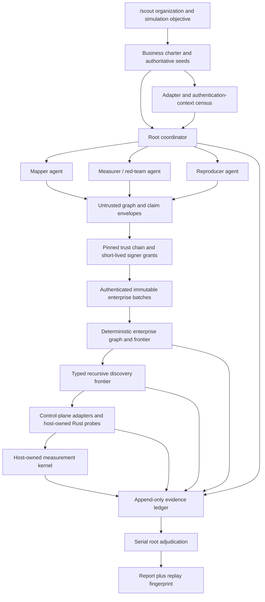

# Scout meta-system

Scout is Clark Code's evidence-first organization-cartography workflow.
`/scout` reconstructs the end-to-end technical system a business operates and
turns that graph into a simulation specification. It coordinates bounded
read-only agents, but the agents are sensors rather than authorities: a
host-owned ledger, adapter census, graph frontier, probe runner, and
measurement kernel decide what can become a supported claim.

This design deliberately separates three questions:

1. Which business control planes and authentication contexts can Scout inspect?
2. What entities and relationships did an agent propose?
3. What did an authoritative control plane or host-owned instrument observe?

Conflating those questions is how an inventory turns into an unverified story,
or how a desktop credential accidentally becomes evidence about an SSH target.

## Goals

- Work on macOS, Linux, and Windows, locally or through Clark's remote executor.
- Authorize and share enterprise discoveries only through explicit Clark
  organization/workspace membership. Email-domain equality is never a tenancy
  or sharing relation; in particular, unrelated `gmail.com` users remain
  isolated.
- Map products and business journeys through source, delivery, runtime, data,
  identity, external dependencies, ownership, and observability.
- Exhaust every safe control-plane context and recursively discovered graph
  frontier rather than sampling familiar tools or default profiles.
- Use host, filesystem, environment, and `.env` discovery only to resolve a
  mapped component or adapter—not as the definition of the business system.
- Fan out independent mapping work under the existing bounded orchestration
  policy.
- Store claims, evidence, checks, corrections, and verdicts in an append-only
  replayable ledger.
- Compute quantitative results in deterministic Rust rather than model text.
- Distinguish capability-limited code from an attested process sandbox.
- Fail closed when a test, credential boundary, proof tier, or isolation
  instrument is missing.

Scout does not grant production write access, retrieve secret payloads, turn an
installed CLI into proof of authentication, treat raw SSH as a sandbox, or
claim that a host/package/file inventory is an organization map.

## Control and evidence flow

The root is the only actor allowed to issue assignments, move phases,
adjudicate, retract, supersede, and seal. A worker can submit only under a
host-issued assignment for the same snapshot and declared scope. A runner can
record and check evidence, but it cannot adjudicate its own conclusion.

## Components

| Component | Responsibility | Trust |
| --- | --- | --- |
| `scout-capability-census` | Standalone cross-platform curated tool, environment-name, credential-surface, and mapped-root dotenv-schema sensor | Untrusted portable sensor with secret-safe output contract |
| `scout-machine-identity` | Race-safe per-origin/organization/workspace Ed25519 identity below an explicit owner-only host-private directory | Host-owned signer; seed bytes are never exposed |
| `scout_capabilities` | Curated adapter/config census and routing decision | Host-owned |
| `scout_adapter` | Target-bound auth census, exact verification, allowlisted GitHub/GitLab/AWS/GCP pagination, bounded cursor exhaustion, and deterministic signed graph append | Host-owned read path plus authenticated local evidence write |
| `delegate_read_only` | Bounded parallel repository sensors | Untrusted reports |
| `resolve_delegation` | Root acceptance or bounded rework | Root-owned |
| `scout_probe` | Bounded file slice/count/JSON receipts | Host-owned |
| `scout_measure` | Wilson or seeded bootstrap interval from bounded JSON | Host-owned |
| `scout_ledger` | Event validation, replay, proof caps, report | Canonical |
| `scout_enterprise` | Enroll a protected collector, claim a fenced backend task, and submit a target-bound receipt through immutable evidence upload and signed batch ingestion | Authenticated backend write path |
| `scout_enterprise_query` | Bounded backend status, bitemporal snapshot, temporal delta, and versioned simulation-overlay reads | Read-only backend materialization |
| `/scout` skill | Orders the workflow and its fail-closed rules | Prompt policy |

The Scout domain contract and pure measurement kernel live in
`agent-orchestration`, so ledger validation and statistical computation stay
independent of a model provider. Provider-local owns the tools because it has
the execution target, project sandbox, and orchestration context.

## Business charter before sweeping

The charter identifies the organization or business unit, products, business
journeys, environments, known control planes, credential limits, exclusions,
and the simulation question. It names authoritative seeds whenever available:

- source forges and organizations;
- cloud organizations, tenants, accounts, subscriptions, projects, and regions;
- identity providers;
- DNS and certificate control planes;
- CI/CD, artifact, deployment, and infrastructure-as-code systems;
- runtime/container platforms and data systems;
- observability, incident routing, and declared external SaaS.

The host capability census is an adapter bootstrap, not the map. Local and
remote executors report OS/architecture, presence of curated DevOps/cloud
adapter executables, provider- or adapter-declared environment-variable names,
known credential-source kinds, and independent truncation flags. Other PATH
entries may contribute only a diagnostic count and digest; those diagnostics do
not affect the business adapter-census fingerprint.

Filesystem discovery is similarly targeted. It inspects declared workspaces,
control-plane-discovered repository/deployment roots, and conventional config
locations required by an active adapter. Within mapped roots it prioritizes
service catalogs, CODEOWNERS, CI workflows, IaC, deployment manifests,
Docker/Kubernetes/Helm, API/event schemas, lockfiles, and `.env` templates.
Actual `.env` key schemas are inspected only when they resolve a mapped
component's configuration edge. Values are never returned, logged, hashed, or
placed in the ledger.

The earlier 20-file UTM validation cap was an ad hoc defensive bound, not a
definition of Scout coverage. The checked-in v1 `.env` scanner used different
bounds, but both approaches reveal the same design error when treated as the
goal: file count is not business-system relevance. In the graph design, a
batch limit yields a resumable cursor and `truncated` coverage cell. It never
means the system was mapped.

The resulting census receives a random id and deterministic fingerprint. A
Scout charter can start only from a census id retained by the host; the ledger
pins the fingerprint. This prevents a model from inventing adapters or silently
changing execution hosts after planning.

## Organization graph and recursive frontier

Scout stores typed entities:

| Domain | Entity kinds |
| --- | --- |
| Business | organization, product, capability, journey, team, owner, actor |
| Authority | identity tenant, auth context, principal, account/project, environment, region |
| Provenance | repository, component, pipeline, artifact, IaC stack, deployment |
| Runtime | service, function, job, API, endpoint, cluster, namespace, host |
| State and flow | database, dataset, cache, object store, queue, topic, event schema, secret reference |
| Operations | trace service, log source, metric, alarm, incident route, runbook |
| Boundary | DNS zone, certificate, vendor, SaaS integration, webhook |

Typed edges include `owns`, `implements`, `source_for`, `builds`, `publishes`,
`deploys_to`, `provisions`, `runs_on`, `routes_to`, `calls`, `publishes_to`,
`consumes_from`, `reads`, `writes`, `authenticates_via`, `configured_by`,
`monitored_by`, `alerts_to`, and `depends_on`. Entity and edge observations
carry evidence digests plus machine, run, adapter, authentication-context,
epoch, source-position, time, and fingerprint provenance. Provider-native ids
establish identity; name similarity only creates a tentative reconciliation
edge. Entity and edge observations carry the ordered
`public < internal < confidential < restricted < secret_reference_only <
do_not_store` classification lattice. Legacy observations default to
`internal` without changing their canonical ids; `do_not_store` is rejected
before event construction, and an edge conservatively joins both endpoint
classifications.

The graph schema uses namespaced SHA-256 identities over enterprise, entity
kind, stable provider namespace, authority scope, and provider-native id.
Versioned adapter builds remain in record ids and provenance but are
deliberately excluded from entity identity, so an adapter upgrade cannot fork
the enterprise graph. Cross-provider links carry their target provider
namespace explicitly instead of inheriting the source adapter. Adapter
protocol version 3 validates that provider types are rooted in these portable
namespaces and separates request/query authority from canonical identity
authority. That distinction lets the same AWS account or GCP project converge
when reached through different authenticated hierarchy paths. Edges and
immutable observations are also content addressed. A
canonical batch is sorted and deduplicated before publication. Unioning batches
is commutative, associative, and idempotent; materializing them in reverse
arrival order produces the same event root and graph digest.

Each observation carries opaque machine, run, adapter instance, authentication
context, discovery epoch, monotonically increasing source position,
observation time, and source fingerprint. Reuse of a source position with
different content is an explicit conflict. The highest coordinator epoch is
materialized; frontier transitions have their own sequence so a normal
pending/leased/terminal lifecycle does not become a false conflict.
Disagreement at the same transition remains a conflict rather than an
arbitrary winner. Retractions are append-only facts.

The graph adds a coordinator-issued discovery charter, exact entity/edge membership
for every declared coverage cell, and content-addressed pass seals. Clark
recomputes requirement, scope-membership, semantic-topology, and pass roots
before accepting a seal. A fixed point requires two consecutive verified
passes with identical roots. The latest verified authoritative membership
defines current scope membership, so absence in a later complete pass retires
old state without deleting history. An incomplete later attempt retains the
last verified view and blocks completion. Qualified topology now materializes
immutable half-open `[valid_from, valid_to)` entity and edge versions from the
signed event history. Classification is monotone absent a future explicit
declassification fact, invalid or forked intermediate passes freeze later
lifecycle changes, charter changes close dropped records as `out_of_scope`
rather than falsely retiring them, and reappearance opens a disjoint version.

The charter also declares a maximum pass age. Status is evaluated against the
host clock, so an otherwise converged graph becomes stale after that bound and
must be refreshed. Entity, edge, neighborhood, and signed-batch receipts are
bounded; entity, edge, and batch listings expose deterministic continuation
cursors, while neighborhoods explicitly report possible truncation. One batch
is limited to 10,000 events, one encoded signed envelope to 64 MiB, and the
target-local authenticated ledger to 100,000 batches. Each envelope is stored
once in the authenticated ledger authority; there is no parallel JSON archive,
repair mirror, or pre-release archive migration reader. Those caps prevent a
single tool result or ledger row from becoming an unbounded context load; they
are not a scalable indexing strategy.

All replicated strings pass a centralized best-effort secret-canary gate in
addition to the rule that evidence stores digests and references, never secret
payloads. It rejects common token assignments, private-key markers,
credential-bearing URLs, JWT-like values, and major cloud/forge token shapes.
This reduces accidental ingestion but is not a formal data-classification or
redaction proof.

Discovery uses a typed priority frontier:

1. enumerate all safe authentication contexts and tenant/account/project
   hierarchies behind the charter's seeds;
2. query authoritative indexes and paginate them to completion;
3. enqueue structured references discovered in resource metadata, source,
   workflows, IaC, deployments, DNS/TLS, runtime configuration, and telemetry;
4. join source → build → artifact → deployment → runtime;
5. follow API, event, data, identity, ownership, observability, and external
   dependency edges;
6. reconcile entities observed by independent sources;
7. repeat until a full pass adds no new entity or edge.

Every frontier row ends as `supported`, `empty`, `denied`, `unreachable`,
`unsupported`, `unsafe`, `stale`, `truncated`, or `untested`. Empty is valid
only after authoritative enumeration reaches its final cursor. Bounds apply to
resumable pages, frontier nodes, regions, calls, bytes, time, rate, and cost;
they never turn an unfinished scan into coverage.

### Exhaustive means business-graph complete

Scout does not stop at the default profile, first authenticated identity, first
successful page, GitHub, or AWS. It also does not enumerate unrelated host
files and packages to inflate coverage. "All" is testable when:

- every expected control-plane cell has a terminal status;
- every recursively discovered reference is resolved or an explicit gap;
- each production service is joined to source/artifact provenance, deployment,
  runtime identity, dependencies, ownership, and observability;
- every in-scope business journey has a closed path or named break;
- a fixed-point pass adds no new graph entity or edge.

The coverage matrix is keyed by adapter × auth context × tenant/account ×
region/project × resource kind. Permission denial, missing adapters, login
requirements, unsafe operations, stale metadata, and truncation remain visible
gaps. Scout never retrieves secret payloads, switches accounts, starts an
interactive login, installs tools, starts services, invokes a paid model, or
mutates a target merely to increase coverage.

### Routing rule

For every needed operation, routing chooses in this order:

1. an available typed host tool;
2. an explicitly authorized target-host CLI or adapter;
3. a portable Rust fallback;
4. `UNFALSIFIABLE` with the missing instrument.

An installed `gh` or `aws` executable means only `present`. AWS profile names,
environment names, and Secrets Manager configuration mean only
`authentication_candidate`. Scout never retrieves a secret value during
discovery.

## Portable Rust tool investigation

The highest-value replacements are small deterministic adapters, parsers, and
graph kernels—not a universal shell clone:

| Need | Rust implementation | Current state |
| --- | --- | --- |
| Adapter/config census | curated registry over `std` filesystem/environment APIs | Implemented as portable census v1 |
| Targeted `.env` schema | explicit-root bounded parser returning key names only | Implemented with coverage/truncation receipts |
| Entity identity and edge normalization | provider-native ids plus typed graph reducer | Implemented v2 |
| Resumable discovery frontier | typed pages, cursor handles, exact membership, two-pass fixed point | Implemented with normalized durable scheduler rows and fenced attempts |
| Structured CI/IaC/deployment/API parsers | small format-specific Rust parsers | Designed |
| Simulation-readiness grader | deterministic graph validator and mutation controls | Implemented in benchmark and enterprise graph |
| source receipt | bounded executor read and SHA-256 | Implemented |
| text/JSON counts | typed parser kernels | Implemented |
| proportion interval | deterministic Wilson implementation | Implemented |
| distribution interval | seeded bootstrap mean/median | Implemented |
| replayable evidence and report | typed event reducer plus immutable enterprise batch store | Implemented |
| GitHub API without `gh` | target-native bounded `reqwest` REST adapter | Implemented when a target token candidate verifies |
| GitLab group projects | target-native bounded `reqwest` REST adapter | Implemented when a GitLab.com target token and exact group verify |
| AWS Organizations and Resource Explorer | fixed-argument target AWS CLI adapter | Implemented when target CLI and auth verify |
| AWS API without `aws` | target-side Rust SDK or SigV4 adapter | Missing instrument; protocol seam implemented |
| GCP organizations, recursive folders/projects, and Cloud Asset resources | fixed-argument target `gcloud` adapter | Implemented when target CLI and active auth verify |
| arbitrary shell replacement | none | Rejected |

`scout_adapter` runs behind the target execution protocol, so an SSH or VM scan
uses that target's credential candidates rather than the desktop's. GitHub uses
bounded native HTTPS with redirects disabled and a fixed `gh` fallback. GitLab
uses a fixed GitLab.com API origin, verifies the exact group path, follows only
provider page headers, and binds numeric group/project identities to the
instance origin; configurable self-managed origins remain missing. AWS uses
only registered STS, Organizations, and Resource Explorer command shapes. GCP
uses fixed active-account, organization/project describe/list, and Cloud Asset
search command shapes. Its CLI does not expose provider page tokens, so the
adapter uses an encrypted stable-key cursor over bounded sorted results and
reports that snapshot-isolation limitation. A machine-readable route manifest
pins operation, provider type, coverage kind, projection, and canonical
identity authority for every registered route. There is no arbitrary argument
path. Raw provider pagination tokens and credential references remain encrypted
in target-private storage. The provider receives normalized projected metadata,
opaque handles, and deterministic receipts—never secret payloads.

`harness/scout-adapter-live-qualification.mjs` exercises that exact target
service over Clark's authenticated remote executor. It verifies every opaque
candidate, follows every returned cursor up to an explicit page bound, and
writes only tool availability, safe failure classes, counts, and SHA-256
summaries. Its token and optional GitHub authority enter through process
environment references; neither is serialized into the receipt. This is the
live qualification lane, not an alternate provider implementation. A live run
cannot pass when every candidate is merely unavailable: at least one provider
must verify and reach a terminal complete page.

For normal graph population, `scout_adapter exhaust_and_append` moves cursor
exhaustion into host code. It follows only target-vault cursor handles, enforces
explicit page, record, and wall-time bounds, and signs and persists every page
before requesting the next. A reached bound leaves a replayable nonterminal
frontier gap that another run or machine can resume. Terminal coverage is
emitted once with cumulative unique entity and edge membership; forked cursor
parents fail closed. Model persistence and one worker's lifetime are therefore
not provider-completeness assumptions.

The same typed protocol is the extension seam for self-managed GitLab and its
hierarchy/membership/CI/runner/registry surfaces, the remaining GCP surfaces,
Azure, Bitbucket/GHES, identity, DNS/TLS, CI/artifacts, Kubernetes/runtime,
data, observability, incident, SaaS, and recovery adapters. Their capability
names can be discovered today, but their authoritative enumeration adapters
are not implemented; each is an explicit coverage gap rather than a reason to
fall back to arbitrary shell.

Clark Hash is useful only as an optional derived semantic candidate index. Its
stateless sparse-JL sketches can store a typical 384-dimensional embedding in
48 bytes at the documented 96-dimension/four-bit profile, making it attractive
for shortlisting likely entity reconciliations and unstructured-document
retrieval. The tradeoff is approximate ranking quality that depends on the
embedding model, codec parameters, seed, and workload. Clark Hash sketches are
therefore neither content hashes nor stable identity. A Scout sketch index must
record embedding model, dimension, codec parameters, seed, source graph root,
and evaluation receipt; it must be disposable and rebuildable. It may route
candidates to deterministic/provider-key resolution or human adjudication, but
cannot decide equality, evidence, completeness, conflicts, privacy, or
deletion.

The useful `clark-personal-graph` pattern is its separation of append-only
episode evidence from a compact, temporal, evidence-linked derived graph. Scout
applies that principle to enterprise control planes: immutable adapter receipts
and signed batches remain truth; the graph is retrieval/simulation state.
Support counts, contradiction state, valid-time intervals, tombstones, a
classification lattice, and bounded neighborhood activation belong in that
derived layer. Human-memory-specific atom extraction, confidence thresholds,
and LLM consolidation are not imported as evidence semantics. Write-time
reactivation may later help reconcile a newly observed service or vendor
against a bounded old neighborhood, but any synthesized relationship remains a
candidate until an authoritative observation proves it.

## Multi-agent design

Scout reuses Clark's orchestration control plane rather than creating a second
agent runtime. Fan-out partitions independent business domains or control
planes—forge/source, cloud/runtime, identity, delivery, data, observability,
external vendors, and journey reconciliation. It does not partition arbitrary
filesystem subtrees. The host enforces:

- bounded parallelism and weighted-token budget;
- exact scopes and acceptance criteria;
- no recursive orchestration;
- read-only tool gates for local child agents;
- optional OS-sandboxed ACP harnesses;
- before/after workspace digests;
- mandatory root resolution of every report.

Scout adds a second limit, `max_worker_submissions`, so the parallel-agent cap
does not accidentally become a lifetime limit. Worker identities are
host-issued assignment ids, not model-chosen authority claims.

### Multi-machine enterprise convergence

The authoritative enterprise state lives in Clark's
`clark-system-cartography` backend under an explicit organization and
workspace. The backend owns source and machine enrollment, revocation,
charters, runs, leased and fenced tasks, verified evidence-object state,
observation ingestion, audit, and outbox publication. Evidence is authorized
for an exact enrolled machine, task, and fence, uploaded to a server-selected
S3 key, and accepted only after the backend verifies the exact bucket, key,
size, checksum, content type, object version, and KMS encryption. An
observation batch must reference that verified evidence object and receives a
signed Clark receipt. This implementation is present in source but is not yet
deployed or validated against production Clark infrastructure.

Every Clark installation may stage the same enterprise schema under the project
executor at `.clark/scout/enterprises/v3-<enterprise-id-sha256>`. The portable
directory name is derived from the logical enterprise id; the manifest pins
the schema, original tenant id, trust anchor, local signer, and coordinator or
replica mode. Batch files contain Ed25519-signed envelopes, are named by their
canonical batch digest, and bind the payload, enterprise, manifest, grant, and
signer through a domain-separated transcript. Publication flushes the temporary
file, atomically renames it, flushes the parent directory, and verifies the
published content. A retry after commit-before-ack returns `already_present`.
Incomplete temporary files are ignored and corrupt or unauthenticated canonical
batches fail closed.

Generation one is explicitly pinned. Trust-policy successors form one serial
coordinator-approved chain; a same-parent fork fails closed. Other machines
create a target-local private key and public proof-of-possession proposal.
Coordinators issue exact machine/run/adapter/auth/epoch/source-range grants that
expire within 24 hours. Collectors can assert observations but cannot issue
charters or passes or retract history. The model never supplies signing keys or
signature timestamps, and normal file tools cannot read or overwrite Scout's
host-private key namespace.

These local directories, SQLite indexes, trust manifests, and signed exchange
bundles are untrusted staging caches and replay projections. They never create
organization membership, never publish or share a discovery, and never become
enterprise authority. Machines may exchange signed
`export_batch`/`import_batch` bundles for local staging. Import
requires the locally pinned anchor and validates the complete chain, grant,
scope, role, validity interval, revocation effective time, payload, and strict
signature. Because the accepted transfer unit remains immutable and content
addressed, duplicates and arbitrary delivery order converge. The target service
now has a durable central-ingestion outbox state machine over verified batch
references: `pending → in_flight → acked|rejected`. Attempt replacement is an
exact compare-and-swap, retry and terminal acknowledgements are idempotent,
conflicting acknowledgements fail closed, and state publication is
write-sync-replace-directory-sync crash safe. A production HTTP client and
transport-neutral coordinator core now drive this state machine. The client
uses the signed batch id as its idempotency key, rejects redirects, requires
HTTPS outside loopback, caps response bodies, verifies the pinned coordinator
signature, and acknowledges locally only after the exact tenant, enterprise,
anchor, batch, and envelope digest match. The coordinator pins tenant-scoped
enterprise anchors, serializes concurrent acceptance in SQLite/WAL, returns
byte-identical receipts after lost responses, and binds an incremental
batch-accumulator root into every receipt. `scout-coordinator` now also
supplies a strict standalone HTTP/1.1 boundary for
`/v1/scout/enterprise-batches`: bearer material is passed without persistence
or echo to an injectable authoritative tenant authenticator, request
size/time/concurrency are bounded, the idempotency key must equal the signed
batch id, tenant-scoped receipt/status reads are available, and malformed or
provider errors collapse to safe JSON classes. Its plaintext listener refuses
non-loopback addresses. It must sit behind Clark TLS ingress, and Clark
organization authentication must supply the production authenticator. The
production route must not introduce a mutable last-writer-wins graph or move
private signing state into the client.

Coordinators can issue an authenticated inclusion checkpoint while holding the
same target enterprise lock used for ingest and query. Status explicitly states
whether that checkpoint covers the current ledger and counts any uncheckpointed
tail. Checkpoint bundles carry only newly added immutable batch ids; replay of
the signed predecessor chain reconstructs exact membership and rejects repeated
deltas, deletion, gaps, or forks. This makes stored and exchanged membership
linear across checkpoint history instead of repeating the full set at every
sequence. Exact checkpoint bundles can be exported and observed by replicas.
Replicas store a target-private per-coordinator highest-seen cursor and reject
gaps, regressions, anchor changes, and same-sequence forks. Observation makes
rollback detectable on that replica after exchange; an external account-level
witness is still required to detect privileged deletion across every machine.
Issuance still authenticates and summarizes the covered local ledger, so
frequent local checkpoints remain linear in current ledger size. Central
accepted-batch membership now has an order-independent persistent accumulator
and bounded membership/nonmembership proofs, but local checkpoint roots retain
their legacy canonical definition until an explicit schema migration.

Materialized enterprise state is never placed wholesale in a model prompt.
Clark's organization-scoped Postgres ledger is the only enterprise graph
authority. Collectors may retain private credential handles, pagination state,
and not-yet-uploaded target receipts, but they do not maintain or exchange a
local enterprise graph. Accepted observations project into backend entity,
edge, claim, coverage, and retraction histories. Snapshot reads pin effective
and knowledge time; delta reads compare two independently pinned bitemporal
cuts, which supports both business-system evolution and hour-by-hour growth of
Scout's knowledge. Simulation overlays are immutable versions pinned to an
exact snapshot and page normalized object memberships. Returned cursors bind
the selected temporal/filter contract and fail closed if reused for another
view.

`scout-scheduler` is the portable scheduling oracle. It has no clock,
filesystem, network, provider, or credential access and builds for WASM.
Immutable task ids bind enterprise, charter, epoch, target, adapter,
authorization context, opaque target-vault handle, canonical coverage/query,
page, cursor handle, origin, and priority. Manifest-owned expansion rules and
quota policies prevent a worker from inventing routes. Claims are target
affine and use monotonically fenced leases; expiry, capped retry/backoff,
rate-limit blocking, terminal gaps, continuation pages, and hierarchy children
are deterministic state transitions. A continuation may move between agent
processes but cannot move away from the target vault that owns its cursor.

The coordinator persists this oracle under the authenticated tenant and pinned
enterprise. Schema v5 uses normalized manifest/binding/task/attempt/quota and
idempotency-operation rows. Immediate SQLite transactions make claim,
heartbeat, completion, reap, and exact replay atomic while touching only
affected rows. Twenty-four concurrent workers claimed 24 tasks exactly once;
restart retained retry state, stale fences failed, and a lost-response retry
returned the exact stored result. The large-claim path queries and mutates only
ready tasks, quota rows, attempts, and the idempotency record; it reconstructs
the legacy v1 receipt root by streaming normalized rows instead of rebuilding a
`Scheduler` object. That exact root remains O(total), but no longer dominates
the mutation at the measured 100,000-task gate.

Terminal adapter work cannot be recorded through a scheduler-only completion.
The coordinator's atomic page boundary validates the exact task, fence,
adapter receipt, page digest, target/auth binding, signed batch provenance, and
evidence, then ingests the batch and completes the task in one SQLite
transaction. A stale fence rolls the graph ingest back; replay returns the
byte-identical receipt. Production still needs horizontally partitioned
coordinators and a cheaper status/oracle digest at very large frontier sizes.

## Ledger and proof contract

The serial phases are:

`charter → map → measure → check → prove → adjudicate → synthesize → sealed`

Every event carries a run id, sequence, actor, and typed payload. Replay checks
sequence, run identity, actor authority, phase, scope, snapshot, and limits
before reducing the event.

Important invariants:

- Worker artifacts are untrusted until a host evidence check passes.
- A later changed or failed check revokes the artifact's verified status.
- A supported headline requires independent reproduction by a different
  producer plus a fresh exact/equivalent host check.
- Proof cannot exceed the evidence kind's tier ceiling.
- T3 offline PoCs require passing positive and negative controls.
- Measurements re-read a verified, path-bound JSON array and require sample
  size, missingness, method version, and interval.
- An underpowered quantitative test cannot support an `UNSUPPORTED` verdict.
- Partial seals require an explicit limitation or follow-up.
- Retractions and supersessions append reasons; prior events are never erased.

The report includes the capability fingerprint and ledger SHA-256 so a replay
can detect altered evidence history.

## Simulation synthesis contract

Scout compiles the verified graph into scenario specifications rather than
cloning production. Each in-scope business journey identifies:

- external actors and entry points;
- ordered and concurrent calls, events, queues, and data effects;
- state stores and schemas;
- identity and trust boundaries;
- vendor and other external effects;
- timeout, retry, idempotency, latency, and failure behavior;
- invariants and expected observability;
- synthetic fixtures and failure-injection points;
- mock, recorded, staging, and real-system boundaries.

`simulation_ready` is a hard conjunction relative to the coordinator charter,
not an average score or a claim of unknowable absolute completeness. Every
critical journey must have a closed actor-to-effect path. Every critical runtime must
have source/artifact/deployment provenance, ownership, runtime identity,
dependencies, a complete behavioral contract, and either meaningful
observability/recovery edges or an explicit blocking gap. A second independently
ordered discovery pass must produce the same requirement, scope-membership,
and semantic-topology roots.

## Isolation model

Isolation is a ladder, not a boolean.

### 1. Capability-limited Rust kernels

`scout_probe` and `scout_measure` expose closed operations, not arbitrary
programs. They have no shell or network API, and the probe has no write
operation. This is the most portable and smallest attack surface.

It is still in-process code, so Scout calls it **capability-limited**, not an OS
sandbox.

### 2. Clark OS sandbox

Local child processes can use Clark's existing cross-platform sandbox:

- macOS Seatbelt;
- Linux bubblewrap;
- Windows restricted token, offline identity, ACL capabilities, firewall, and
  job object.

An OS-sandbox claim is supported only when the backend is enforced and positive
and negative controls pass. A missing or setup-required backend is a
capability gap, not a successful test.

### 3. Remote hosts

The remote executor transports typed filesystem and census operations. It does
not currently transport an attested sandbox policy. Therefore a raw SSH run is
`external` containment. A remote benchmark may pass its functional cases while
the isolation verdict remains `UNFALSIFIABLE`.

If the target has bubblewrap, Scout can run a standalone benchmark under a
read-only root with one narrow writable receipt directory and a denied-write
control. This proves that exact benchmark boundary; it does not prove that all
future SSH commands are sandboxed.

### 4. WASM capsule seam

`scout-capsule-core` is a WASM-clean, deterministic transform kernel for
bounded candidate records. It validates provider namespace and record shapes,
enforces input/depth/token/string/record/output limits, rejects duplicates,
sorts stably, and returns a deterministic page digest. It builds for
`wasm32-unknown-unknown` and has no direct ambient filesystem, environment,
clock, process, or network API.

`scout-capsule-host` now runs the Rust guest through Wasmi behind an exact
administrator-owned SHA-256 approval set. It rejects every import before
linking, creates a fresh store and instance for each invocation, and enforces
module, table, instance, linear-memory, input, output, fuel, deadline, and
concurrency bounds. Its receipt binds the module/input/output digests, empty
import set, limits, fuel consumed, runtime, and duration. The real
`scout-capsule-guest` compiled with zero imports and returned byte-identical
normalization output to the native core.

The library is also exposed through the versioned target-native
`scout-capsule-v1` service and deferred `scout_capsule` tool. An
administrator-signed Ed25519 registry maps logical capsule ids to exact module
digests, input/output schemas, tenant and enterprise allowlists, target id and
target-identity digest, host-owned limits, generation, and host-clock validity
window. Registry roots, module stores, registries, and modules must be real
directories/regular files and may not traverse symbolic links. The model can
only request `census` or `invoke` with a logical capsule id, enterprise id, and
bounded typed input; it cannot supply a module, path, digest, signing key,
tenant, target identity, or limits. Target identity is cached only after a
successful adapter census, and registry/module bytes remain inside the
host-private target namespace. Oversized successful output is reduced to its
authenticated isolation receipt and byte count rather than exposed to the
model.

The deadline is a caller bound, not a Wasmi hard interrupt. A timed-out worker
retains its concurrency slot until deterministic finite fuel stops it, which
prevents unbounded detached-thread admission. This host qualifies pure
transforms; it does not expose filesystem, credential, clock, process, network,
or WASI imports. Ambient inventory remains a brokered host capability.
Production still needs an administrator/MDM installation and registry-signing
flow, release identity, and remote policy distribution; the agent-callable
service deliberately does not provide any module-upload or self-approval path.

## Cross-platform contract

| Surface | macOS | Linux | Windows | SSH target |
| --- | --- | --- | --- | --- |
| Curated adapter census | native Rust | native Rust | native Rust | typed RPC |
| Credential context labels | native Rust | XDG-aware Rust | APPDATA-aware Rust | typed RPC |
| Targeted config/`.env` schema | executor reads | executor reads | executor reads | typed RPC reads |
| Graph/frontier/simulation kernels | portable Rust | portable Rust | portable Rust | host-owned |
| Probe/measure/ledger | portable Rust | portable Rust | portable Rust | host-side over executor |
| Pure capsule transform | signed target registry + Wasmi zero-import guest | signed target registry + Wasmi zero-import guest | signed target registry + Wasmi zero-import guest | typed target service |
| Child-agent isolation | Seatbelt/tool gate | bwrap/tool gate | restricted token/tool gate | external unless attested |

Paths are handled with `Path`/`PathBuf`; sensitive-path checks normalize both
slash styles. Host-specific adapters improve discovery but cannot change graph
semantics or weaken coverage accounting.

## Evaluation

`scout_benchmark` is a deterministic offline benchmark. It performs no model
calls, network calls, `.env` loading, or target mutations. It checks:

- bundled skill dependency resolution;
- synthetic business graph and simulation-readiness validation;
- fixed-point replay and complete control-plane coverage;
- mutation controls for host-inventory-only output, region omission, denied as
  empty, orphan ownership, unversioned deployment, missing observability,
  missing behavioral contracts, undeclared vendors, false joins, secret
  leakage, and unstable discovery;
- complete ledger replay and fingerprint stability;
- unissued worker and forged actor rejection;
- worker self-certification rejection;
- missing replay-recipe and unverified failed-test rejection;
- T3 control requirements;
- underpowered-null rejection;
- partial-seal gaps;
- Wilson reference values and seeded-bootstrap determinism;
- tenant-isolated concurrent central ingestion, signed receipt-chain replay,
  persistent batch-accumulator proofs, and lost-response idempotence;
- target-affine scheduler quotas, fenced leases, crash/restart recovery,
  manifest-limited hierarchy expansion, and byte-identical operation replay;
- atomic adapter-page receipt, signed batch, graph ingest, and fenced terminal
  scheduler commit with stale-fence rollback;
- affected-row projection writes and order-independent persistent object
  accumulator proofs;
- strict hosted HTTP authentication, tenant isolation, idempotency, body/header/
  deadline/concurrency limits, and safe socket failures;
- portable explicit-root capability/`.env` census with secret canaries,
  symlink refusal, deterministic semantic digests, and truncation accounting;
- deterministic WASM-clean capsule normalization and resource bounds;
- containment positive/negative controls.

Companion enterprise/store tests check monotone classification joins,
`do_not_store` rejection, clearance-first query filtering and cursor/filter
non-interference, plus two-pass temporal qualification,
retirement/out-of-scope/reappearance history, invalid-intermediate-pass
freezing, and bounded `as_of` reads.

The default enterprise reducer test adds 1,200 synthetic services across eight
machines: 7,203 entities, 6,003 edges, 1,200 simulation contracts, one
charter-pinned critical actor-to-journey-to-state-effect path, exact typed
coverage/frontier membership, and two independently sealed identical passes.
It signs every batch with a deterministic coordinator or collector grant and
asserts strict verification, forward/reverse delivery equivalence, duplicate
idempotence, and hard simulation completion relative to that charter. Store
tests additionally exercise coordinator-to-replica proof/grant activation,
restart, retry-after-publish, concurrent-machine convergence, temporary-file
crash residue, corruption failure, private trust-pin replacement, same-name
batch mutation, valid-SQLite forgery, checkpoint/ingest races, checkpoint
cursor recovery, signed checkpoint exchange, sequence gaps/forks, and
cross-enterprise rejection. Remote loopback tests send a target-service request
above the default 16 MiB WebSocket frame limit and prove that a symlinked Scout
root cannot escape the configured target root.
The live adapter harness additionally proves target-native credential
selection and pagination without copying provider credentials to the desktop
or recording normalized resource payloads.

Two independent scale gates prevent an object accumulator from standing in for
the graph reducer. The one-million-object persistent accumulator passed in
67.10 seconds with 1,999,999 active nodes, order-independent roots, and valid
membership/nonmembership proofs at 1,424,228,352 bytes peak RSS. The separate
one-million-`EnterpriseEvent` gate passed forward and reverse canonical replay,
duplicate idempotence, full materialization, and bounded public-query equality
in 199.361 seconds at 3,628,122,112 bytes sampled peak RSS. It materialized
20,000 entities and 10,000 edges without conflicts. A second full run
reproduced its event root, graph digest, query digest, semantic digest, and
serialized sizes. This proves the current reducer at the gate, while the 3.6
GB working set makes streaming/sharded affected-key reduction a production
requirement rather than an optional optimization.

A full 25,000-service/eight-machine gate exercised the joined system rather
than only its object accumulator. It passed with 300,041 signed events, 150,003
entities, 125,003 edges, 25,000 simulation contracts, 42 bounded batches, two
fixed-point passes, no conflicts, forward/reverse root equality, concurrent
central ingestion, restart idempotence, and checkpoint membership. Build/sign
took 26.363 seconds, forward/reverse materialization took 16.489/17.317
seconds, and the full enterprise case took 169.180 seconds. Its derived index
was 1,537,720,320 bytes, rebuilt in 36.892 seconds, and answered warm status in
22 ms without immutable reads. The whole run took about 298 seconds and peaked
near 7.50 GB RSS. That is a passing correctness gate and a failing economy
signal: the requested scale works on one large host, but the monolithic working
set still blocks a production-complete claim.

The affected-key reducer has a separate 100,000-event gate. A one-row
observation update reduced 100,001 candidate events and 10,000 materialized
rows to 11 candidate events and one affected row, while matching the exact
full snapshot. The measured reducer time fell from 154.982 ms to 0.108 ms.
With projection version 7, a fresh store-level 25,000-event gate rebuilt in
4.860 seconds; appending a new key took 336 ms, read zero immutable files,
replayed zero prior event bodies, affected one topology row, wrote two SQL
rows, and did not fall back to a full projection. The derived index occupied
85,512,192 bytes. The remaining O(total cached event-id and materialized-row)
exact-root scan is still a production gap.

The normalized scheduler has a separate 100,000-frontier-task gate. It passed
a fenced 1,024-task claim, exact idempotent retry, and restart receipt equality
using only normalized scheduler rows. The current independent rerun used 473,063,424
bytes of coordinator state; initialization took 10.069 seconds, claim 891 ms,
exact retry 1 ms, and restart receipt reconstruction 292 ms. Only 1,024 task
rows mutated while 98,976 remained untouched, and claims/roots matched the
portable reference exactly. The receipt root still streams all normalized task
rows, so horizontal partitioning needs a composable status digest.

The benchmark's cross-platform canonical hash includes the enterprise case's
deterministic semantic digest (trust anchor, authenticated-envelope root,
counts, event root, graph digest, duplicate result, and completion), while
excluding timing and host metadata. A platform cannot match merely by returning
the same case names and pass states.

The receipt records `live_model_calls: 0` and `values_observed: false`. The
business-map case also records a semantic graph SHA-256. Its mutation controls
prove that the grader can reject plausible but incomplete maps.

The required validation lanes are:

1. local unit, protocol, provider, frontend, and benchmark checks;
2. `scl` functional run with containment honestly marked `external`;
3. `cpu` functional run inside bubblewrap when its negative control succeeds;
4. UTM Ubuntu and Windows functional runs with guest scratch cleanup;
5. UTM macOS only when its guest-execution backend supports the probe.

`harness/scout-utm-qualify.mjs` implements the executable UTM lanes. It pushes
one platform binary, reads it back and compares SHA-256, runs through the
marker-authenticated guest channel, pulls receipt/report bytes only after their
guest hashes are fixed, compares canonical/event/graph/index roots to a local
reference, and proves exact guest cleanup. On Windows it also records
path-scoped Defender detections, executable signature state, real-time
protection state, transfer length/hash, and the absence of detections on a
successful run. Bare `utmctl exec` success is never accepted as execution
evidence.

The current projection-v7/adapter-v3 cross-platform reference includes
canonical identity authority, temporal qualified topology, classification,
AWS resource ownership, recursive GCP folder/project hierarchy edges,
normalized scheduler persistence, and the hardened skill contract. The v8
reference binary passed all 17 deterministic cases locally, on `cpu` under
bubblewrap, on `scl` with external containment, and in UTM Ubuntu ARM64 and
Windows ARM64. All five lanes produced canonical SHA-256
`0a2ffc673e6299a2ae7f4ca03ca9116dc3692df53f3c0c92abef68eb5ad75885`,
enterprise semantic digest
`a0541ad238a32d671bf60c0dbcf3187af4a802a53f570a05d03051384f9cc16d`,
central-ingestion semantic digest
`ca41503c26ea017f23f1d98dd6c1fa5d981f46135c99c8bce052472c62a4c0fb`,
event root
`21a76e8be5f568064fa661ca38fd59776203d040984c081231c3901a610ab6d4`,
graph digest
`9cb59586f978f638d720e190126726c84539acf0bfd5f41a259cc93af6a9142a`,
and central batch root
`12eb5efbc47054fe579477b36af04ff22bdf4b014eca773b9eb2e90c16859846`.
The persistent-object semantic digest and root remain
`43afd1d5456053b0c3ee918474430cb88569562cb4783fe00c88e80aa761b286`
and
`f1b0f9d7ad5b7b4360b869e526bfb3723daa57910a6d025b1d066b1d80b3f9b5`.
The second checkpoint wrote nine affected rows out of 13,224 projected rows,
and each checkpoint chain carried its 18 batch ids exactly once in 2,905
bytes.

Those two v8 UTM lanes reproduced the host artifact after byte-for-byte guest
read-back and proved exact guest scratch cleanup. After the provisional-versus-
qualified retrieval fix, a final-source v9 replay preserved the same canonical
hash locally, on `cpu`, on `scl`, and in UTM Ubuntu. The unsigned Windows v9
artifact was read back byte-for-byte at 11,129,344 bytes with SHA-256
`d6891a74054aaedc9c60fca9962f0e3566afca889ffb05faea72d6510b9fe7eb`,
then Defender quarantined it as `Trojan:Win32/Bearfoos.B!ml` before execution
and reported `DidThreatExecute: false`. The harness retained Defender and
real-time protection, added no exclusion, recorded the failure, and proved
scratch cleanup. Therefore the current source is functionally qualified on
four lanes, while current Windows full-benchmark packaging is blocked pending
Authenticode signing/reputation qualification rather than counted as passed.

The capsule host has its own cross-platform receipt lane. The real zero-import
guest module SHA-256
`4adce0c8bc7f3e28f27fa17085f858e5e55c45ce3321eed7c4e31a2c76c6e797`
produced the exact native normalization bytes locally and on `cpu`/`scl`.
Those lanes also invoked it through a generation-7 administrator-signed target
registry and proved the signed-service output matched the native oracle. UTM
Ubuntu ARM64 and Windows ARM64 repeated the binary/module read-back, direct and
signed-service module/input/output digests, zero-import/fresh-instance checks,
and exact scratch cleanup. The Windows run kept Defender service and real-time
protection enabled with zero detections or threats; that qualifier binary was
unsigned, so the result is functional/isolation evidence rather than release
packaging. Every lane records `deadline_is_hard_interrupt: false`; finite fuel
and retained concurrency admission bound the known Wasmi limitation.

The UTM macOS backend still rejects a disposable start with
`OSStatus_-2700 / operation not supported` while returning exit zero; the VM
remained stopped, so macOS guest execution is blocked rather than passed. On
`cpu`, the
protocol-v3 live target service verified the GitHub CLI candidate and
exhausted 80 repositories in one terminal page; the receipt contains only
counts and hashes. Two discovered AWS profile candidates both failed closed as
`provider_unavailable`, consistent with the direct STS qualification gap.
GCP has deterministic fake-target coverage but no current live credentialed
receipt.

The portable capability census also ran to non-truncated completion over the
declared development roots on `cpu` and `scl`. `cpu` reported `gh`, `aws`, and
`bwrap`; `scl` reported `gh` but not `aws`, `gcloud`, or `bwrap`. The two
receipts covered 3,535 directories, 13 dotenv files, and 206 dotenv key names
without executing a discovered tool or emitting any value.

The independent `scout-capability-census` binary cross-compiles for Linux
x86_64/ARM64, macOS ARM64, and Windows ARM64. Fresh UTM qualifications passed
on Ubuntu ARM64 and Windows ARM64 with non-truncated, value-free receipts,
byte-for-byte transfer/read-back checks, and proven scratch cleanup; Windows
Defender remained active with no detections. The registered macOS 26 UTM guest
is an explicit `unreachable` coverage row because that Apple virtualization
backend currently rejects guest-agent file transfer, command execution, and IP
discovery. No sensor binary reached that guest.

## Next extensions

1. Deploy and validate the implemented `clark-system-cartography` routes,
   Aurora migrations, S3 presigning/verification, signing key, audit, outbox,
   bitemporal delta, durable change stream, and simulation overlay APIs in
   development before production.
2. Replace the remaining store-level O(total-id/row) root scans and
   scheduler-level O(total-row) receipt hash with composable Merkle roots and
   horizontally partitionable status digests; re-run the 100k/1m gates.
3. Route the portable capability/`.env` census from manifest-declared machines
   and component roots, then turn every truncation or missing instrument into
   resumable frontier rows.
4. Add target-side organization adapters for self-managed forge surfaces,
   broader cloud/identity, DNS/TLS, delivery/artifacts, runtime/data,
   observability, incidents, vendors, and recovery systems.
5. Build the administrator/MDM capsule installation, registry-signing,
   rotation, and release-identity flow; add hard runtime preemption without
   weakening finite fuel or admission bounds.
6. Add a full signed multi-charter store-ingest lifecycle fixture, explicit
   coordinator-authorized declassification facts/policy revisions, and
   cross-enterprise row-transplant tests.
7. Evaluate a disposable Clark Hash candidate index against real reconciliation
   labels while keeping provider-native identity and signed evidence
   authoritative.
8. Add Authenticode-signed Windows packaging and repeat the Defender-on lane
   against the distributable artifact.

Current limits are explicit: the Clark backend domain, database migration,
signed task/evidence/batch wire contract, S3 verification boundary, and
portable client exist in source but are not deployed or exercised against
production AWS; Clark's Scout backend tools now use the portable client, but
the owner-only machine identity is access-controlled rather than encrypted
through Keychain, DPAPI, or a Linux keystore; generation-one local
staging trust is locally pinned or
transferred through an external fingerprint ceremony rather than a Clark
account trust service; private Scout files use owner-only modes on Unix and a
protected current-user DACL on Windows, but no path uses DPAPI encryption at
rest; offline expiry has no authoritative external clock; exchanged
checkpoints provide replica-local rollback detection but no global external
witness; the legacy loopback-only standalone coordinator remains only a
test/staging boundary and must not be treated as enterprise authority; local
checkpoint issuance and full Rust materialization
retain legacy linear roots even though central batch membership and SQLite row
persistence are incremental; central per-batch
inclusion proofs exist, but local checkpoint inclusion needs its own bounded
API; SQLite WAL is intended for a target-local filesystem rather than a shared
NFS/SMB mount; broader GCP/Azure/identity/data and other enterprise
control-plane adapters remain missing; and the secret-canary filter is defense
in depth, not a signed classification or redaction proof. The final-source
Windows ARM64 full benchmark is currently quarantined before execution, while
the independent capsule qualifier passes; Authenticode packaging and
distribution qualification remain required. The current scheduler mutates
normalized affected rows and meets
the 100k latency gate, but still streams all task rows for its legacy exact
receipt root. The current store avoids immutable-file reads, unaffected SQL
writes, and unaffected event-body replay, but still scans all event ids and
materialized topology rows for its legacy exact roots. Qualified temporal
history is reconstructed from immutable events and has direct adversarial
tests, but the signed end-to-end multi-charter store fixture and an explicit
declassification authority contract remain open. The signed capsule target
service is implemented, but administrator installation/rotation, release
signing, and production policy distribution are not.
