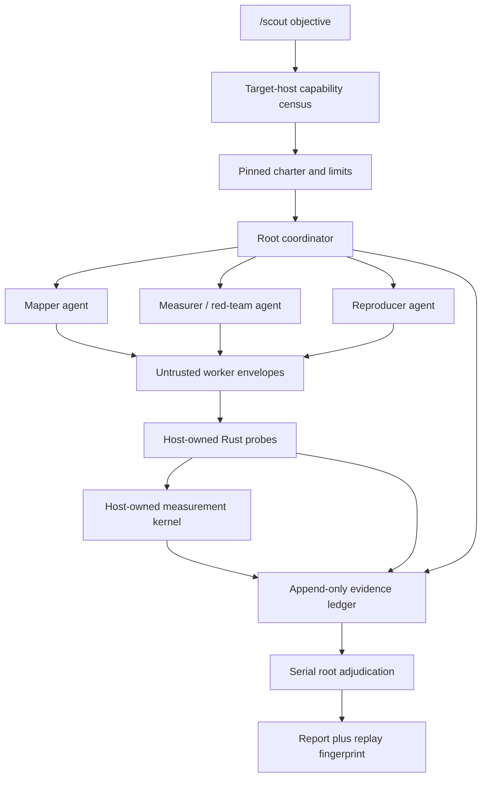

# Scout meta-system

Scout is Clark Code's evidence-first system-cartography workflow. `/scout`
coordinates bounded read-only agents, but the agents are sensors rather than
authorities: a host-owned ledger, capability census, probe runner, and
measurement kernel decide what can become a supported claim.

This design deliberately separates three questions:

1. What can the selected host inspect?
2. What did an agent propose?
3. What did a host-owned instrument independently observe?

Conflating those questions is how an inventory turns into an unverified story,
or how a desktop credential accidentally becomes evidence about an SSH target.

## Goals

- Work on macOS, Linux, and Windows, locally or through Clark's remote executor.
- Discover every target-host capability before planning, then exhaust every
  safe context in a pinned surface manifest rather than sampling familiar
  tools or default profiles.
- Find `.env` files and credential surfaces without returning secret values.
- Fan out independent mapping work under the existing bounded orchestration
  policy.
- Store claims, evidence, checks, corrections, and verdicts in an append-only
  replayable ledger.
- Compute quantitative results in deterministic Rust rather than model text.
- Distinguish capability-limited code from an attested process sandbox.
- Fail closed when a test, credential boundary, proof tier, or isolation
  instrument is missing.

Scout does not grant production write access, retrieve secret payloads, turn an
installed CLI into proof of authentication, or treat raw SSH as a sandbox.

## Control and evidence flow

The root is the only actor allowed to issue assignments, move phases,
adjudicate, retract, supersede, and seal. A worker can submit only under a
host-issued assignment for the same snapshot and declared scope. A runner can
record and check evidence, but it cannot adjudicate its own conclusion.

## Components

| Component | Responsibility | Trust |
| --- | --- | --- |
| `scout_capabilities` | Names-only target census and routing decision | Host-owned |
| `delegate_read_only` | Bounded parallel repository sensors | Untrusted reports |
| `resolve_delegation` | Root acceptance or bounded rework | Root-owned |
| `scout_probe` | Bounded file slice/count/JSON receipts | Host-owned |
| `scout_measure` | Wilson or seeded bootstrap interval from bounded JSON | Host-owned |
| `scout_ledger` | Event validation, replay, proof caps, report | Canonical |
| `/scout` skill | Orders the workflow and its fail-closed rules | Prompt policy |

The Scout domain contract and pure measurement kernel live in
`agent-orchestration`, so ledger validation and statistical computation stay
independent of a model provider. Provider-local owns the tools because it has
the execution target, project sandbox, and orchestration context.

## Capability discovery before planning

The execution protocol exposes `environment/capabilityCensus`. Both local and
remote executors return the same typed receipt:

- operating-system and architecture labels;
- executable **names** found in `PATH`;
- environment-variable **names**;
- known credential-source labels;
- independent truncation flags.

Discovery never executes a found binary. The provider then walks the declared
project scope for `.env`, `.env.*`, and `*.env` files, including gitignored
files, and parses key names only. It returns file locators, key names,
sensitivity classes, and a schema hash derived only from names. Values are
never returned, logged, hashed, or placed in the ledger.

The resulting census receives a random id and deterministic fingerprint. A
Scout charter can start only from a census id retained by the host; the ledger
pins the fingerprint. This prevents a model from inventing capabilities or
silently changing hosts after planning.

### Exhaustive means manifest-complete

The coordinator expands the census into a pinned surface manifest. It includes
every detected tool and credential source, every safely enumerable
account/profile/host context, every declared source or infrastructure surface,
and an `other` family for executables that no adapter recognizes. The manifest
must cover source control and forges, clouds, containers and orchestration,
virtualization and sandboxes, databases, networking, observability,
infrastructure-as-code, build and package systems, language toolchains,
browsers and mobile tooling, local model tooling, operating-system services,
shells, SSH, environment names, and `.env` schemas whenever detected.

Scout does not stop at the default profile, the first authenticated identity,
the first successful page, or GitHub and AWS. Independent agents sweep
manifest partitions, while root adjudication remains serial. Each row records
an opaque authentication-context id, safe probe, bound, and one of `present`,
`configured`, `authenticated`, `supported`, `denied`, `unreachable`, `empty`,
or `untested`. Adapters paginate and enumerate regions, projects,
repositories, clusters, or analogous namespaces to the declared limits.
Non-secret resource identifiers appear only when the declared scope and output
classification permit them; otherwise Scout retains counts and digests.

"All" is therefore testable: every pinned manifest row has a terminal status.
It is not unbounded ambient access. Limits, truncation, permission denial,
missing adapters, login requirements, and unsafe operations remain explicit
coverage gaps. Scout never retrieves secret payloads, switches accounts,
starts an interactive login, installs tools, starts services, invokes a paid
model, or mutates the target merely to increase coverage.

### Routing rule

For every needed operation, routing chooses in this order:

1. an available typed host tool;
2. an explicitly authorized target-host CLI or adapter;
3. a portable Rust fallback;
4. `UNFALSIFIABLE` with the missing instrument.

An installed `gh` or `aws` executable means only `present`. AWS profile names,
environment names, and Secrets Manager configuration mean only
`authentication_candidate`. Scout never retrieves a secret value during
discovery.

## Portable Rust tool investigation

The highest-value replacements are small deterministic tools, not a universal
shell clone:

| Need | Rust implementation | Current state |
| --- | --- | --- |
| PATH, environment, credential-source census | `std` filesystem/environment APIs | Implemented |
| `.env` inventory | bounded parser returning key names only | Implemented |
| source receipt | bounded executor read and SHA-256 | Implemented |
| text/JSON counts | typed parser kernels | Implemented |
| proportion interval | deterministic Wilson implementation | Implemented |
| distribution interval | seeded bootstrap mean/median | Implemented |
| replayable evidence and report | typed event reducer | Implemented |
| GitHub API without `gh` | `reqwest` REST adapter | Design-ready, not enabled |
| AWS API without `aws` | target-side AWS SDK adapter | Design-ready, not enabled |
| arbitrary shell replacement | none | Rejected |

Clark already carries a Rustls-backed HTTP client, so a GitHub REST adapter
would not need to shell out. An AWS SDK adapter is also technically feasible.
The blocker is authority placement, not Rust: when Scout targets an SSH host, a
desktop-side adapter would use desktop credentials and describe the wrong
system. Native network adapters therefore belong behind the target execution
protocol or a separately authorized credential broker. They must return
resource metadata only, never secret payloads.

## Multi-agent design

Scout reuses Clark's orchestration control plane rather than creating a second
agent runtime. Fan-out is allowed only when the user or active skill authorizes
delegation and there are independent workstreams. The host enforces:

- bounded parallelism and weighted-token budget;
- exact scopes and acceptance criteria;
- no recursive orchestration;
- read-only tool gates for local child agents;
- optional OS-sandboxed ACP harnesses;
- before/after workspace digests;
- mandatory root resolution of every report.

Scout adds a second limit, `max_worker_submissions`, so the parallel-agent cap
does not accidentally become a lifetime limit. Worker identities are
host-issued assignment ids, not model-chosen authority claims.

## Ledger and proof contract

The serial phases are:

`charter → map → measure → check → prove → adjudicate → synthesize → sealed`

Every event carries a run id, sequence, actor, and typed payload. Replay checks
sequence, run identity, actor authority, phase, scope, snapshot, and limits
before reducing the event.

Important invariants:

- Worker artifacts are untrusted until a host evidence check passes.
- A later changed or failed check revokes the artifact's verified status.
- A supported headline requires independent reproduction by a different
  producer plus a fresh exact/equivalent host check.
- Proof cannot exceed the evidence kind's tier ceiling.
- T3 offline PoCs require passing positive and negative controls.
- Measurements re-read a verified, path-bound JSON array and require sample
  size, missingness, method version, and interval.
- An underpowered quantitative test cannot support an `UNSUPPORTED` verdict.
- Partial seals require an explicit limitation or follow-up.
- Retractions and supersessions append reasons; prior events are never erased.

The report includes the capability fingerprint and ledger SHA-256 so a replay
can detect altered evidence history.

## Isolation model

Isolation is a ladder, not a boolean.

### 1. Capability-limited Rust kernels

`scout_probe` and `scout_measure` expose closed operations, not arbitrary
programs. They have no shell or network API, and the probe has no write
operation. This is the most portable and smallest attack surface.

It is still in-process code, so Scout calls it **capability-limited**, not an OS
sandbox.

### 2. Clark OS sandbox

Local child processes can use Clark's existing cross-platform sandbox:

- macOS Seatbelt;
- Linux bubblewrap;
- Windows restricted token, offline identity, ACL capabilities, firewall, and
  job object.

An OS-sandbox claim is supported only when the backend is enforced and positive
and negative controls pass. A missing or setup-required backend is a
capability gap, not a successful test.

### 3. Remote hosts

The remote executor transports typed filesystem and census operations. It does
not currently transport an attested sandbox policy. Therefore a raw SSH run is
`external` containment. A remote benchmark may pass its functional cases while
the isolation verdict remains `UNFALSIFIABLE`.

If the target has bubblewrap, Scout can run a standalone benchmark under a
read-only root with one narrow writable receipt directory and a denied-write
control. This proves that exact benchmark boundary; it does not prove that all
future SSH commands are sandboxed.

### 4. WASM capsule seam

A future `scout_wasm_probe` should accept only a host-approved module digest and
JSON input. It should provide no ambient WASI filesystem, environment, clock,
process, or network imports. Host imports would be narrow, for example:

- `read_fixture(handle, offset, length)`;
- `emit_receipt(bytes)`;
- deterministic seeded randomness when declared.

The runner must enforce fuel, memory, input, output, and wall-clock limits and
record module digest, runtime version, import set, limits, controls, and output
digest. WASM is useful for portable pure experiments and parsers; host
inventory remains a brokered capability because a WASM module cannot safely
discover ambient credentials by itself.

No WASM runtime is added in Scout v1. The repository has no current WASM
runtime dependency, and neither validation target advertised one. Adding a
large runtime before a concrete capsule contract would increase supply-chain
and startup cost without improving the current closed Rust probes.

## Cross-platform contract

| Surface | macOS | Linux | Windows | SSH target |
| --- | --- | --- | --- | --- |
| Executable census | native Rust | native Rust | common executable-extension Rust | typed RPC |
| Environment names | native Rust | native Rust | native Rust | typed RPC |
| Credential labels | native Rust | XDG-aware Rust | APPDATA-aware Rust | typed RPC |
| `.env` key names | executor reads | executor reads | executor reads | typed RPC reads |
| Probe/measure/ledger | portable Rust | portable Rust | portable Rust | host-side over executor |
| Child-agent isolation | Seatbelt/tool gate | bwrap/tool gate | restricted token/tool gate | external unless attested |

Paths are handled with `Path`/`PathBuf`; sensitive-path checks normalize both
slash styles. Executable discovery understands Unix executable bits and common
Windows executable extensions. Host-specific tools improve routing but are
never required for the core Scout workflow.

## Evaluation

`scout_benchmark` is a deterministic offline benchmark. It performs no model
calls, network calls, `.env` loading, or target mutations. It checks:

- bundled skill dependency resolution;
- exhaustive manifest policy (every discovered family and context, every row
  terminal);
- complete ledger replay and fingerprint stability;
- unissued worker and forged actor rejection;
- worker self-certification rejection;
- missing replay-recipe and unverified failed-test rejection;
- T3 control requirements;
- underpowered-null rejection;
- partial-seal gaps;
- Wilson reference values and seeded-bootstrap determinism;
- containment positive/negative controls.

The receipt records `live_model_calls: 0` and `values_observed: false`.
Its canonical SHA-256 covers ordered case ids and pass/fail states only, making
equivalent platform runs directly comparable without including host identity,
paths, timestamps, or capability counts.

The required validation lanes are:

1. local unit, protocol, provider, frontend, and benchmark checks;
2. `scl` functional run with containment honestly marked `external`;
3. `cpu` functional run inside bubblewrap when its negative control succeeds.

## Next extensions

1. Add a versioned remote sandbox RPC and policy attestation so Linux/Windows
   SSH targets can prove the same boundary as local execution.
2. Add the digest-pinned WASM capsule runner after defining its import ABI and
   benchmark corpus.
3. Add a target-side adapter registry for every detected capability family,
   starting with GitHub and AWS metadata, with explicit authorization,
   allowlisted operations, response schemas, pagination limits, context
   enumeration, and redaction tests.
4. Add optional signed ledger export when reports must cross trust domains.
