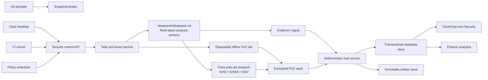

# Clark Security platform architecture

## Product objective

Clark Security is a multiplayer security system for authorized source
repositories. It combines repository-wide analysis, exact-diff review,
controlled PoC generation and replay, finding lifecycle tracking, periodic
rescans, and organization-wide risk views.

The design target is an enterprise with roughly 10,000 services, 2,000
engineers, many repository hosts and owners, and concurrent scans from desktop,
CI, pull requests, scheduled policies, and security campaigns.

The product model is deliberately stronger than “store scanner output”:

- evidence and coverage are sealed before a scan becomes authoritative;
- a finding and one observation of that finding are separate records;
- absence in a later scan means resolved only when later coverage is
  sufficient;
- PoCs are typed, replayable, isolated, automatically executed artifacts;
- potential novelty is evidence-backed and clearly labeled rather than blocked
  on a serial review queue;
- collaboration and ownership are first-class rather than comments attached
  to a local report.

## Clark Security contract principles

Clark owns these backend contracts:

- canonical manifests, findings, coverage, and artifact digests;
- host-owned finalization rather than trusting agent-authored completion;
- stable finding identity separated from scan-specific occurrence identity;
- replayable scan recipes and parent/rerun relationships;
- append-only finding decisions plus a current materialized triage state;
- remediation attempts with explicit generate, apply, and verify states;
- semantic comparison persisted separately from raw scan output;
- coverage-aware `new`, `persisting`, `resolved`, `reopened`, and `unknown`
  classification;
- stable repository targets that survive worktree and clone path changes;
- bounded progress, failure, cancellation, cost, and artifact metadata.

Clark extends those contracts for a multi-tenant service:

- organization, team, service, repository, and owner identity;
- repository-host installations and revocable access grants;
- a queue and lease protocol for desktop, CI, and cloud workers;
- first-class PoC recipes, automatic executions, and immutable receipts;
- encrypted zero-day artifact storage and access audit;
- novelty assessment and coordinated-disclosure workflow;
- cross-repository campaigns, blast-radius queries, and aggregate posture;
- policy inheritance, suppressions, SLAs, assignments, comments, and activity.

## Trust boundaries



The LLM is never a source of authority for repository identity, coverage,
execution receipts, or access control. It proposes threat models, candidates,
PoC scripts, semantic matches, novelty, severity, and remediation.
Deterministic services validate and record the evidence around those proposals
without introducing a human approval queue.

## Canonical identities

All identifiers are opaque and organization-scoped unless explicitly
content-addressed.

| Entity | Stable identity |
| --- | --- |
| Repository | Git provider installation plus provider repository node id |
| Repository snapshot | repository id plus immutable commit/tree digest |
| Scan definition | policy id plus revisioned configuration |
| Scan run | host-issued UUID with idempotency key |
| Candidate | scan-local source/control/sink/impact ledger id |
| Finding | versioned semantic fingerprint of root cause and security boundary |
| Occurrence | one finding observed in one scan run |
| Artifact | SHA-256 content digest plus immutable object version |
| PoC recipe | finding/candidate plus revisioned recipe digest |
| PoC execution | host-issued run id and sandbox attestation |
| Comparison | ordered before/after scan pair plus matcher version |

Path, worktree, branch name, title, line number, and LLM wording are attributes,
not identity.

## Core data model

### Tenancy and repository access

- `organizations`
- `organization_memberships`
- `teams`
- `services`
- `service_owners`
- `git_installations`
- `repositories`
- `repository_aliases`
- `repository_access_grants`
- `repository_sync_cursors`

Repository records retain provider node ids after access is revoked. Revocation
immediately prevents new fetches and PoC runs while preserving authorized
historical metadata under retention policy.

### Policy and scheduling

- `security_policies`
- `policy_versions`
- `policy_bindings`
- `scan_schedules`
- `scan_campaigns`
- `campaign_targets`
- `budget_pools`
- `quota_events`

Policy inheritance is organization to service/team to repository. The effective
policy is materialized on every run so later policy changes do not rewrite
history.

### Scan execution

- `scan_runs`
- `scan_targets`
- `scan_tasks`
- `task_attempts`
- `task_leases`
- `scan_progress`
- `scan_events`
- `coverage_items`
- `scan_artifacts`
- `scan_seals`
- `scan_costs`

`scan_runs` stores the requested recipe, effective policy version, exact
production model route (`~deepseek/deepseek-v4-flash-latest`), trigger, parent run, target snapshot, and
terminal reason. Tasks are idempotent and attempt-scoped. A worker completion
cannot update the run unless it still owns the matching lease generation.

### Findings and lifecycle

- `findings`
- `finding_occurrences`
- `finding_locations`
- `finding_edges`
- `finding_matches`
- `scan_comparisons`
- `triage_decisions`
- `finding_assignments`
- `finding_comments`
- `finding_watchers`
- `finding_slas`
- `external_issue_links`
- `remediation_attempts`

`findings` is the durable root-cause identity. `finding_occurrences` preserves
exact scan evidence. Triage decisions are append-only; a current-state
projection is updated transactionally. A manual false-positive or accepted-risk
decision never deletes the underlying evidence.

### PoC and novelty

- `poc_recipes`
- `poc_runs`
- `poc_receipts`
- `poc_artifacts`
- `sandbox_attestations`
- `novelty_assessments`
- `novelty_evidence`
- `disclosure_cases`
- `disclosure_events`
- `vulnerability_identifiers`

Positive and negative controls are separate `poc_runs`. A reportable finding
requires a valid pair for the same candidate and repository snapshot. A blocked
or unsafe attempt remains queryable and forces deferred validation.

Novelty state is independent of severity. An assessment can move directly
among `unassessed`, `suspected`, `known_variant`, `likely_novel`, and
`confirmed_novel`; it does not have to wait in intermediate queues.
`confirmed_novel` still requires machine-verifiable PoC validation and retained
prior-art evidence. That is an evidence invariant, not an approval step.
The confirmation transaction binds one verified `novelty_prior_art` vault
artifact produced by the successful same-scan `prior_art` task to a reported
occurrence, requires passing signed positive and negative controls for that
occurrence and candidate, records at least two independent prior-art searches,
and captures explicit confirmation from the authenticated member. Clark stores
the artifact digest and immutable object version in the append-only decision.
If a search finds relevant prior art, the same member records `known_variant`
immediately instead.

The automated phase searches NVD, GitHub Security Advisories, and OSV with
fixed-domain queries derived only from validated CWE identifiers and a generic
taxonomy. It never sends repository identity or code to a search provider.
Allowlisted source captures are HTTPS-only, redirect-free, and bounded.
`~deepseek/deepseek-v4-flash-latest` may return `no_match_in_automated_sources`, but that state is
deliberately weaker than `no_prior_art_found` and cannot confirm novelty by
itself. Full captures and model receipts remain in the restricted vault;
ordinary finding views receive only the automated conclusion, searched-source
count, and match count.
Disclosure follows a separate state machine:

`draft -> vendor_contacted -> coordinated -> patched -> public`

The UI may say “potential novel vulnerability.” It says “confirmed novel” only
when the stored validation and prior-art receipts support that statement, not
solely because an LLM generated a new PoC.

## State machines

### Scan run

`queued -> preflight -> snapshotting -> analyzing -> poc_running
-> validating -> sealing -> ingesting -> completed`

Terminal alternatives are `failed`, `canceled`, `unsafe_to_execute`, and
`superseded`. Every transition carries an expected state/version and
idempotency key.

### PoC execution

`proposed -> queued -> provisioning -> running ->
passed | failed | timed_out | resource_limited | unsafe_to_execute | canceled`

Passing means the script produced the expected bounded observation. It does not
by itself prove severity, novelty, or production reachability.

### Finding analytical lifecycle

- `new`: first sufficiently covered observation;
- `persisting`: matched in a later sufficiently covered scan;
- `resolved`: absent from a later complete scan covering the prior surface;
- `reopened`: observed again after resolution;
- `unknown`: later scan was partial, failed, or did not cover the prior surface.

Analytical lifecycle is computed. Human workflow state such as `open`,
`accepted_risk`, `false_positive`, and `wont_fix` is separate.

## Implemented API surface

ClarkChat account APIs use `/api/orgs/{organizationId}/security/*`. Clark Code,
desktop, CI, cloud-analysis, and PoC-lab workers use `/v1/security/*` with a
Clark Platform key. Account credentials are never forwarded to the worker API
or to presigned object-store URLs.

### ClarkChat product APIs

```text
GET    /api/orgs/{organizationId}/security/posture
GET    /api/orgs/{organizationId}/security/repositories
POST   /api/orgs/{organizationId}/security/repositories/register
GET    /api/orgs/{organizationId}/security/repositories/{repositoryId}/scan-runs
GET    /api/orgs/{organizationId}/security/repositories/{repositoryId}/policy
PUT    /api/orgs/{organizationId}/security/repositories/{repositoryId}/policy
GET    /api/orgs/{organizationId}/security/findings
GET    /api/orgs/{organizationId}/security/candidates
GET    /api/orgs/{organizationId}/security/findings/{findingId}
GET    /api/orgs/{organizationId}/security/findings/{findingId}/occurrences
GET    /api/orgs/{organizationId}/security/findings/{findingId}/poc-receipts
POST   /api/orgs/{organizationId}/security/findings/{findingId}/decisions
POST   /api/orgs/{organizationId}/security/vault/grants
GET    /api/orgs/{organizationId}/security/policies
POST   /api/orgs/{organizationId}/security/policies
```

### Scanner and scheduling APIs

```text
POST   /v1/security/scanners/enroll
POST   /v1/security/scan-runs
GET    /v1/security/scan-runs/{scanRunId}
POST   /v1/security/scan-requests
POST   /v1/security/scan-requests/claim
POST   /v1/security/scan-requests/{requestId}/heartbeat
POST   /v1/security/scan-requests/{requestId}/complete
POST   /v1/security/tasks/claim
POST   /v1/security/tasks/{taskId}/heartbeat
POST   /v1/security/tasks/{taskId}/complete
POST   /v1/security/scan-comparisons
```

### Artifact and seal APIs

```text
POST   /v1/security/scan-runs/{scanRunId}/artifact-uploads
POST   /v1/security/scan-runs/{scanRunId}/artifact-commits
POST   /v1/security/scan-runs/{scanRunId}/seal
```

Desktop and CI clients never directly mark scans complete. They upload
immutable evidence and ask the backend to seal it. The begin/commit protocol
returns short-lived object-store upload grants. Commit verifies size, digest,
media type, scan ownership, and artifact role. Seal rechecks the manifest,
snapshot, coverage, candidate, PoC, and artifact bindings in one transaction.

Finding decisions use optimistic concurrency. List APIs never return raw PoC
content. Any active member who can access the repository receives an immediate,
short-lived, version-bound vault grant. There is no purpose form, reviewer,
approval queue, or consume step; every grant still emits an audit event.

Every aggregate response includes freshness, repository denominator, failed
scans, and incomplete coverage. A falling finding count without coverage is not
rendered as posture improvement.

## Ingest and sealing protocol

1. Resolve repository access and immutable target snapshot.
2. Create the scan run with effective policy and idempotency key.
3. Workers lease bounded tasks and stream typed progress.
4. Workers upload immutable artifacts directly to object storage.
5. Artifact commit verifies digest and ownership.
6. Candidate ingestion creates scan-local rows only.
7. PoC runs execute in the lab and the host signs their receipts.
8. Seal validates coverage, candidate closure, artifact digests, and receipt
   pairs against the target snapshot.
9. One transaction records the seal and emits `security.scan.sealed`.
10. An idempotent normalizer upserts findings and occurrences.
11. A comparison job links the new scan to the latest comparable complete scan.
12. Lifecycle, SLA, ownership, notification, and analytics projections update.

Raw agent output can be retried or discarded. Only sealed data reaches finding
and posture projections.

## Disposable PoC lab and zero-day vault

PoC execution must not run in the application API process or a general analysis
worker. Each control gets a fresh microVM or equivalent hardened sandbox with:

- a read-only, content-addressed source snapshot;
- a separate writable scratch disk destroyed after the run;
- network disabled by default, with no cloud metadata route;
- no inherited organization, Git, model, or provider credentials;
- CPU, memory, process, file, output, and wall-clock quotas;
- syscall and device restrictions;
- deterministic runtime image digest;
- signed sandbox attestation and bounded logs;
- separate positive and negative executions.

Raw scripts, crash inputs, exploit outputs, traces, and reproducer archives go
to a dedicated vault:

- envelope encryption with per-organization and per-finding data keys;
- KMS-backed rotation and cryptographic deletion;
- no plaintext in logs, queues, search indexes, analytics, or support tooling;
- metadata-only search outside the vault;
- immediate five-minute access grants for active members with repository
  access;
- immutable access and export audit;
- watermarking and download controls for high-sensitivity cases;
- configurable retention and legal hold;
- automatic revocation when organization or repository access is removed.

Normal findings may retain a redacted PoC summary. Suspected novel
vulnerabilities default to the most restrictive storage class while remaining
immediately available to authorized repository members.

## Scheduling at enterprise scale

Triggers are coalesced by repository and target:

- provider webhooks for default-branch pushes and pull requests;
- periodic risk-tier schedules;
- explicit desktop/CI scans;
- organization campaigns for a vulnerability pattern or dependency;
- remediation verification scans.

The scheduler uses separate priority classes:

1. active exploit or disclosure response;
2. pull-request and remediation verification;
3. developer-requested interactive scans;
4. default-branch policy scans;
5. periodic baseline and campaigns.

Fair-share queues prevent one organization or monorepo from starving others.
Duplicate requests for the same repository, snapshot, effective policy, and
scanner version share one run. Retry attempts retain the same task identity and
receive a new lease generation.

At 10,000 repositories, a reasonable initial target is 10,000 scheduled scans
per day plus event-driven scans, with capacity for bursts around 100,000 runs
per day. Storage and event partitions use organization plus time; hot query
indexes use organization, lifecycle state, severity, owner, repository, and
updated time.

The executable Postgres simulation creates 10,000 repositories and 2,000
active engineers, pages the full posture set, leases disjoint 500-repository
batches to concurrent workers, expires one worker, and proves that a recovery
worker can reclaim the same work only with a higher fence. It also proves that
an active member from one organization cannot query another organization.

## Managed production execution path

The Clark worker now consumes scheduled GitHub scan requests end to end:

- it claims organizations in fair-share order and uses fenced, expiring leases;
- it fetches only immutable 40- or 64-hex GitHub archive revisions with a
  short-lived installation token;
- it normalizes and content-addresses a bounded source inventory;
- it runs the Inventory, Threat Model, Discovery, Attack Path, Validation,
  Adjudication, PoC, and Seal task graph;
- production semantic phases require exact `~deepseek/deepseek-v4-flash-latest`;
- Cloud Analysis and PoC Lab enroll as distinct Clark signing identities;
- positive and negative controls execute in fresh disposable offline sandboxes;
- full signed control receipts go to the restricted versioned vault while task
  ledgers retain bounded summaries;
- only the current fenced Seal task can read and bind the exact vault trace;
- the backend revalidates artifacts, receipts, coverage, and identity before
  signing the final Clark seal.

The worker emits aggregate `Clark/Security` backlog, PoC backlog, and oldest-age
metrics every 30 seconds. ECS target tracking scales on managed backlog; the
production worker can scale to 20 tasks. Sustained capacity and wait-time alarms
are provisioned without tenant or repository ids as metric dimensions.

The infrastructure definition includes a dedicated rotating KMS key, versioned
vault bucket, KMS-only writes, explicit application denial of list and delete,
exact-prefix IAM, three independently bootstrapped signing seeds, and an
immutable PoC sandbox selector/digest check.

These paths are implemented and locally verified. They are not represented as
deployed until an authorized Clark dev/production rollout and live canary
produce receipts.

## Storage and infrastructure

- PostgreSQL: tenancy, policies, runs, findings, occurrences, collaboration,
  lifecycle, leases, and idempotency.
- Immutable object storage: canonical scan artifacts and ordinary evidence.
- Isolated encrypted vault: PoC and suspected-zero-day artifacts.
- Event bus: scan, finding, lifecycle, ownership, and notification events.
- Redis or equivalent: ephemeral scheduler coordination and rate limits, never
  source-of-truth state.
- Columnar analytics store: posture trends and large organization aggregates.
- Metadata search index: titles, taxonomy, owners, paths, and redacted
  summaries; never raw exploit bodies.
- KMS and secrets manager: signing, envelope encryption, provider grants, and
  short-lived worker identity.

All transactional tables carry `organization_id`; authorization is enforced in
the service layer and database policy. Object keys are opaque and cannot be
derived from user-controlled repository names.

## Product surfaces and journeys

### Organization overview

Security leaders see coverage denominator, scan freshness, open risk by
severity and service, SLA breaches, rescan health, novel-evidence queue, and cost.
Every chart drills into the repositories and failed/incomplete runs behind it.

### Repository workspace

Engineers see current posture, latest comparable scan, branch/PR scans, owned
findings, coverage gaps, scan policy, and a timeline. “Rescan” creates a new run
against the current immutable snapshot; it never mutates an old run.

### Finding room

A finding page combines the root cause, current lifecycle, occurrences across
repositories and revisions, attack path, code evidence, PoC status, ownership,
decisions, comments, remediation attempts, external tickets, and activity.
Sensitive PoC content opens in a separately authorized lab view.

### Live scan

The run page shows preflight, inventory, independent passes, candidate
validation, automatic PoC execution, sealing, cost, and retry state. Cancel is
idempotent. Partial output is visible as non-authoritative work, never as final
findings.

### Remediation and rescan

An engineer generates a patch in an isolated workspace, reviews and applies it
through an explicit repository workflow, runs targeted verification, and then
requests a comparable rescan. The occurrence becomes resolved only after
coverage-aware comparison.

### Potential novel vulnerability

The discoverer sees a restricted case created from a sealed finding. Clark
automatically replays the PoC, searches NVD, GHSA, and OSV using non-sensitive
taxonomy, captures allowlisted source evidence, and records the GLM assessment
in a versioned vault artifact. The finding view shows the bounded automated
conclusion and whether the evidence bundle is ready, collects the member's
independent searches and outcomes, and offers two immediate actions: confirm
novel when no prior art matches, or mark known variant when it does. Artifact
ids remain hidden from the workflow. Any authorized repository member can
continue the work or coordinate disclosure immediately. Multiplayer activity
is auditable without exposing exploit content to ordinary dashboards or
notifications.

### Cross-repository campaign

Security creates a hypothesis or known pattern, previews target selection,
launches a budgeted campaign, watches coverage and failures, deduplicates shared
root causes, assigns service owners, and tracks remediation by blast radius.

## Failure and edge-case policy

- Revoked Git access: cancel unstarted fetches, terminate renewable leases, and
  keep historical sealed metadata.
- Force push: old scans retain their immutable snapshot; new scans use the new
  commit and compare only when scope is meaningful.
- Partial/failed scan: findings may be inspected but cannot prove resolution or
  improve posture coverage.
- Worker retry: late completions from an expired lease generation are ignored.
- Duplicate upload: identical digest and idempotency key returns the original
  artifact; conflicting content fails.
- Candidate split/merge: comparison supports many-to-many occurrence groups
  with a reason and matcher version.
- Monorepo: policy and ownership operate on declared service scopes while the
  repository snapshot remains shared.
- Fork/rename/transfer: provider node identity and alias history avoid creating
  a new repository accidentally.
- False positive: append a decision; do not delete evidence. Reappearance under
  materially changed code can request re-review.
- Unsafe PoC: record `unsafe_to_execute`, retain the candidate, and
  automatically try a safer bounded reproducer without prompting for approval.
- Network-dependent reproduction: default to blocked. Any exception requires a
  predeclared destination allowlist and isolated credentials; the scan
  continues and reports deferred validation rather than waiting for a person.
- Secrets in output: quarantine the artifact, redact previews, rotate exposed
  credentials through a separate incident workflow, and preserve audit.

## Current implementation gaps

The primary local, managed-cloud, backend, vault, product, paid-evaluation, and
enterprise-scale paths are implemented and exercised. Remaining gaps are
operational breadth and collaboration depth:

1. Deploy and canary the managed worker, KMS vault, alarms, and signing-secret
   bootstrap in Clark dev and then production.
2. Load-test the implemented automatic admission path against 10,000
   repositories, connect immutable provider usage events to Clark billing,
   and expose versioned organization envelope management.
3. Add remediation workspaces, assignments, comments, SLA, ownership, external
   issue synchronization, disclosure cases, and cross-repository campaigns.
4. Add GitLab and Bitbucket snapshot brokers behind the same immutable-source
   contract and finish provider revocation/rename/transfer reconciliation.
5. Add large-tenant server-side search, analytics materializations, posture
   trends, cost views, and opaque-cursor pagination across every product list.
6. Exercise signing-key rotation, backup restore, KMS failure, region failure,
   and long-retention/legal-hold procedures.
7. Continuously canary the exact published PoC sandbox image and independently
   attest that network, credentials, filesystem, process, and resource
   boundaries remain enforced.
8. Expand prior-art beyond the bounded NVD/GHSA/OSV corpus with first-party
   advisory APIs, continuous corpus refresh, and coordinated-disclosure
   integrations while preserving “potentially novel” language until evidence
   supports a stronger state.

None of these gaps requires a reviewer to unblock ordinary work in an
authorized repository. Automated policy, containment, quotas, and audit remain
the guardrails.
