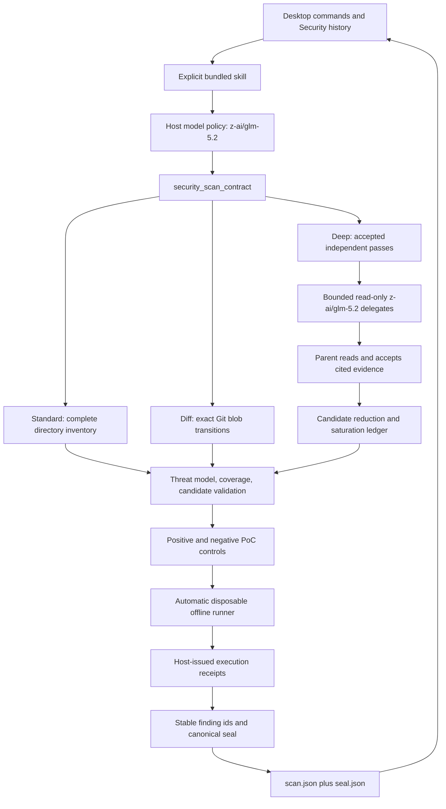

# Clark Code Security

Clark Security is a Clark-native, evidence-backed repository scanning workflow.
Its product identity, runtime contract, finding fingerprints, execution
receipts, artifact formats, and user experience are owned by Clark.

## Architecture map



The model proposes security meaning. Git, inventory, orchestration, coverage,
phase closure, and final receipt authority stay in deterministic host code.
That boundary is the central porting decision: Clark adopts the workflow's
useful reasoning stages while keeping its own provider, tool, permission,
remote-execution, and desktop contracts.

## Implemented: standard, exact-diff, and deep contracts

The first production slice provides:

- `/security`, expanded to the collision-safe bundled
  `$security:security-scan` skill;
- `/security-diff`, expanded to `$security:security-diff`;
- `/security-deep`, expanded to `$security:security-deep`;
- a host-owned `z-ai/glm-5.2` model policy for the whole root scan turn;
- deterministic, paged target inventory through `security_scan_contract`;
- a canonical JSON scan bundle under
  `.clark/security-scans/<scan-id>/scan.json`;
- exact reviewed/excluded coverage over the inventoried target;
- threat-model, discovery, validation, attack-path, and reporting phases;
- a contract-v2 PoC record for every candidate, including blocked and unsafe
  attempts;
- an automatic `security_poc_execute` tool that copies the exact repository
  inventory, denies network access, confines writes to that disposable copy,
  bounds time and output, and persists local artifacts;
- session-owned, host-issued positive and negative control receipts that model
  JSON can reference but cannot mint;
- stable semantic finding identities that do not depend on line numbers;
- a final evidence seal that rejects stale inventories, partial coverage, and
  reportable findings without a reproduced or partially reproduced PoC;
- durable `seal.json` receipts beside canonical scan bundles;
- a desktop Security popover with standard/diff/deep history, seal state,
  coverage counts, deep-pass counts, and sealed findings;
- local scan parity through Clark's existing `Executor` boundary. Remote scan
  analysis works, but remote PoC sealing intentionally fails closed until the
  target-native disposable runner is deployed.

The standard mode inventories the complete selected directory. Diff mode binds
either a resolved Git range or a content-addressed working-tree patch. Deep mode
adds host-receipted independent discovery passes and saturation to the same
full-inventory evidence contract.

## Exact Git diff mode

`security_scan_contract(action="diff_inventory")` supports:

- `working_tree`: a `base` commit against a throwaway Git tree containing
  staged, unstaged, untracked, renamed, and deleted files;
- `range`: a resolved `base` and `head` commit.

The host reads `--raw --full-index -z` Git evidence. Each target id includes the
resolved base and the exact in-scope blob transitions. Range targets also bind
the immutable head commit. Working-tree targets intentionally exclude
`.clark/security-scans/`, so writing the canonical bundle cannot invalidate its
own scan; any other in-scope content change does.

Every changed path must have a coverage row, including deleted paths.
Unchanged files followed for controls or reachability are recorded separately
in `supportingCoverage`. Candidate source/control/sink evidence may use current
repository paths or previous rename/delete paths, but every diff candidate must
touch a changed path. This prevents a patch review from laundering unrelated
repository findings into its result.

## Bounded deep mode

`security_scan_contract(action="deep_begin")` creates a session-owned run
against one repository inventory. The deep skill explicitly authorizes Clark's
existing bounded read-only orchestration; selecting it exposes
`delegate_read_only` and `resolve_delegation` on the first GLM 5.2 model call.
The model cannot substitute a different child model because the same
host-owned Security model override flows into orchestration.

An orchestration counts as a pass only after all its reports are accepted.
Acceptance already requires the parent to read cited repository evidence.
Clark records the orchestration id, distinct parent focus, task ids, attempts,
and claim counts in session state. The root then calls `deep_checkpoint` with
the semantically reduced candidate ids observed during that pass.

Deep finalization requires:

- at least three accepted, checkpointed passes;
- a distinct non-empty focus for every pass;
- two consecutive passes with no novel candidate ids;
- the final bundle's candidate ids to exactly equal the union checkpointed
  across all passes;
- the ordinary complete inventory, threat-model, validation, and attack-path
  invariants.

This separates model judgment about semantic duplicates from host authority
over whether independent work ran, whether the parent accepted it, and whether
the declared reduction reached saturation.

## Runtime flow

1. The composer expands `/security` to the bundled Security skill.
2. The provider detects the exact revisioned skill binding.
3. The provider pins the model to `z-ai/glm-5.2`, clears reasoning
   settings inherited from a different conversation model, and exposes the
   normally deferred `security_scan_contract` tool on the first model call.
4. The agent asks the contract tool for its schema and target inventory.
5. The agent reviews applicable `SECURITY.md` policy, constructs a repository
   threat model, and reviews every inventoried path.
6. Each candidate receives an attempted PoC outcome. When execution is safe,
   the agent runs a positive exploit control and a distinct negative safe
   control in separate disposable copies.
7. The host issues receipts containing the exact inventory, script, workspace,
   output, exit-code, containment, and artifact digests. Failed, stale,
   cross-candidate, and model-invented receipts do not validate.
8. A reportable candidate also receives a concrete attack path and calibrated
   severity.
9. The agent writes the canonical JSON bundle to ignored `.clark` state.
10. The contract tool re-inventories the target and finalizes only if the
   snapshot, coverage, evidence, PoC, and phase invariants still hold.
11. The agent reports findings from the returned seal. A failed seal can never
   become a synthetic clean result.

## Model and deterministic responsibilities

GLM 5.2 owns semantic work:

- threat modeling;
- source/control/sink reasoning;
- candidate separation;
- counterevidence;
- PoC hypotheses, positive and negative control scripts;
- exploitability and severity judgment;
- remediation direction.

The host owns facts that must be mechanically enforceable:

- target containment;
- inventory ordering and snapshot identity;
- file-coverage equality;
- candidate closure;
- attack-path presence for reportable findings;
- disposable workspace construction and offline process containment;
- PoC timeout and output bounds;
- execution result, control, snapshot, and artifact digests;
- receipt authority and positive/negative receipt pairing;
- canonical bundle digest;
- stable finding fingerprint.

The repository snapshot identity includes each path, size, and modification
time. Diff mode additionally seals Git blob transitions. The finalizer
recomputes both after reading the bundle, so an intervening source or target
change invalidates the scan.

## Contract artifacts

The model-authored bundle includes:

- contract version, scan id, mode, model, scope, and inventory id;
- the current phase;
- assets, trust boundaries, attacker inputs, and invariants;
- one reviewed or explicitly excluded coverage row per inventoried path;
- candidates expressed as source, nearest control, sink, and impact;
- one validation disposition and evidence record per candidate;
- one PoC outcome per candidate, with host-issued receipt ids or concrete
  blocked/unsafe limitations;
- an attack path for every reportable candidate.

The host-created seal includes:

- scan and target identity;
- canonical bundle digest;
- reviewed/excluded/candidate/PoC counts;
- stable finding ids, fingerprints, severity, source path, impact, PoC outcome,
  and positive/negative receipt ids.

Detailed narratives remain model-authored; the seal identifies which narratives
passed the deterministic evidence contract.

Successful tool finalization writes the returned receipt beside the bundle as
`.clark/security-scans/<scan-id>/seal.json`. The desktop reads only bounded,
schema-valid bundles and seals through the provider boundary, skips malformed
artifacts, and never treats an unsealed bundle as findings. The local desktop
workbench remains artifact-backed. Clark's organization backend stores
normalized scan, finding, occurrence, coverage, evidence, PoC-receipt,
lifecycle, and posture records in Postgres.

## Verification

The adversarial acceptance suite uses an intentionally vulnerable 21-file fake
repository, a 14-finding oracle, three protected near-miss controls, excluded
vendor noise, and deliberate contract failures:

```bash
cargo test -p provider-local --test security_adversarial -- --nocapture
cargo test -p provider-local \
  tools::security_poc_execute::tests::full_tool_issues_distinct_receipts_without_mutating_checkout \
  --lib -- --exact
cargo test -p provider-local --test local_loop \
  security_skill_fake_provider_seals_artifact_and_exposes_history -- --exact
corepack pnpm@10 --dir harness test:security-ui
node harness/security-simulation.mjs --offline
```

The smaller positive and negative contract examples remain available:

```bash
cargo run -p provider-local --example security_scan_simulation
cargo run -p provider-local --example security_diff_simulation
```

Targeted and full validation:

```bash
cargo test -p provider-local security --no-fail-fast
cargo test -p provider-local deep_scan --no-fail-fast
cargo test -p provider-local --no-fail-fast
cargo clippy -p provider-local --all-targets -- -D warnings
cd app
pnpm test
pnpm typecheck
pnpm build
```

Live-model tests remain ignored and env-gated. They must not be run without
explicit authorization because they consume real provider credits. When a paid
Security model test is explicitly requested, use Qwen 3.7 Flash for the test
harness; this does not change the product workflow's GLM 5.2 default. The
current paid test identifier advertised by Clark Platform is the raw
`qwen/qwen3.7-flash` id:

```bash
node harness/security-simulation.mjs --paid --live-only
```

The harness rejects any other paid-test model, parses only an ignored
`CLARK_CODE_API_KEY`, redacts credentials from output, and writes its paid
receipt to `/tmp/clark-security-simulation/receipt-paid.json`.

See [security-simulation-report.md](security-simulation-report.md) for the
acceptance matrix and the latest checked run.

## Platform handoff and remaining slices

Clark Desktop exports canonical Clark Security manifests, coverage, candidate
ledgers, findings, and signed PoC receipts to the organization backend. Stable
device and PoC-lab signing identities survive restart. Uploads are
content-addressed, crash-retry safe, and never send Clark account or Platform
credentials to a presigned vault URL.

The Clark backend supplies organization posture, repository history,
coverage-aware resolution and reopening, scheduled scan requests, fenced task
leases, signed scan seals, immediate audited vault links, and the ClarkChat
Security workspace. The executable scale test covers 10,000 repositories,
2,000 engineers, tenant isolation, concurrent leasing, and crash recovery.

The managed Clark worker now consumes immutable GitHub revisions, executes the
fenced analysis/PoC/seal graph, stores full PoC traces in the versioned KMS
vault, emits aggregate autoscaling metrics, and seals findings through the
backend. Production infrastructure injects three distinct Clark signing seeds
and independently binds the PoC runtime to the published immutable sandbox
selector.

The remaining slices are:

1. deploy and canary that managed path in Clark dev and production;
2. add live progress and cancellation to the desktop panel rather than only
   sealed local history and cloud-sync status;
3. load-test the automatic rate, concurrency, and spend envelopes at sustained
   enterprise throughput, connect usage events to billing, and add versioned
   policy management;
4. add isolated generate/apply/rescan remediation attempts plus idempotent
   external issue synchronization;
5. add server-side repository and finding search, campaigns, ownership, SLA,
   comments, disclosure, and notification projections for the largest
   organizations.

Each slice retains the existing negative controls and deterministic evidence
boundaries before adding authority or mutation.
