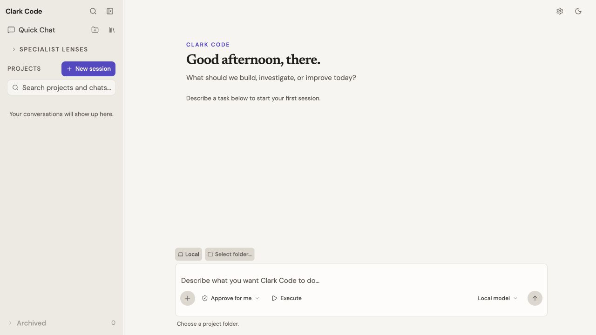
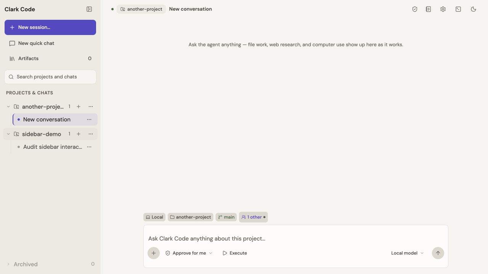
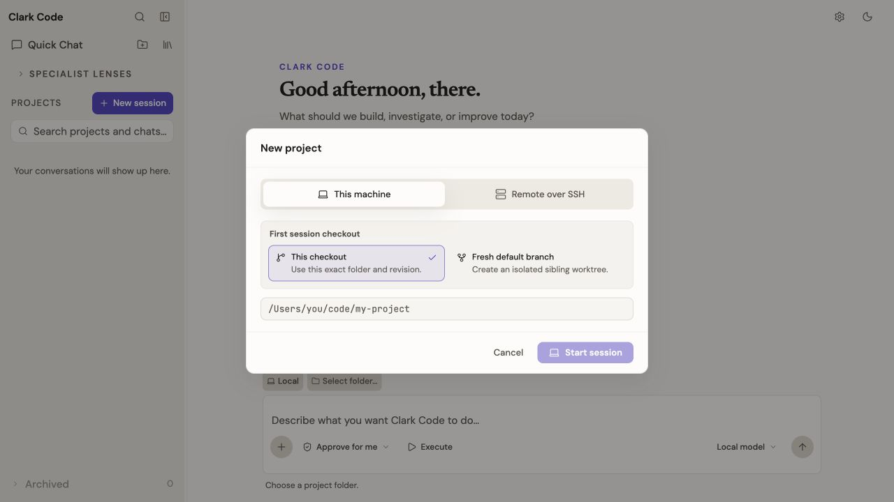
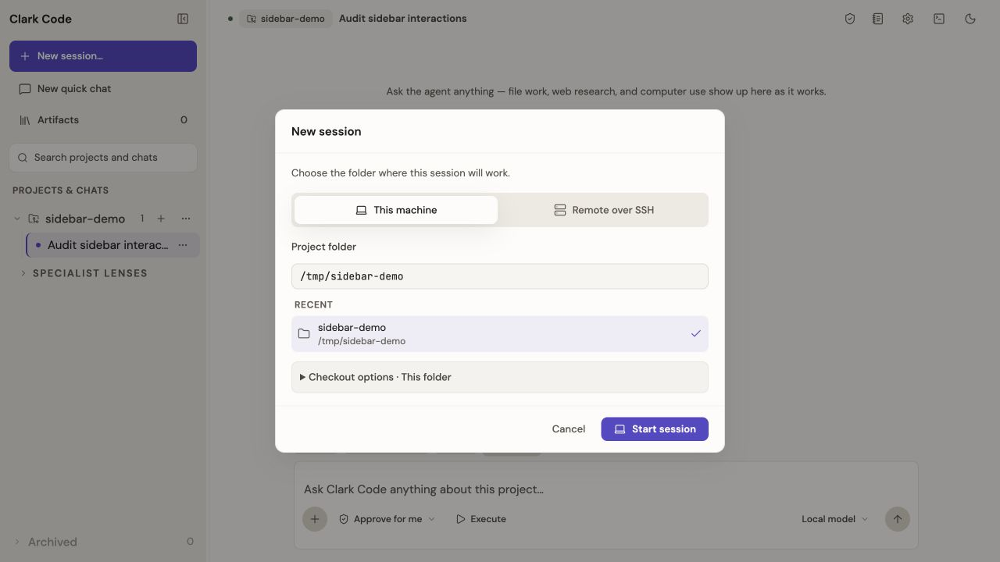
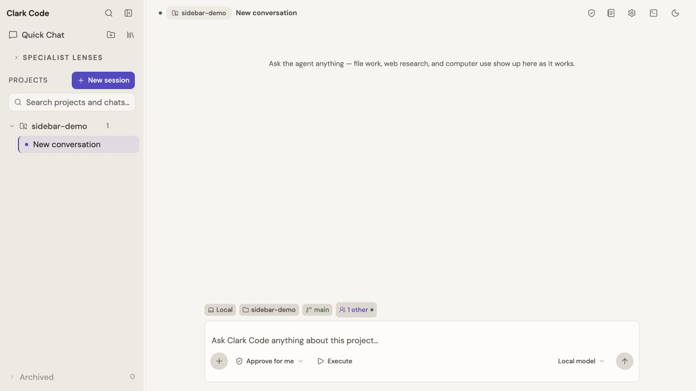
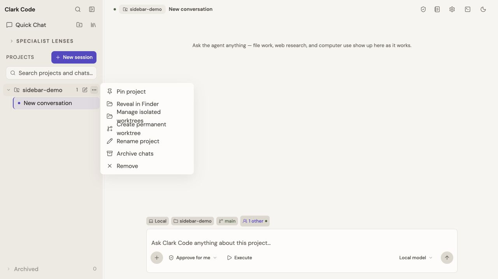
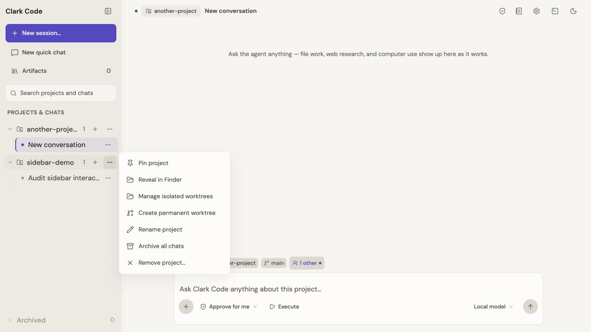
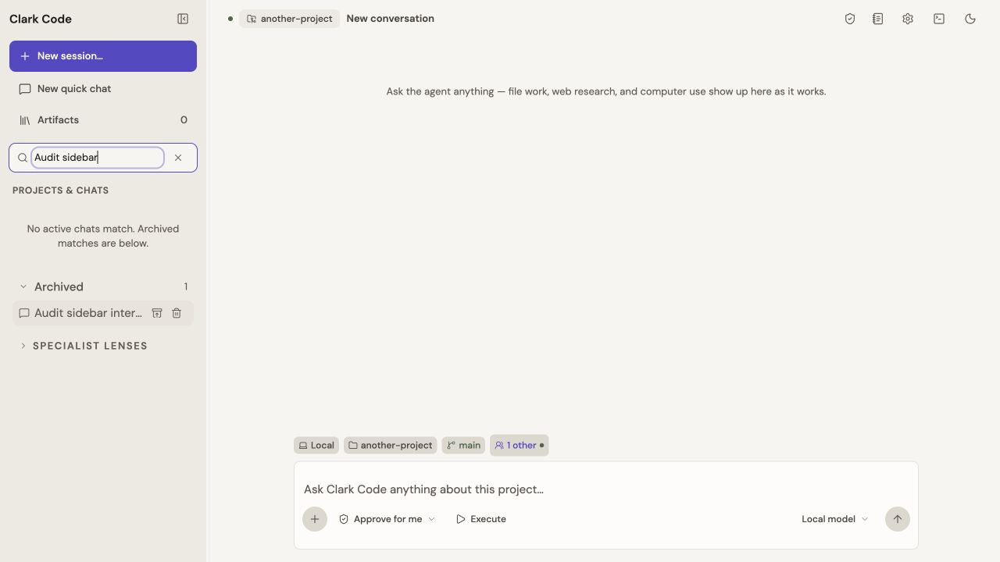
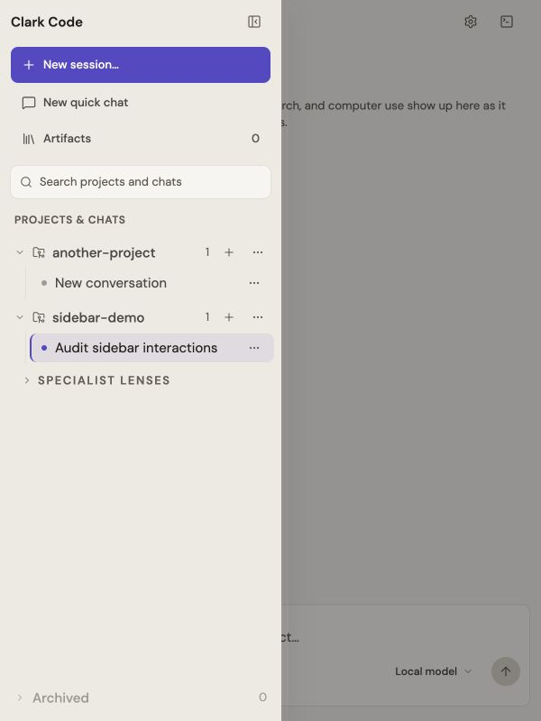

# Sidebar UX audit and repair — September 4, 2026

Scope: Clark Code foundation sidebar and its session chooser, rendered in the Codex in-app browser against the local mock bridge. The two projects and conversations shown here are disposable preview data. No hosted-model prompts, native folder permissions, SSH sessions, file deletion, or releases were performed.

The audit follows familiar interaction principles: consistent actions and labels, visible controls, clear feedback, and recoverable navigation ([Nielsen Norman Group heuristics](https://www.nngroup.com/articles/ten-usability-heuristics/)). Findings below come from this audit's screenshots and interactions; code-only findings are identified separately.

## 1. Find the starting action — repaired

Before: Quick Chat, an unlabeled new-project icon, and a prominent New session button competed for attention. The collapsed rail gave New session a different behavior. Search had two entry points and scrolled with the content. The foundation also displayed an empty Specialist lenses disclosure: opening it revealed nothing.

After: one New session action opens the folder/host chooser in both layouts. New quick chat is a separate, explicitly project-free action. Artifacts has a visible label. Search stays above the scrolling project list. Empty specialist catalogs no longer render a disclosure. Existing configured specialist navigation remains below projects.

## 2. Choose a session folder — repaired

Before: the New session button opened a dialog titled New project. Checkout strategy appeared before folder selection, and the path had no visible field label in browser preview.

After: the dialog says New session, explains the folder choice, labels the field, and puts checkout options behind a disclosure that summarizes the current choice. Native builds retain their Choose folder button. Starting is guarded against duplicate submission, displays progress, and keeps errors in the chooser. Cancel during a pending start detaches the pending session through the existing epoch cancellation boundary.

Observed checks: entering `/tmp/another-project` and selecting Start session produced that project's conversation and focused its composer. Browser preview does not exercise the native OS folder dialog. Pending failure/cancellation paths were reviewed in code, not fault-injected in the browser.

## 3. Navigate projects and conversations — repaired

Before: project creation and menu controls were visible only on hover/focus. Empty project headers were disabled. Conversation rename required an undisclosed double-click, while the only hover action was Archive.

After: project rows have visible plus and overflow buttons. Empty projects expand to an explicit No sessions yet state and Start a session action. Conversations expose a visible overflow menu with Rename, Archive, and Delete. Active conversations expose `aria-current`. Opening a single-row menu no longer enters bulk-selection mode. Shift and modifier selection remain available.

Observed checks: expanded both projects; invoked explicit Rename; changed the title to Audit sidebar interactions; archived it; observed the empty-project state; restored it and reopened its conversation. Existing stable ordering and mutation focus behavior remain in place.

## 4. Use action menus — repaired

Before: long project menu labels wrapped into fixed-height rows and overlapped. Escape dismissed the project menu but left focus on the page. Remove did not name its object.

After: menu rows grow with their content; labels name Archive all chats and Remove project. Arrow keys, Home, and End navigate menu items. Escape returns focus to the originating project or conversation control. Conversation deletion retains its existing confirmation; this audit did not execute permanent deletion.

Observed checks: ArrowDown moved focus from Rename conversation to Archive conversation; Enter archived the disposable conversation. Escape from the project menu returned focus to Project actions for sidebar-demo.

## 5. Search and recover archived work — repaired

Before: archived matches lived in a closed tray at the bottom of the sidebar, separate from active search results.

After: a search reveals archived matches immediately below active results in the same scrolling region. Clear search restores the normal layout. Search also indexes full project paths and project aliases. Archived rows expose their restore/delete controls without requiring hover.

Observed checks: searching Audit sidebar after archiving the disposable conversation revealed its archived result; selecting Restore reopened the conversation and returned keyboard focus to its row.

## 6. Navigate a narrow window — repaired

Code finding: below 768 pixels the sidebar unconditionally became an icon rail and removed its expansion control, making the conversation list inaccessible.

After: an Expand sidebar control opens the complete sidebar as an overlay drawer. It traps Tab focus, closes on Escape or backdrop click, and closes when a conversation is chosen. Escape returns focus to Expand sidebar. The resize handle is omitted in the drawer, and resizing the window no longer overwrites the preferred desktop width.

Observed checks at 600 × 800: opened the drawer, selected a different conversation, confirmed it closed and switched projects, reopened, pressed Escape, and confirmed focus returned to Expand sidebar. Temporary viewport override was reset afterward.

## Validation and limits

- Frontend typecheck, production build, and full suite passed: 835 tests passed, 5 skipped across 175 passing and 2 skipped files.
- Source assertions were updated for the consolidated creation controls; actual interactions were checked in the in-app browser as described above.
- Earlier in this task, unchanged Rust gates passed: formatting, scoped Clippy, 816 tests (8 skipped), and agent-core WASM check. Subsequent changes were frontend-only.
- The product's existing type, color, spacing, and motion system was retained. Screenshots are not a claim of WCAG compliance; screen-reader traversal, measured contrast, branded specialist/account flows, native folder selection, live SSH, and packaged-app operation remain separate verification boundaries.
- Changes are local and uncommitted. The installed application has not been rebuilt or released.
